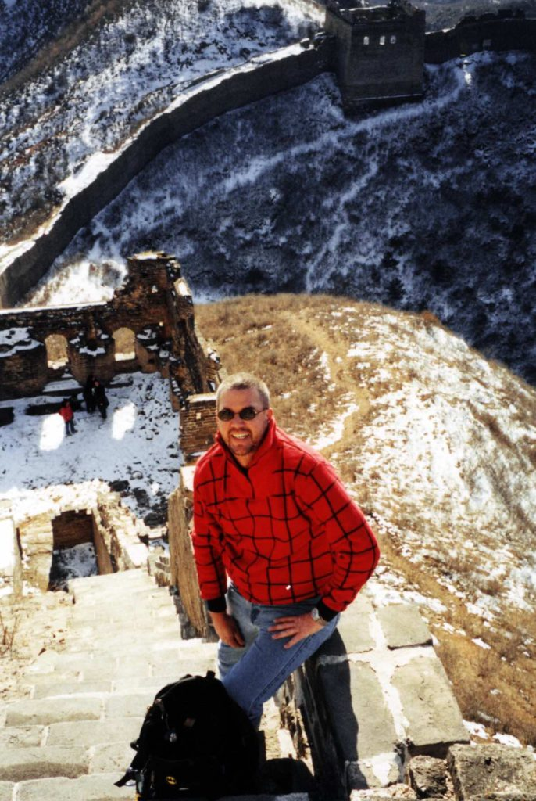
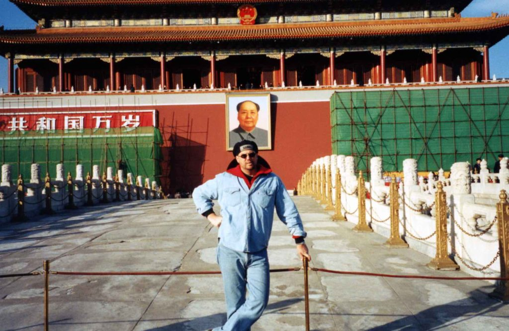

I have been in Beijing for a few days now and it’s very cold.  Today, I went to the Silk Market (knock-off market) and bought a nice North Face GORE-TEX jacket with a zip-out fleece lining for $18.  I also had to buy a new North Face backpack ($11) because I ripped out my old bag by putting too much stuff in it.  I need to try and lighten my load somehow.  Once I get thru the cold weather of Tibet and Nepal I can get rid of some of my heavy clothes.  Once I get to India, the rest of my trip will be in warm weather. 

Two days ago I went on a six -mile trek on the Great Wall of China.  There was snow on parts of it so it made for some great photos.  We walked on a part of the wall that isn’t frequented by many tourists.  It was about two and a half hours outside of Beijing.  This part of the wall is in its original condition and hasn’t been restored at all.  Lots and lots of steps have made my legs very sore today.  Yesterday I went to the Forbidden City and Tiananmen Square. 

_The Forbidden City_

I had no idea they were both so large.  I will probably go to the summer palace tomorrow.  You would not believe how many bicycles there are here.  There is a constant battle for road space between cars, bikes, taxis and buses.  I found that the key to riding a bike in China is to never stop moving. Just keep merging in and out of traffic. Amazingly, I haven’t seen any traffic accidents but it still looks like total chaos to me.  The cost of living here is very cheap.  My room cost $3 a night, a very large beer was only .20 cents and my Peking duck dinner cost only $1.50.  I will probably be here a few more days and then I’ll travel to Xian to see the Terra Cotta Warriors, and then to Tibet.  I hope I can get into Tibet, it can be very tricky to get a visa from the Chinese government.

On The Road,

Andy
