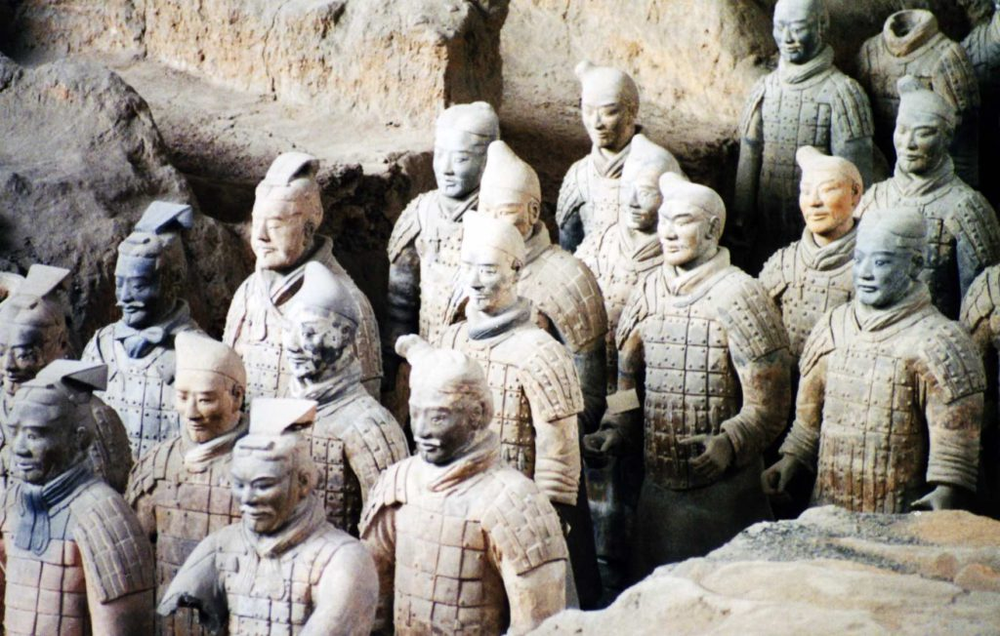

I am now in Chengdu, which is pretty much right in the middle of China.  China has to be the grayest country I’ve ever been to.  It has a little black and white thrown in but it is mostly devoid of color.  The streets are gray, the buildings are grey and the sky is always gray from all the pollution.  I am in Chengdu for two reasons: to go see the great panda research center, but mostly because Chengdu is the springboard that most people use to get into Tibet.  In order to obtain a visa I am forced to join a tour group and pay extra money.  The Chinese government really doesn’t want you in Tibet so they make it very difficult and expensive to get in.  Once I arrive in Tibet I can ditch my tour group and go on my own.  There are very few places in Tibet that tourists are allowed to visit. 

I was happy to finally leave Beijing after about a week.  It was fun but getting very cold.  I shaved my head bald before I started this trip and now my head gets cold very easily.  On my last night in Beijing I went with another girl from Texas to celebrate our last night there.  Our special dinner included eating scorpions.  With a little salt, they actually tasted pretty good.  I couldn’t bring myself to eat the grasshoppers.  They just didn’t look like they were fresh.

_Scorpions on a stick_

I took a 14-hour train trip from Beijing to Xian to see the Museum of the Terra Cotta Warriors and Horses.  This is the tomb of the first emperor of unified China (Qin) that was built over 2000 years ago.  Guarding the emperor’s tomb are over 6000 life-size soldiers and horses in full battle gear, complete with chariots. 

_Terra Cotta Warriors_

They have only excavated the first vault of his tomb but have found three more and expect to find even more.  Each warrior has its own distinct face and they are all standing in formation.  They were all originally painted in brilliant color but that paint has long worn away.  It has been a long arduous process digging them up and putting all the broken pieces back to together.  They still have a long way to go.

On The Road,

Andy
