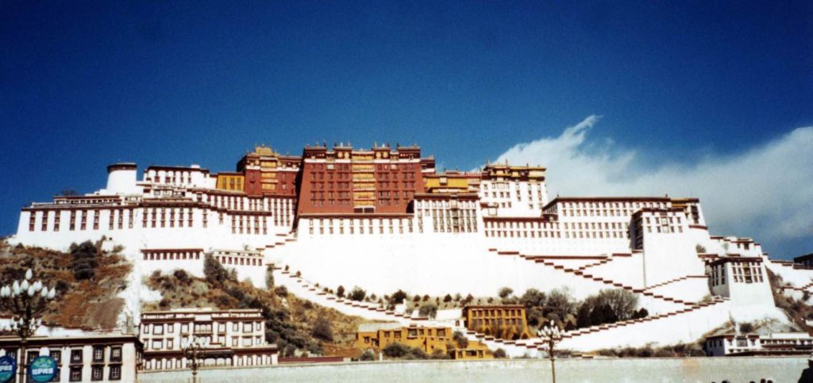
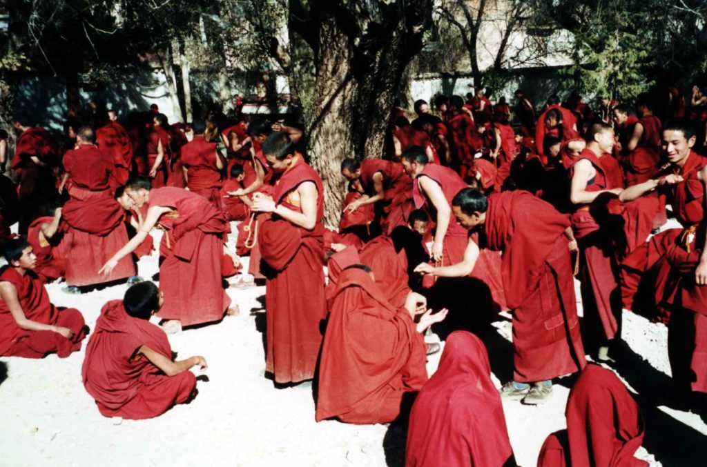
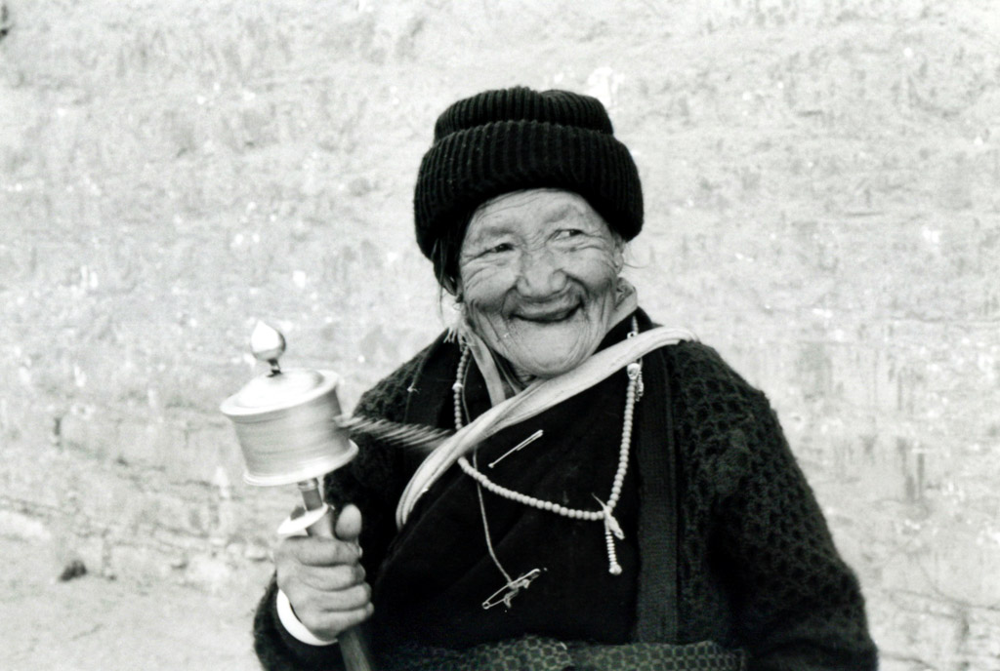
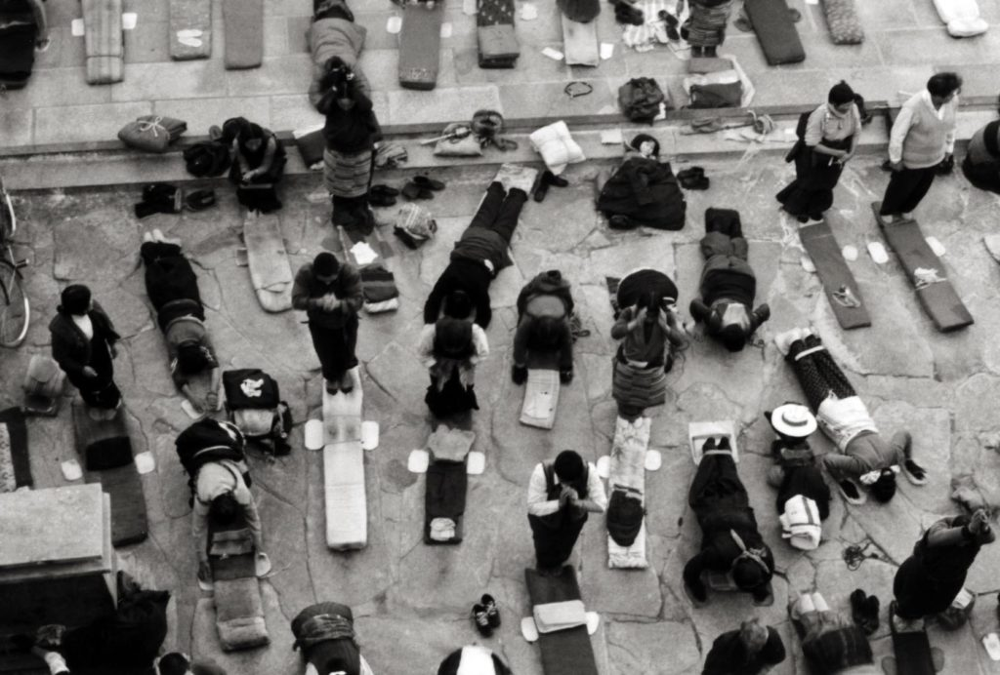

“Shangri-La”, “The Land of Snow”, “Rooftop of the World” are just a few of the names for Lhasa, Tibet.  I arrived here four days ago and leave tomorrow towards Nepal by rented Land Cruiser.  Lhasa is the holiest city in Tibet.  It was home to the Dali Lama until he exile in the mid 1950's.  The Potala Palace was his winter residence and the landmark everyone sees when they enter Lhasa. 

_Potala Palace_

It was built atop a huge rock hill in 1645.  It’s thirteen stories high and has over 1000 rooms.  It is filled with shrines and statues of Buddha and past Lamas.  I also toured the summer residence of the Dali Lama, which isn’t as big and ornate but is still quite impressive.  You can see the radio and other artifacts that the 14th and current Dali Lama used before his exile.  You can see everything but his photo, which is outlawed in Tibet and the rest of China.  They are not allowed to even speak his name.  A group of nomads came up to me and asked if I had a photo of him so they could see his face.  They didn’t believe me when I said I didn’t.  I feel sorry for them that they can’t even see their spiritual leader.  I also visited three or four monasteries and watched the monks in action.  I sat for an hour and watched them chant and then drink their yak butter tea. 

Each of the monasteries is down to about 700 monks.  Before Mao’s ‘Cultural Revolution’ each one housed about 7000 monks.  The Cultural Revolution was a tragedy that took place in the 1950’s.  Mao decided that China’s capitalist past needed to be wiped out and also demanded that the people put nothing or nobody before the communist party.  To accomplish this Mao destroyed temples, monasteries, churches and even works of art.  Universities and secondary schools were closed.  Writers, artists and intellectuals were dismissed, killed or persecuted.  Anyone with an education was dangerous.  Mao was paranoid and it still goes on today.  In fact, I could get in trouble if anyone sees me writing this.  There are signs in the internet cafes warning against this kind of “propaganda.”  The Chinese government is now in the process of cultural genocide of the Tibetan people.  They are moving in a lot of Han Chinese to make the Tibetans a minority in their own country.  They are trying to breed out the Tibetan race.  The Chinese military has a heavy presence here.  The Tibetan people are so much friendlier than the Han Chinese.  They always say hello and want to shake your hand.  They are always smiling and curious of us westerners. 

Some will come up and get in your face to just stare at you.  I have never seen a more religious people.  They worship at their temples with fervor.   They will prostrate themselves in front of their temples for hours.  They stand up and then lay back down touching their foreheads to the ground over and over again. 

_Worshipers_

The weather here is warm in the sun because of the thin air but below freezing at night.  My spartan hotel doesn’t have heat so I have to bundle beneath lots of blankets.  My altitude sickness is getting less and less each day I am here.  I still get headaches in the evening and can’t seem to sleep.  It will probably get worse in the next six days as I will be traveling higher and higher into the Himalayas until I reach Mt. Everest base camp.  Then it will be all downhill from there until I reach Nepal.

I was wandering around today taking photos when I came across an ancient man.  I raised my camera to take his photo and he waves his arms and shakes his head ‘no’.  I ask him if he thinks I’ll be somehow stealing his soul if I take his photo.  He said, “No, you have your lens cap on.”

On The Road,

Andy
