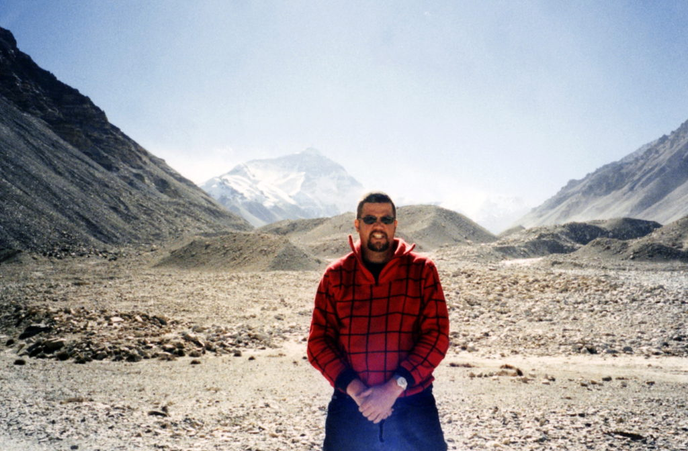
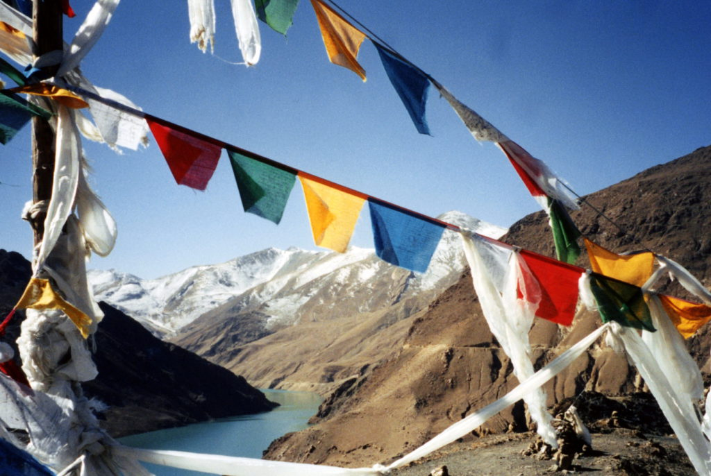

…well, not all of it, of course. Actually, it was the hills right next to Everest. I left Lhasa on a 5-day trip in a Land Cruiser to Nepal. I split the cost of the trip with another American couple that I couldn’t stand by the end of our trip. Our driver barely spoke any English. Our first four nights were spent sleeping in monasteries and temples that we were able to tour and explore. The nights were very cold. No heat in any of the little guest houses that we stayed in. No hot water either. I didn’t take a shower for five days. I would wake up and find the bucket of water in my room completely frozen. It was hard getting into bed at night but once I was under my two blankets I warmed up. On our fifth day we finally reached the Mt. Everest base camp. As soon as our Land Cruiser stopped I hopped out and immediately headed for the big mountain. Everest called to me and I answered. Just myself and another Danish guy who was traveling to Nepal in a separate Land Cruiser.

It was so cold and very, very windy. Base camp sits at about 15,800 feet above sea level. That is higher than any mountain in the continental United States or Europe. It was very hard to breathe as I was walking into the wind. I walked a good distance to a large rock hill and started to climb. Everything is rock and boulder, nothing grows at this elevation. I climbed until I felt my lungs would explode and my head ached. I couldn’t climb any further so I stopped, sat down and buried three photos at the base of Everest. The first was a photo from our 1991 Stefanek family reunion. This was the last reunion that my father and grandmother were alive to attend. I buried them all under rocks and then stacked more rocks on top of them to make my own little shrine. I rested enough to make the long walk back to our Land Cruiser and the small cabin where we spent the night. The drive away from Mt. Everest the next morning was somber. I had put all my energy and excitement into getting there. The very bumpy ride to Nepal was a pain in my ass, literally. We were driving on the Friendship Highway from Lhasa to Nepal. The Friendship Highway is neither a highway nor friendly. How can you call something a highway that is 95% unpaved? We had to cross streams and take detours because parts of it were washed out. It was definitely not friendly either. My body has never been tossed around and jiggled like that before. I could have used a neck brace, but the scenery was amazing. We had many great views of Everest and the Himalayas along the way and we did stop for photo breaks.

_Himalayan Prayer Flags_

The trip out of Tibet and into Nepal was quite an ordeal. In-between the two countries is about five miles of no-mans land. So, myself and six other travelers were let off at the Tibetan border and we had to hitch a ride to the Nepal border. I rode in the back of a very dusty cargo truck. After we finally got our visas to Nepal we had to ride three hours in a taxi to Kathmandu. The taxi drivers pride themselves on being fast and reckless. We were speeding thru the Nepal mountains (Nepal is 75% mountains), passing on blind corners and even passing when other cars were coming at us. They expected the other guy to pull off the road for us. My hands were on the dashboard in a death grip the whole time. Whenever we had a close call our driver would just laugh. After dodging cattle, dogs, chickens, bicycles and people the whole trip I was exhausted by the time we reached Kathmandu. Just inside the city limits we got a flat tire and had to change taxis for the rest of the journey to our guest house we stayed at.  
I really like Kathmandu. Lots to do and see and I can actually watch CNN and read a western newspaper. There are a lot of westerners here, so that means lots of different western foods for a change, a welcome change to the terrible food in Tibet.  
Kathmandu is also very cheap. My shared hotel room with two beds costs only $3.50. I think I’ll stay here for a while and do some trekking and maybe some whitewater rafting. I must say it's so nice to be in warm weather again.

On The Road,  
Andy
