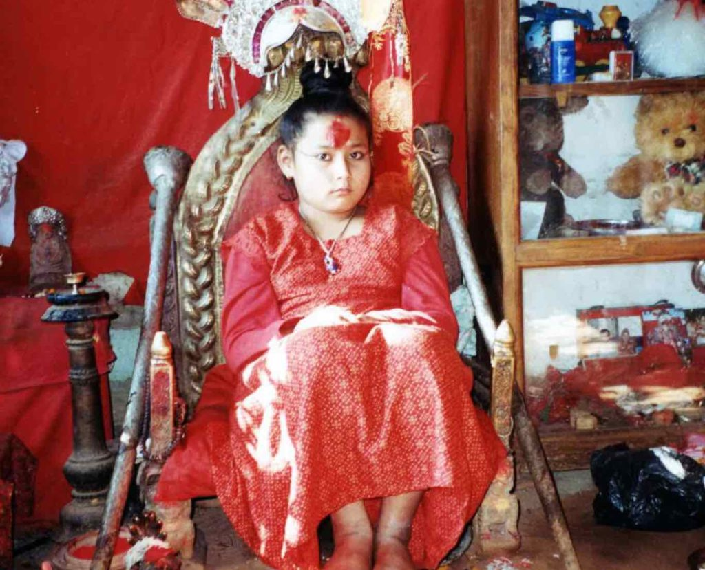
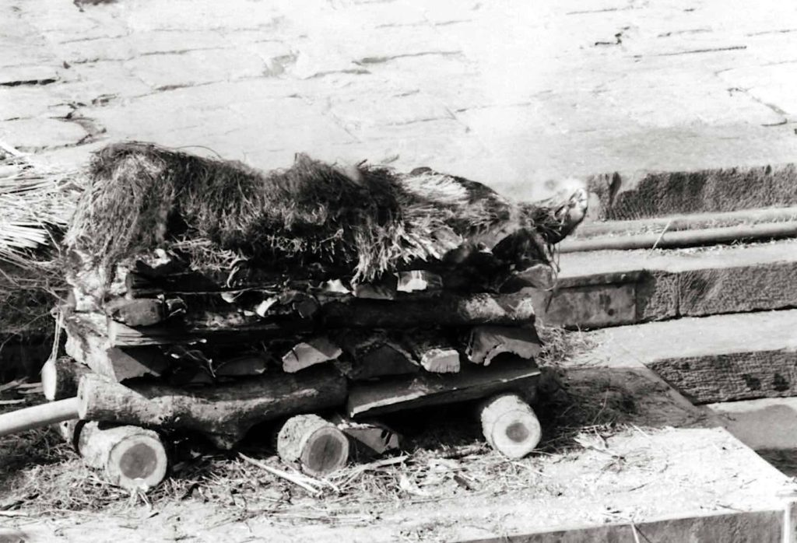
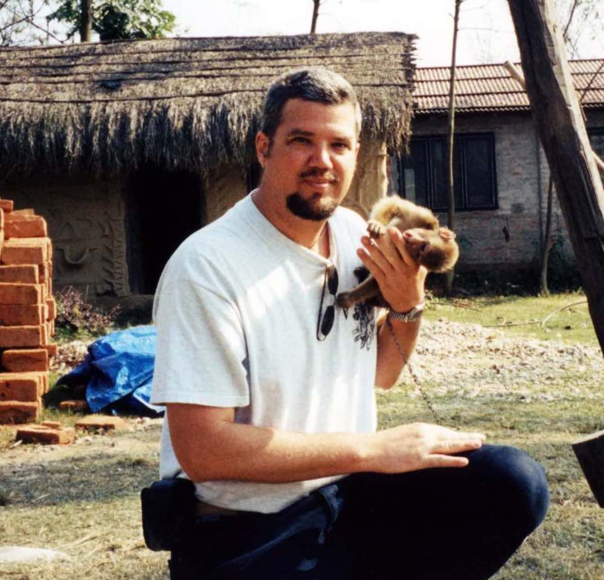
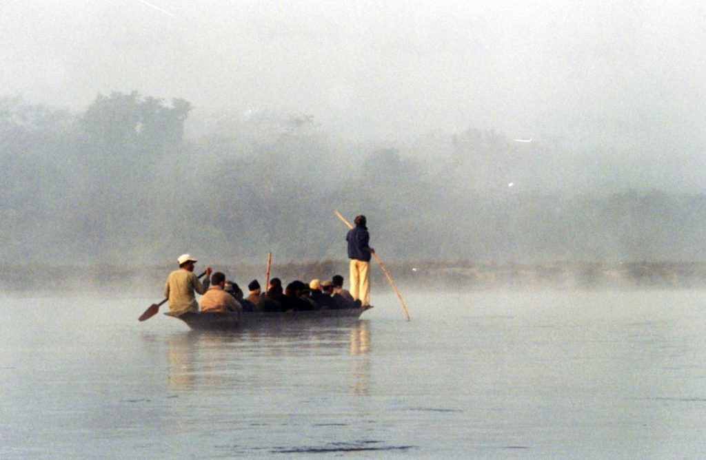
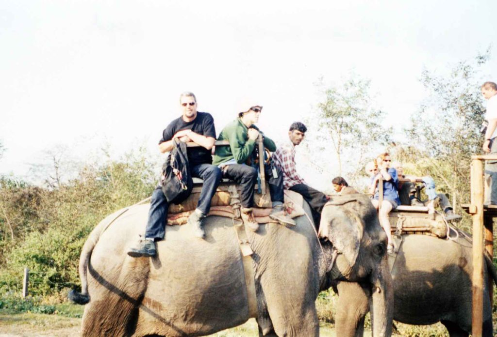
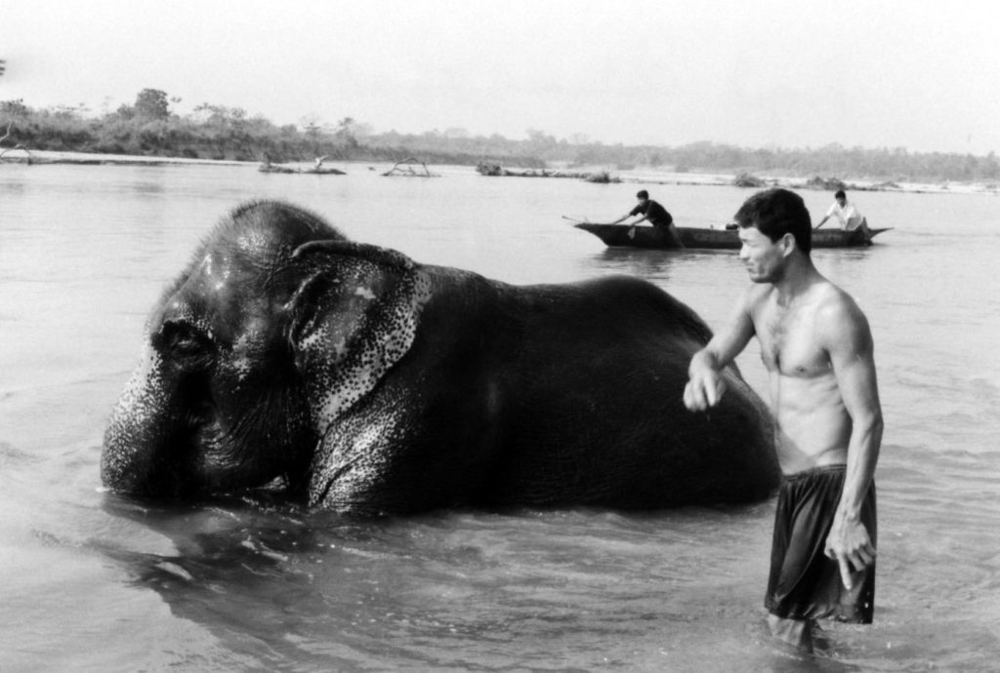
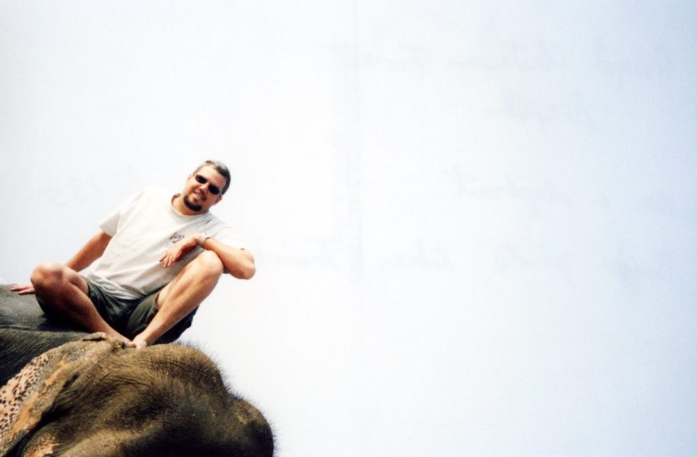
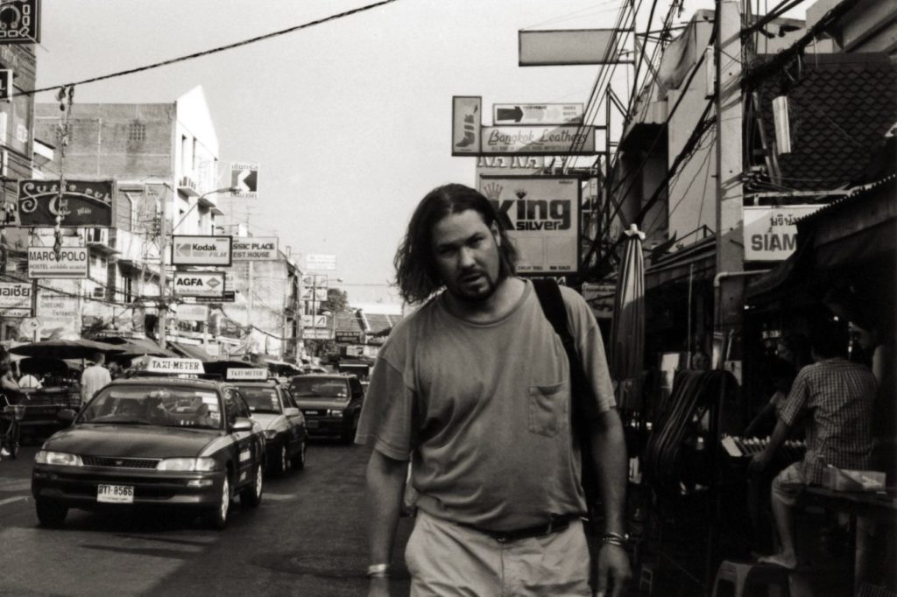
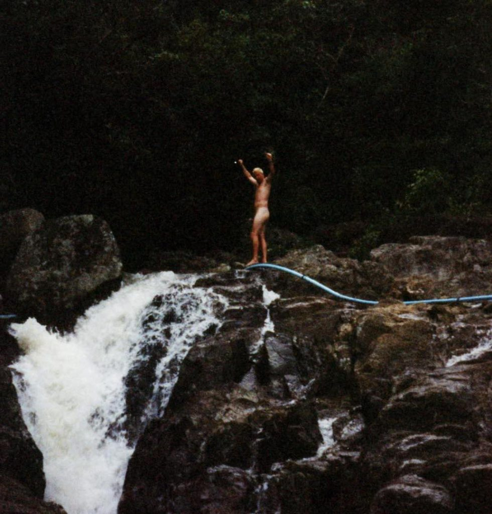
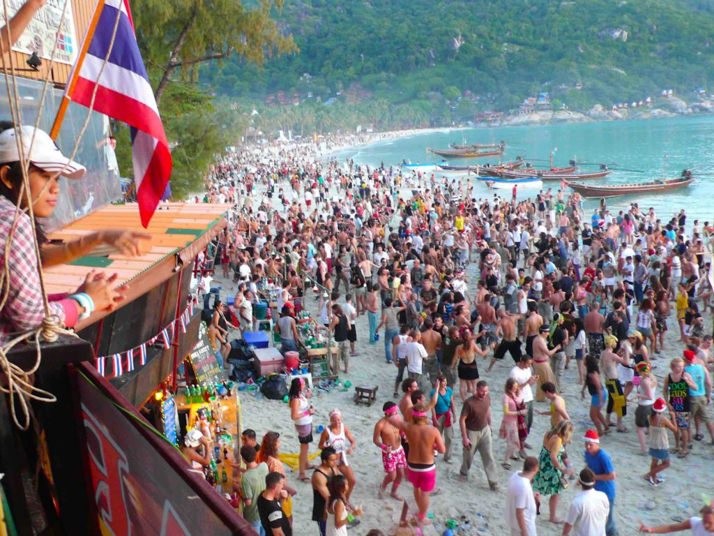

I’m still alive and traveling. When I last wrote I had just entered Kathmandu, Nepal. I stayed in Nepal for two weeks and saw many interesting things. I visited the cities of Bhaktapur, Pashupatinath, Patan and traveled to the Chitwan National Forest in southern Nepal. All three of the cities are very old and historic with amazing city squares full of temples and weird people selling and doing everything. In Patan I went to the house of the KUMARI.

_Kumari of Patan_

She is the living goddess of the city. Only Kathmandu, Patan and Pashupatinath have a KUMARI. A girl becomes a KUMARI at about two years of age and will continue to be the city goddess until she starts menstruating at about age 13 or 14. A KUMARI is not allowed to bleed. The search for the new KUMARI is very involved and painstaking, not unlike the search for the new Dali Lama. She is rarely allowed to leave her holy house, except for celebrations and festivals where she is worshipped with a frenzy. Her feet are not allowed to touch the ground outside her house. She is carried everywhere. I went into her room and sat with her and talked to her mother. The KUMARI doesn’t speak to visitors. It was quite an honor. I don’t think she gets many guests. It seems like a lonely life. I actually feel sorry for her.  
Pashupatinath is a city on a river. That river feeds into the sacred Ganges river in India, the holiest for Hindu’s. On the banks of the river are special cement ghats, where they burn the dead bodies and then sweep the ashes into the river. This was quite a sight to see. I’d never seen a body cremated before. They were lining up to use the cremation ghats. The cremations go on all day, every day. The river isn’t that big, only 20 feet wide and ankle deep. Just downstream a hundred feet or so people are doing their laundry, washing dishes and drinking the water. Some people wade into the water in search of gold fillings that may have been swept in along with the ashes.

_Burning the Dead_

The trip south to the Chitwan National Forest was a nice break from the pollution of the cities. I traveled with some friends I met in Tibet. We were in search of the elusive Bengal Tiger. Our first day there we explored on our own and played with the two-month old monkey that lived at our huts. He would jump all over me and liked to sit on my head and shoulders. He was so cute and fun.

The next day we took a dugout canoe down the river looking for crocodiles. I’m not sure sitting in a wobbly little canoe below the water line looking for crocs is a good idea. We saw a few but they didn’t bother us.

Then we walked thru the jungle and grasslands looking for the Bengal Tiger, rhinos and other wildlife. Again, I’m not sure walking on foot with a guide, without a rifle, looking for tigers is a good idea. There are many accounts of tigers attacking humans. I really did want to see one, though. I felt confident that I would survive. I know I can’t outrun a tiger but I was sure I could outrun my two older friends. We didn’t see a tiger but talked to another guy who did. He said it was scary when the tiger stopped and just stared at them before going off into the thicker jungle. The next day we went on a safari, but this time atop elephants. We rode around for two hours but still no tiger.

The next day as I was lying beside the river getting some sun one of the handlers brought his elephant down to the river for a bath. The elephant just laid there in the middle of the river while his owner scrubbed him with a brush. I went over to take some photos and help out. He asked me if I wanted to climb on for a ride, of course I did. The previous days ride was not as fun as I expected. We had gotten on the elephant by way of stairs and a platform. We rode four to an elephant in a wooden box affixed to his back. Now was my chance for a real ride. I stood in front of the elephant, grabbed his huge ears and put my foot on his trunk. He lifted me right up and I stepped onto his enormous head and then onto his back. I sat on him bareback and rode around for a while. Great fun.

I handed my camera to the handler to take my photo atop the elephant. When I developed my film when I got home I was disappointed by this terrible photo. I also had to laugh, though. He couldn't even get the huge elephant in frame.

After Nepal I flew to Bangkok and hot weather. Since I left Nepal I haven’t worn long pants or shoes (just flip-flops). Bangkok is the gateway to S.E. Asia, so everyone passes thru this city. I have already passed thru here three different times on this trip. All the backpacking travelers come here to decompress after being in the jungles of Burma or trekking somewhere. We all stay in the same place, the famous Khaosan Road. This is where all the bars and parties are. Rooms are cheap and plentiful. Every bar and restaurant blares the newest movies on their TV’s. I just saw CASTAWAY last night. Just walk in, order dinner and watch a movie. Every freak from every part of the world stops by this well-known street. I’ve met quite a few interesting people. After five days I headed down to the island of Koh Phangan in the South China Sea for a few days of sun and fun. Mostly, I went down to reserve a good bungalow for New Years Eve. All the travelers in Southeast Asia are headed to Koh Phangan for their famous New Years Eve party. The island was starting to fill up weeks in advance.

_Cousin Jeff on Khaosan Road_

After four days I flew back to Bangkok to meet my cousin Jeff, who came to visit on Dec. 24th. We Spent Christmas in Bangkok and then we flew back down to Koh Phangan on the 26th. The island was really filling up now and every night was getting crazier and crazier. It was ready to explode by Dec. 31st. During the day we would lay on the beach with all the topless sunbathers or ride our rented motorcycles around the hilly island in search of waterfalls to bathe in.

On a small section of beach in the party town of Haad Rin there is bar after bar and nightclub after nightclub pumping out the techno music and alcohol every night of the week. Everyone dances on the beach or in the shallow surf. At 11:30pm on New Years Eve it started to rain and by 11:45pm is was a hard downpour. I thought, ‘why tonight?’ It hadn’t rained the whole time I was in Thailand. Then Jeff and I got the same idea at the same time (great minds think alike). At midnight we ran from our shelter, stripped off our clothes and ran into the ocean. Nothing like a cleansing baptism to start the new century off in style. We danced and swam and jumped around in our new year's suits. We were hoping that others would follow our example (especially the girls) and join us, but nobody did. That’s OK, they missed out. It was a blast. It was probably my best New Years Eves ever. We danced and partied (with our clothes on) till 5am, when it was time to catch a taxi back to the pier and get on a ferry to the mainland.

_Still partying in the morning on Haad Rin Beach_

From there we got a flight back to Bangkok and another room on Khaosan Road for two days until Jeff flew home on Jan. 3rd.  
Today is my last day in Bangkok so I finally did some sightseeing. The Emerald Buddha and the 150 foot long reclining Buddha are both worth seeing. Tomorrow I fly to Calcutta, India for the culture shock of my life. I’ll spend about a month traveling thru India and maybe into Pakistan and Bangladesh. Then back to Bangkok to head into Cambodia, Laos, Vietnam, Burma and other parts unknown.

On The Road,  
Andy
