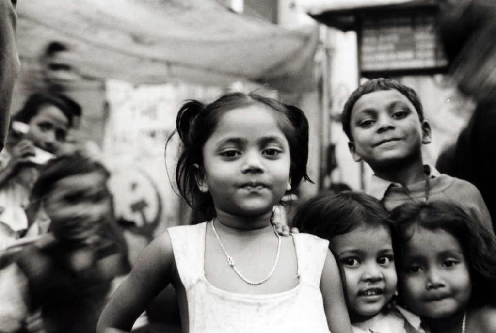
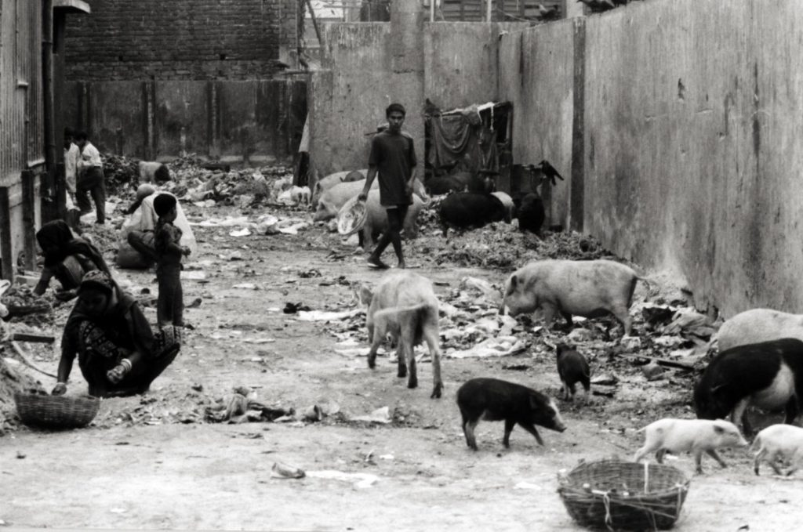
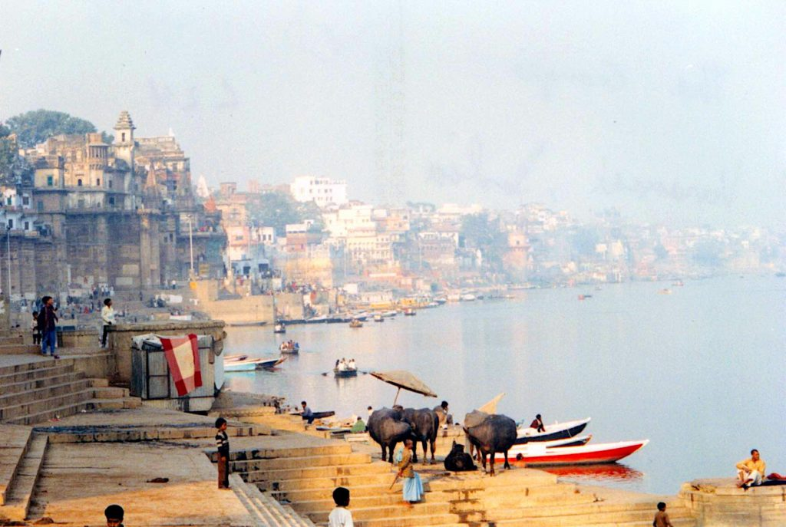
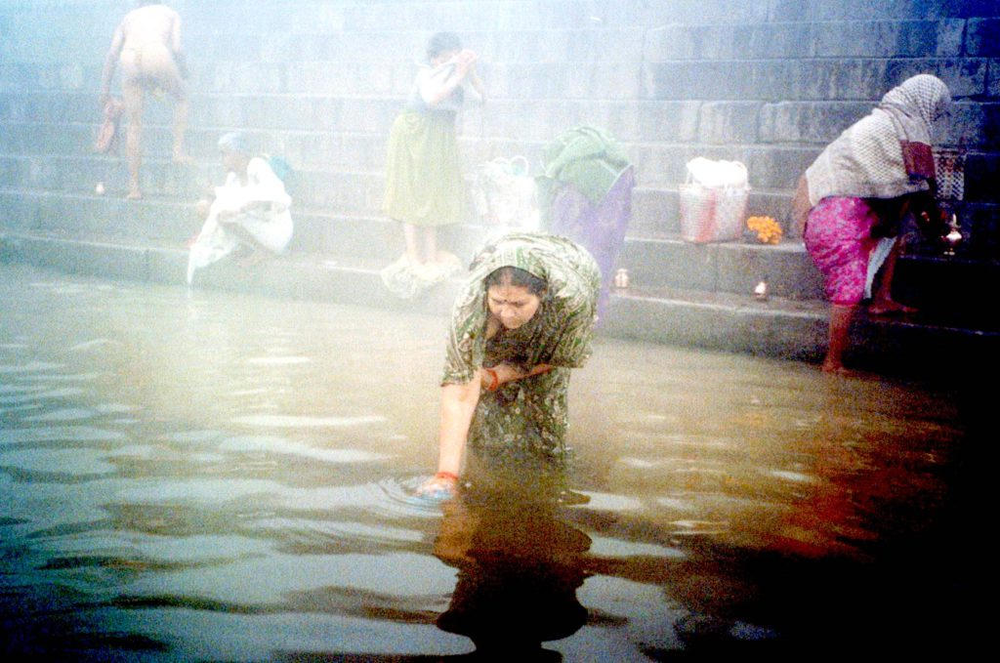
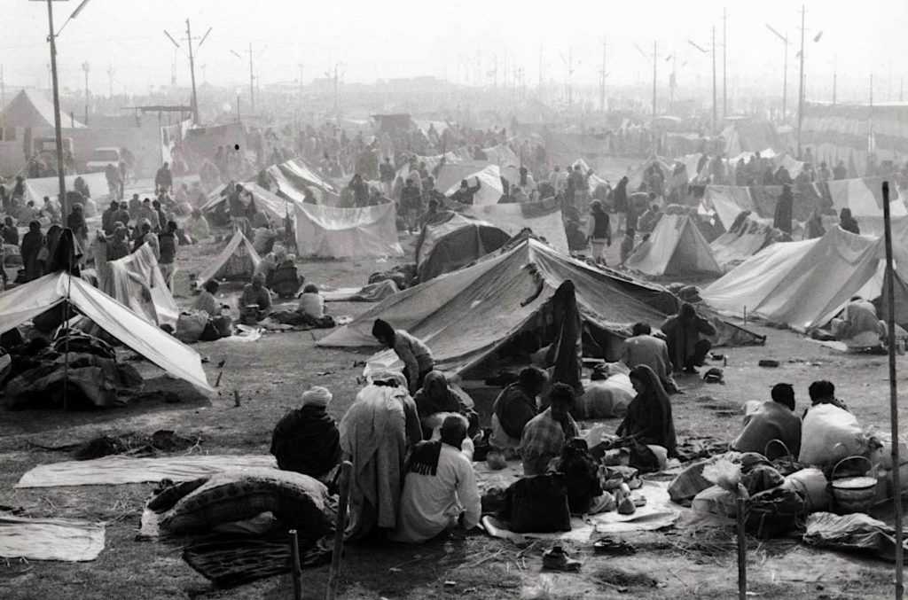
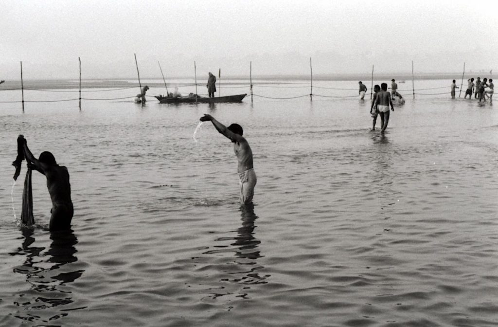
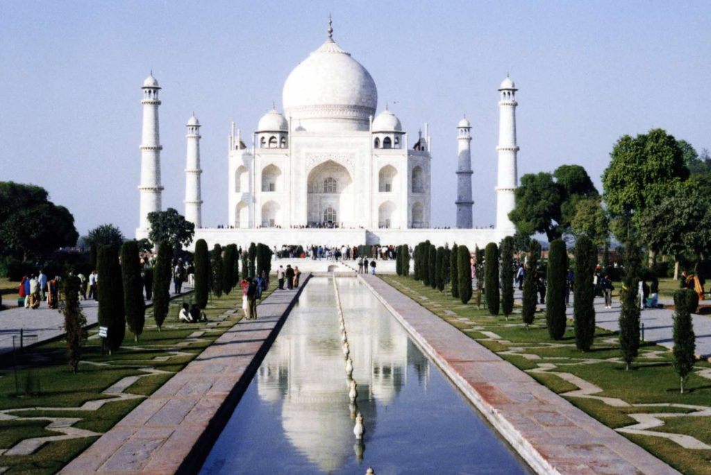

Oh, Calcutta! What a crowded city you are. Over 16 million people are living here. I expected to see hundreds of people sleeping in the streets. I wasn’t expecting to see thousands of families doing it. Calcutta’s most famous slum is called ‘City of Joy’, but I did not see a lot to be joyful about. As a photographer, I did spend a lot of time there though, it made for great photos. The faces of the children were unforgettable as they played in the heaps of garbage alongside the dogs, goats and pigs. Yes, pigs were wandering through the downtown streets, if you can call them streets.

_Street Kids_

_Street Pigs_

Needless to say, this is one polluted city. The streets are filled with taxis and buses blowing billowing plumes of black diesel smoke. Sometimes its hard to see more than a few blocks ahead of you. Calcutta is not without its fascinating parts, though. It is the last city in the world with hand pulled rickshaws. For .50 cents I took a few rides instead of walking. I felt bad because most of them are barefoot and life expectancy for a rickshaw puller isn’t very long.  
The Hindu’s in India are religious fanatics. I guess that’s all they have in life. I went to the Kali Temple early one morning to witness the goat sacrifices. Everyday they sacrifice about 20 goats and then feed them to the poor. The first goat was just a baby. They stuck his head into the stocks and with one swift blow of the sword it was all over. I kept my eyes on the head. The eyes rolled around a bit and the mouth kept opening and closing as if it was trying to scream but there were no lungs to push any air. The next goat was a large one. This time I kept my eyes on the body. When the blow was delivered they yank the body back near the drain so all the blood can flow down it. Then after ten seconds or so they grabbed it by the legs and drag the body away but the headless goat wouldn’t stop kicking. I had seen enough so I left. I also left Calcutta.

The next city I went to was the very holy city of Varanasi.

_Ganges River in Varanasi_

The Ganges River runs through the city and is very wide at this point. It is said that if you die here and are burned on the ghats along the river then you will break the cycle of reincarnation and finally go to heaven. So, all the old, sick and dying travel here from all over and wait to die. Along the river are the burning ghats. Stacks and stacks of firewood lay at the ready. The fires can burn 24-hours a day if the dead bodies are backed up waiting. The poor, priests and babies do not get burned so their bodies are just dumped into the river. It is not uncommon to see dead bodies floating down the river, although, I didn’t witness any. The river is so polluted and diseased that I’m surprised that anything can live in it, but I did see many large freshwater dolphins swimming about. Everyday, all day, people are bathing, washing dishes, doing laundry and even drinking from the river.

I’m sure that would be enough to kill most westerners. I did take a sunrise and sunset rowboat ride on the river. In the early morning the temperature was only about 40 degrees but the river was still full of people. I don’t know how they do it.

The next city I went to was Allahabad. I hadn’t planned on going here but when I heard about the MAHA KUMBH MELA Festival was going on I just couldn’t keep away. This is the holiest of all Hindu festivals. It happens only once every 12 years and this year was the 12th one, which makes it even more special and holy. So, this biggest festival happens only once every 144 years when the planets are aligned in this formation. The last regular one was in 1989 and it set the world record for the largest gathering of humans at 13 million people. I’ve heard estimates that this one may top 40 million people. If the largest human gathering in the history of world is gonna happen, I gotta be there! Sangam is the name of the place in Allahabad where it all takes place. This is the place where the Ganges, Yamuna and the mythical underground Sarawati River all join together and the Ganges continues. They say that one dip into the river during the festival and a whole lifetime of sins are forgiven.

_MAHA KUMBH MELA_ Camping

_MAHA KUMBH MELA_ _Bathing_

Many celebrities are coming to the big event including Madonna (she may need to bathe for a week to atone for all her sins), Richard Gere, Demi Moore, Sharon Stone and others from all over the world. A huge tent city has been erected for all the pilgrims. It looks like a very large refugee camp. Masses of people are just sleeping anywhere they can find a flat piece of ground. I even saw one lady sleeping on a large pile of rocks. There are a few days during the month-long festival that are the holiest bathing days. I was there for the second holiest day and will try to return for the holiest day, Jan. 24th. I walked five miles from town (no vehicles allowed) to the Sangam at midnight to see if people were bathing yet. I was told that it all begins at 7am. I was too tired to walk back to town so luckily I met an Indian family that had a thatched hut near the river and they invited me to spend the night in their hut and go to the river with them in the morning. It was a cold night and I froze but it was better than walking to town and back. We all went to the river with millions of others and got into the river. I only went in up to my knees. It was too cold and too polluted for my taste. So from my knees on down I’m sinless. It was quite a sight to see so many people bathing at sunrise. I’ve never seen so many people in all my life. The rest of the day was spent celebrating with food, music and parades.  
Today I arrived in Agra. I got here just before sunset so I rushed from the train station with my three cameras and started clicking away at the TAJ MAHAL. I will go inside tomorrow. I’ve walked completely around the outside and scouted the best photo positions for the best sunrise shots tomorrow. I’m sure I’ll spend many rolls of film. The TAJ MAHAL is my main reason for coming to India. I’ve been fascinated by it since I was a little boy when my grandmother used to tell me about her visit here to see it in the 1950’s. So far it’s everything I dreamed and more. I’ll let you know what the inside looks like later.

On The Road,  
Andy
