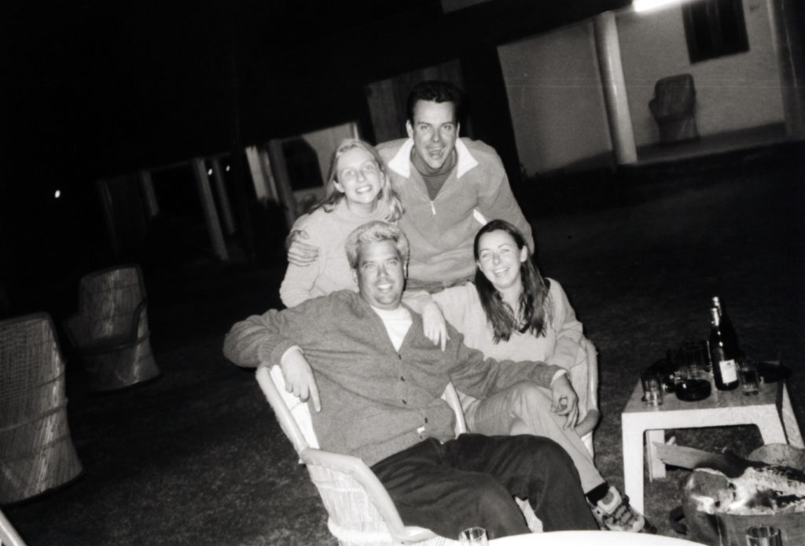
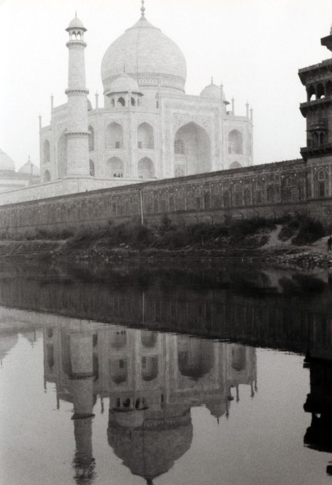
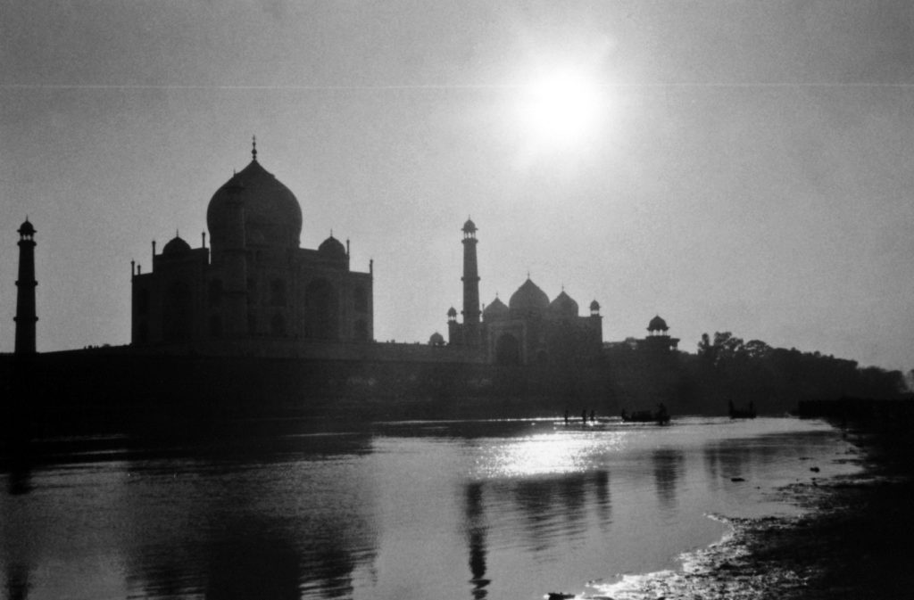

…the Bengal Tiger. I am bound and determined to see a wild tiger. I have seen every other animal in the wild and the tiger is the last on my list. So I headed to Ranthambhour National Park to see if I can see one of the 30 or so tigers that live there. It was nice to get out of the bigger cities again and relax in nature. I signed up for the three-hour afternoon safari. We were all in an open top Canter, which is a truck that seats about 20. I grabbed the front seat for myself. If a tiger wanted to get in the truck it would be very easy, in fact we heard stories of how a tiger had jumped into one and carried off a child. True or not? I’m not sure. We headed into the park with our eyes pealed and our hopes high. We saw many different kinds of wildlife including jackals, parrots, wild boars, spotted deer, blue bulls and many others. We came across a jeep that saw a tiger near a watering hole so we raced through the forest to the spot. No tiger, already gone. Dejected, we carried on. I asked our guide when was the last time he saw a tiger, he said “five days ago”. Now I’m really disheartened. After driving around a while we headed to where the tiger was spotted earlier. We came over a hill and there she was, walking right across our path and up a hill. A large female about eight feet long. We all got our cameras out and fired away. She was less than fifty yards from me. After she disappeared over the hill we all let out a huge sigh of relief. Some of the other people with me have been trying to see a tiger for longer than I. We drove off and then ten minutes later we saw another tiger. It was also a large female but a different one. Two tigers in one day. The guide told us how lucky we were. We celebrated that night with a big campfire and lots of beers.

_Me and my fellow tiger searchers celebrating our successful day_

The Taj Mahal in Agra, India was a huge highlight. I walked all around the monument snapping photos from every angle. The inside was small, dark and held two tombs. The inside was not as impressive as I’d always imagined it to be, but the outside, WOW.

I have decided not to go back to the KUMBH MELA for the holiest bathing day. Although, a few people have suggested that I might need to go back and bathe in the waters a little deeper this time, one person suggested that I need to bathe at least above my waist.  
I am in the state of Rajasthan now. It is in the N.W. desert part of India. I was in the city of Jaipur, which was very nice and offered lots of shopping. Today, I am in Udaipur. Udaipur is famous for having the James Bond movie OCTAPUSSY filmed here. They have a white marble palace here that rises straight out of the middle of a lake. I am going there by boat for dinner tonight. I have been a strict vegetarian since arriving in India. I am trying to be the first person I know and maybe the first westerner to go through India without getting food poisoning or any other food ailment. Meat and unclean water is usually the cause. I’ve got a pretty strong stomach. I was one of only two people out of twenty-five who didn’t get sick when I was in Africa three years ago. Tomorrow night I head to Bombay (Mumbai), the movie making capitol of the world. India makes more than twice as many movies as America.

On The Road,  
Andy
