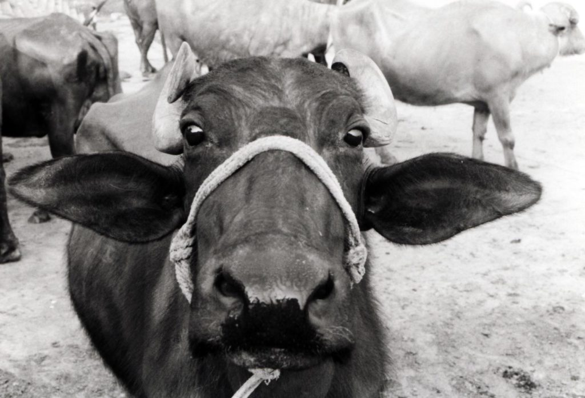

As long as I’ve been in India, I still can’t get used to the free-roaming cows. These animals are holy and not to be bothered. I’ll be walking down the sidewalk minding my own business and here comes a big Brahma bull with huge horns passing me by. They are like dogs here. They just go about their business ignoring the people and eating out of the trashcans. The people don’t pay any attention to them either. They lie in the middle of the street and make the cars and scooters go around them.

India is like that, though. You can see things here that you never see in any other country. I was walking home one evening about midnight and I turn the corner and almost run into a huge painted elephant in the middle of the city. The guy riding him stopped at a street vendor and bought some food and took off, never getting off the elephant. An Indian drive-thru.

You see beautiful women in their colorful sari’s and face jewelry next to the poorest, most crippled beggars. Riding on the train in the morning, a most common sight is to see men AND women squatting along the tracks and ditches doing their morning business. These are only a few of the contradictions that make up the beautiful and harsh life of India.  
After Udaipur, I jumped a train to Ahmedabad and waited for my connecting train to Bombay. I had thoughts of staying in Ahmedabad but decided that I needed to keep moving south. Less than 20 hours later the earthquake hits, with Ahmedabad receiving the most death and damage. They are saying now that they expect over 100,000 dead. The government is importing hundreds of tons of wood to burn all the dead before the decaying bodies cause nasty diseases. Bombay is a big city full of movie stars and jetsetters. This is where the real rich of India live. Bombay even has nightclubs and discos. For the first time in India I went to a nightclub and had a few beers. That’s why I slept through the 8:30 AM earthquake that most of Bombay felt. After two days I headed south towards Goa.  
Goa is a small state three-fourths the way down the western Indian coast on the Arabian Sea.

_Women beach vendors are always trying to sell me something of give a beach massage_

Goa belonged to Portugal until 1961, the last territory to be given back to India. For this reason, it is largely Catholic and the buildings are in the Spanish/Portuguese style. It was also a major stop on the 60s and 70s hippie trail, along with Marrakesh and Kathmandu. Of those three cities that I’ve been, I’d say that more hippies have stayed here than anywhere else. I still see lots of gray haired ponytailed old men on the beach with their hippie chicks. They are still searching for enlightenment at the many ashrams that still dot the area. The weather suits them. They all arrive here for the winter and lay on the beaches all day until it gets too hot, about mid March.

_Paddle ball is a favorite beach activity_

Then they head to northern India into the mountains where it’s a lot cooler for the summer. Not a bad life if you can afford it. It’s really cheap here so most can afford it. A nice, big, old Spanish style house on the beach cost about $300 a month. I first went to Benaulim in south Goa. It’s small, less touristy and cheaper. I spend my days laying out and swimming in the ocean and my nights at beach hut restaurants with bonfires. I met up with German friend Inge who I’d traveled thru Tibet and Nepal and a few other friends. We’d meet in the mornings for days of leisure and nights of fun. At one of our friends hotel the owners were celebrating their 25th wedding anniversary. Our friends invited us to crash it with them. What a great time! All the beer and food we could ingest. The guests were all dressed up in suits and gowns and us travelers were in shorts and sandals. We stood out but were made very welcome.  
After a few days we headed to the north Goa town of Candolim. It’s larger and more expensive, relatively speaking since I’m still only paying about $3 a night for my room. There are also a lot more hippies here and package tourist from Germany and Britain. The oversized old European women like to lay around topless and the men wear G-string bathing suits. Not a pretty sight, but fortunately, there are plenty of younger topless women to divert my attention. I will stay here a week or so before heading further south to really hot weather.

On The Road,  
Andy
