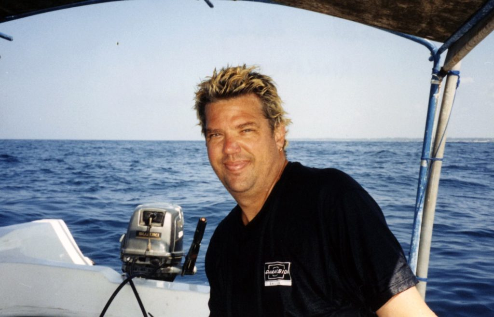
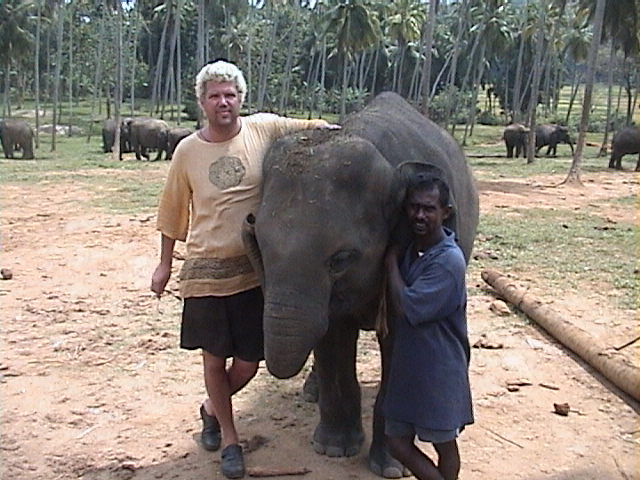
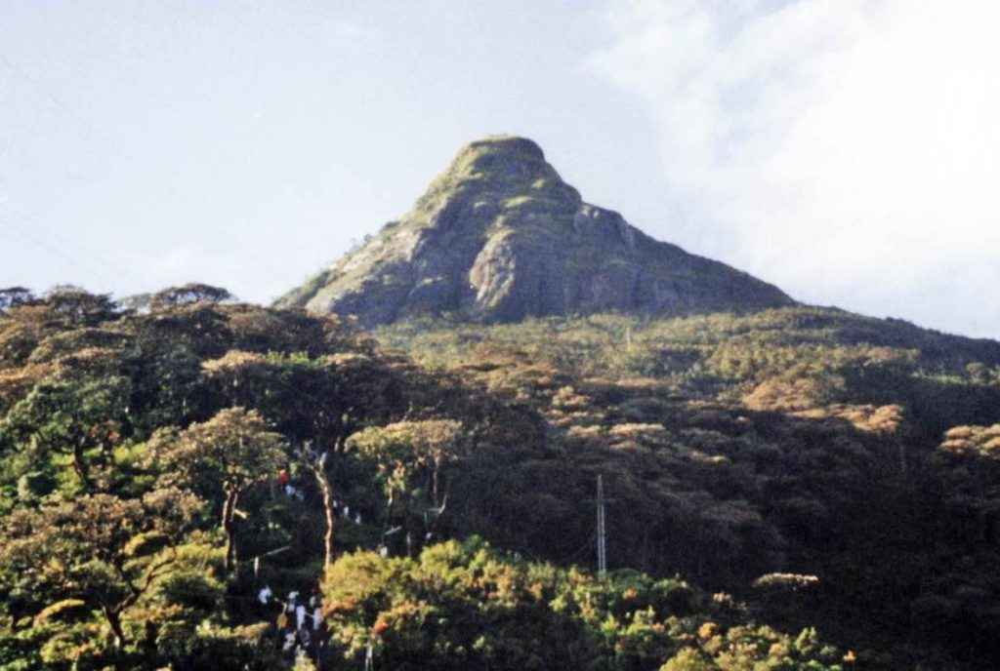
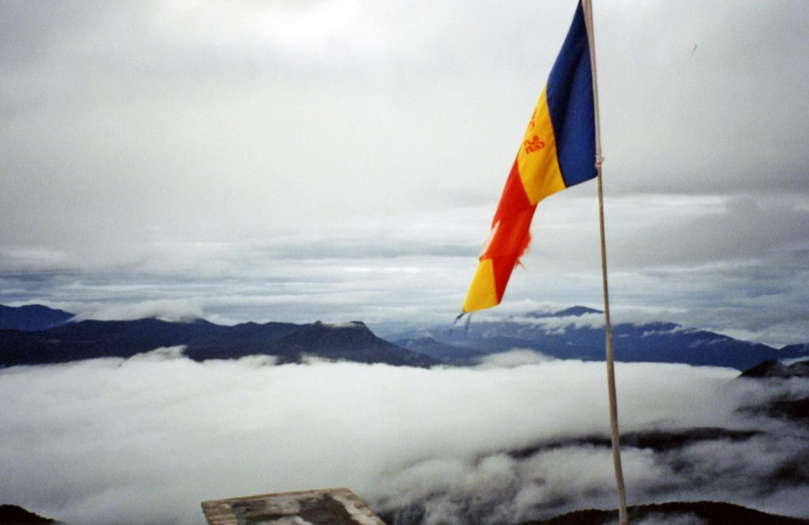

When our story last left off, I was heading further into south India and into Kerala. There, I took a boat cruise through the famous backwaters of Kerala. Instead of taking the boat all the way to the end city, I got off early at an ashram to spend the night. The guru is one of the few female guru’s in India. Her name is Amma and she’s known as the 'hugging guru'. Over a thousand people a day wait in line for her warm embrace and kind whispers she places in each ear. When I said I didn’t want a hug her devotees all looked at me as if I’d just turned down a date with Julia Roberts. As soon as I walked into the place I knew I was in trouble. I felt as if I was in Guyana with Jim Jones. All the followers walk around in their white robes with blank faces and vacant eyes. They do a good job of brainwashing at these places. Don’t worry, my brain left as dirty as it came in. I put on my loudest, brightest, most colorful shirt to see if I could get a reaction. Nothing. These gurus have all settled in India selling consciousness expansion without ever giving a thought to the grim realities that lay ahead for all these people who take them seriously. All these pathetically eager followers who think they can buy peace and understanding for five dollars a day. A generation of permanent cripples and failed seekers who don’t understand the essential old mystic fallacy of the guru culture, the desperate assumption that their guru is tending the light at the end of the tunnel. I could write for hours on what I saw, but I won’t.  
After my 24-hour self-imposed incarceration I headed further south on the next boat I could find to Trivandrum and jumped on a plane to Sri Lanka. My plane touched down in the capitol city of Colombo. I didn’t even stop to eat before hopping on a train headed down the west coast to the beach town of Hikkaduwa.

I scuba dived inside a 100-year old shipwreck and snorkeled with huge sea turtles. I swam behind a group of three large turtles that were at least five feet long but very agile in the water. They didn’t mind when I touched their shells but didn’t like it when I grabbed their feet.  
Further south, some new friends I made and I stayed inside the walls of an old Dutch fort in the coastal city of Galle. In the center of Sri Lanka we trekked into one of the few rainforests left in the world. We crossed rope bridges and relaxed under waterfalls. Just outside the city of Kandy we went to an elephant orphanage. Lots of cute babies were being fed out of huge milk bottles. It was strange hanging out with elephants that were shorter than me.

Next, I’m off to a place called Adam’s Peak.

It has been a pilgrimage center for over a 1000 years. The huge footprint at the top is said to have belonged to Adam or Buddha or Shiva, depending on which religion you believe in. We started our climb at 4am in order to see the sunrise from the peak. The peak sits at 6675 feet. I walked the five miles of mostly steps to get to the top. It took me two and a half hours and I think I shed 10 pounds but I did it. I could have made it faster but there was a logjam of people trying to reach the summit with me. We are above the clouds for sunrise. It was a beautiful sight to see the sun rise through the clouds. The walk down was no picnic. I’d sooner join an ashram than make that pilgrimage again.

_Sunrise from above the clouds on Adam's Peak_

My last day and night in Sri Lanka were spent on the beach in Negombo. I flew back to India for one night before heading back to Bangkok. I will brag that I made it through India and Sri Lanka without getting sick or having any stomach issues. I could be the first person ever, I think. I can chalk it up to not eating any meat, street-eats or drinking the water. I really didn’t miss eating meat that much in India because their food, especially the curries, are excellent. That being said, the first thing I did when I got to Bangkok was eat a Big Mac.  
Now, I’m back in Bangkok and deciding what to do next. Much of my plans are up in the air and I’m in a quandary at what to do.  
Oh yea, the Thai prison. I have a friend from S. Africa who emailed me about two unfortunate Nepali guys who are serving a life sentence in a Thai prison for drugs. It is quite common for Thai police to set up unsuspecting poor people in order to get reward money. The reward money increases in correlation with the amount of drugs caught on the person. The Thai courts say that “the police are our friends and therefore would never lie.” I know what you’re thinking, all prisoners say they are innocent. Have you seen the movie BROKEDOWN PALACE? People sympathetic to the Nepali prisoners cause are working for their release, but the courts and government work very slowly. Since these guys have been sent up the river then that’s where I will have to go to visit them. I boarded the taxi boat to go up river to the notoriously brutal prison. I was only allowed to visit with one of the Nepali prisoners. I passed all security checks and went inside the prison to visit the 28 year old Nepali. He spoke very good English and I was surprised at how upbeat and friendly he was. For eight years he has lived in a 6’x12’ cell for sixteen hours a day with twenty-one other prisoners. That’s cramped. He is partially deaf in one ear from the beating he received from one of the guards. We talked for an hour and I bought him some food and supplies from the prison store. This made him very happy since he rarely gets visitors. My friend from S. Africa that visited him last year was his first and only visitor until I showed up. I don’t know for sure if he’s guilty or innocent but a life sentence in a Thai prison is harsh. Anybody need a prison pen-pal?

On The Road,  
Andy
