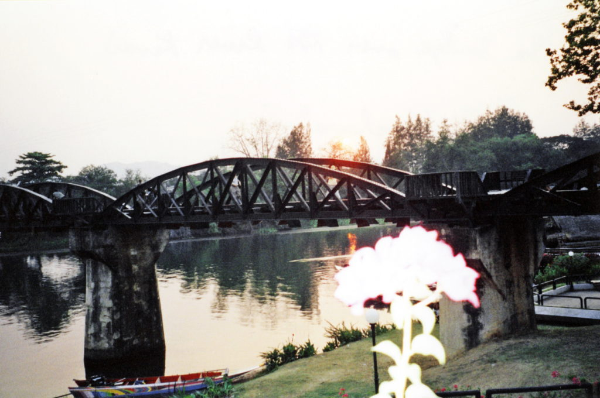

Bangkok can get a bit hectic so I used the time I had waiting on my Cambodian visa to get out of town and into a smaller city. I decided to go to Kanchanaburi. Most of you probably haven’t heard of this town but you’ve all heard of what’s here. This is where the Bridge over the River Kwai is located.

_Bridge on the River Kwai_

It’s only a three-hour bus ride from Bangkok. I slept in a great little guest house that actually floated on the river. I took right to the small town peacefulness. My first day I got up early and went to the Erawan seven-tiered waterfalls for a brisk cold water swim. Then I took a long-tailed boat up the river to an elephant preserve and rode thru the forest bareback on my elephant. Then laying down on my bamboo raft, I floated down stream and headed to the railway station.

I got on “The Death Railway” near where a large number of the 100,000 local laborers and Allied prisoners of war died trying to finish a particularly hard part of the track. There is a cave there that is used as a shrine to those that died. I rode for an hour until I got to “The Bridge.” We slowly crossed it as many tourists took our photo. You can actually stand on the bridge next to the tracks as the train passes by. During the World War II, engineers predicted that it would take five years to construct the bridge, but the Japanese forced the POW’s and local laborers to complete this vital section of the 260 mile railway in just sixteen months. Tens of thousands died from disease, starvation, torture and exhaustion. The Allies destroyed the bridge in December 1945. 
The next day I went to the JEATH War Museum (Japanese, English, American/Australian, Thailand, Holland). The museum stands in a hut modeled after the those that housed the POW’s and tells the story of the Death Railway. I also visited the cemetery where most of them are buried.

Back in Bangkok, I caught a flight to Phnom Penh, Cambodia. My main reason for coming to Cambodia is to see Angkor Wat and all the surrounding ruins, but I found something even more moving here. First, I traveled to Siem Reap, which is near the small town of Angkor. I had to take a five-hour boat trip up river from Phnom Penh to Siem Reap. I rode on the roof of the over-crowded boat.

I didn’t want to be caught inside in case it sank. It had only small windows and no life vests. Besides, I could work on my tan (I got burnt). I spent one and a half days exploring the ruins and could have spent one and a half years. They are enormous. These ruins are called the ‘Jewel of South East Asia.’ The biggest jewel is Angkor Wat.

In fact, it is the largest religious edifice in the world and one of the ancient wonders of the world. It is about 1000 years old and took 30 years to build. The reliefs that surround the outer wall are the longest in the world. They are incredibly detailed, as are all the thousands of statues and stone carvings inside. I wandered around fifteen other different ruin sites scattered about the 40 square mile radius.

Some were well preserved and others were almost eaten up by the jungle. It was like a scene from RAIDERS OF THE LOST ARK. I felt like Indiana Jones as I explored the ruins mostly to myself. The task of restoring them is like putting together a jig-saw puzzle with no pictures as a guide. After a few days I was exhausted and took my boat back to Phnom Penh.

By far, the most moving thing I’ve seen on my trip is here in Phnom Penh, THE KILLING FIELDS.

The Killing Fields and the Tuol Sleng Genocide Museum are a reminder of man’s inhumanity to man. They warn you before you go that it isn’t for the faint of heart. I’ll give you the same warning. Stop reading now if you don’t want to hear details of what I saw and learned. When Pol Pot’s Khmer Rouge came to power in 1975 his first order was to empty out all the cities and relocate everyone to the countryside. Two million people left Phnom Penh to work in the fields 18 hours a day and eat nothing but rice, porridge and water. He said he was trying to transform Cambodia into a completely self-sufficient agrarian utopia. He declared it YEAR ZERO and all vestiges of pre-revolution society were to be eradicated, including schools and religion. Democratic Kampuchea had no need for professionals, doctors, teachers or artists. Anyone affiliated with the old regime met their deaths in the Killing Fields. He killed anyone with an education and those who wore glasses because they seemed to look intelligent. Your duty was not to think, but only to work. Thinking was a one-way ticket to the Killing Fields. He molded the young children into sadistic torturers and killers. They were taught to kill their parents, relatives and friends. The children in turn taught the next generation of youngsters to torture and kill. When the next generation was ready, they tortured and killed the group that had just taught them. It was a vicious circle. Nobody lasted very long. They seemed to torture and kill everyone without reason, just for the pleasure of it. What useful information could poor peasants farmers have? They were tortured anyway. The Tuol Sleng Genocide Museum is a powerful glimpse into the horrors of the Pol Pot regime. It is a former high school turned into a torture chamber. It has been largely untouched since it was discovered in 1979. Over 20,000 people were tortured and killed here, only seven are known to have survived. Large rooms were divided up into tiny cells. Prisoners were not allowed to speak or move without permission. The classrooms had bare metal cots that the prisoners were strapped to, then electrocuted and beaten. Above each cot was a photo of some poor tortured victim. They documented everything. Before your time was up, you were photographed and your family history was recorded.

Then you were photographed again after you were dead. The photos of these poor dead souls are everywhere throughout the school. The look of hopelessness and despair on their faces is heart wrenching. The tools and implements of torture are still lying around. Paintings depict the torture as it’s happening. Ripping off of fingernails, dragging behind motorcycles and drowning in washtubs are just a few of the scenes depicted. Photos of when they first discovered the Killing Fields and all the mass graves are displayed. Hundreds of skulls formed a large Cambodian map in one classroom. This place made me sick.

_Prisoners were strapped to this metal bed and electrocuted_

Ten miles outside Phnom Penh are the actual Killing Fields. It is just a large field with a few trees scattered around. In the center is a forty-foot tall large Buddha Stupa (shrine) to commemorate what happened here. It is filled with thousands of human skulls, all victims of ‘Brother Number One.’ The field is full of large pits which used to be mass graves. Some pits are surrounded by a fence and describe what was found inside the pit. One pit has a large tree next to it. The sign on the tree describes how it was used. The men would grab the babies and small children by their legs, swing them so their heads smashed against the tree and then were thrown into the pit.

Bullets were too expensive to be wasted on victims. They used hoes, shovels and sticks to beat victims over the head and then throw them into the pit. If you weren’t killed from the blow then you were buried alive in the mass grave. We were shown the palm trees from where they would take the stiff branches with serrated edges that they used to saw heads off. There was no mercy for anyone. When Pol Pot took power in 1975 the population of Cambodia was seven million. When he was defeated in 1979 the population was four million. What kind of mad ruler tries to kill off all his people? In a few more years there would have been nobody left to rule. I have been to the concentration camps of Auschwitz and Dachau in Europe but what I saw here is much worse. Even after Pol Pot was forced out and in exile the American government persisted in recognizing the Khmer Rouge as the legitimate government of Cambodia. The American philosophy was that "any enemy of our enemy must be our friend". Since Cambodia was also also an enemy of Vietnam then they must be our friend. That’s embarrassing. Pol Pot was never brought to trial and died of natural causes on April 15th 1998. Before he died he declared his conscious cleared to an American journalist.  
This all happened less than 25 years ago…

On The Road,  
Andy
