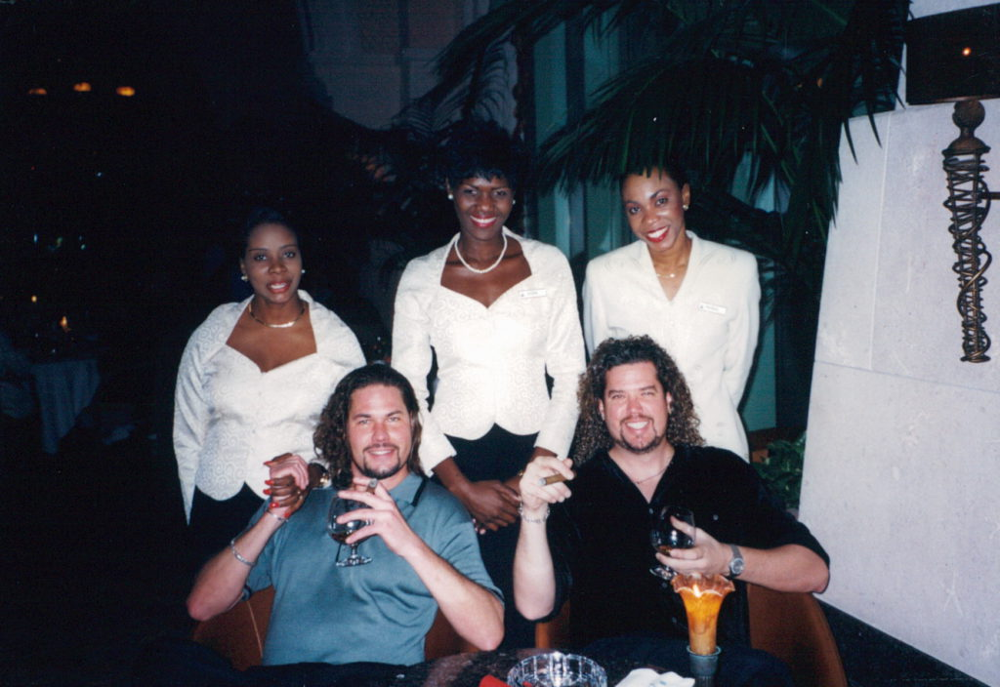
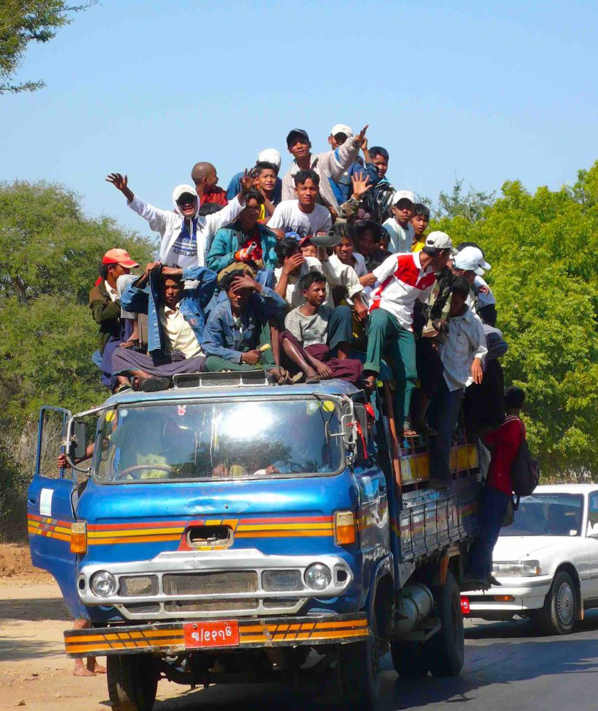

I have written this letter because many people have asked me “how do you do it?” or “what’s it like to travel by yourself for so long?” I hope this answers some questions and explains the process.  
What is a traveler and what is a tourist? The three main differences between the two involve time, companionship and money.  
Tourists know they will be tourists for a week or two. They have a return ticket home. Travelers usually don’t know how long they will be traveling and don’t have a return date in mind. They will usually be gone, at the very least, three months. I met one girl from Denmark who left home at 19 and four years later she just went home. Another guy I met was going to travel for three months and seven years later he still hasn’t made it back home. Tourist have an exact destination and they have an itinerary of how long they will be at each place and usually what they will do when they get there. Travelers have no plans and no itinerary. They go to places on whims and stay as long as they feel like it. When they get bored or have seen everything they want to see, then they move on. Travelers are nomads. I can spot them from a mile away. They dress different, look different and act different.  
The second difference is companionship. Tourists almost never travel alone, travelers almost always do. Just because I always travel alone doesn’t mean I always travel alone. I will travel with different people I meet for a period of time. When our travel desires differ, we say goodbye and keep in touch by email. Many times we will meet up again in a different part of the world. I traveled with a great older German lady through Tibet and Nepal. Two months later we met up again in India. I usually never travel with Americans. I can see other Americans when I get home, besides there aren’t that many American travelers. I prefer to learn about different people from different countries.  
The third difference is money. Tourists are looking for ways to spend their hard earned money and travelers are looking for ways to save it. This is why tourists and travelers don’t mix well and don’t hang out together. My cousin and I took a tourist trip to the Bahamas over Christmas one year. We ate at nice restaurants and gambled in the casinos.

I had five days to spend all the money I had allotted myself for this vacation and I was going to spend it all if it killed me. As a traveler, I try to squeeze every penny, centavo and sen out of every dollar, peso and ringgit. My price range for nightly accommodations is from less than a dollar, up to ten dollars. I get very upset if I have to pay more than that. Lots of times I stay in dorm rooms. That means I may share a room with from 5 to 50 people. I rarely have my own bathroom and as of now I haven’t had a hot shower in over a month. Good thing it’s hot here now. In cold Tibet when I had no hot water, I didn’t shower for a week. In India my shower consisted many times of just a bucket of water. I usually do my laundry in the sink. I learned a new trick on this trip. If I take a bucket into the shower and put my clothes and soap in it, then I can stomp on my clothes in the bucket while taking a shower. Multi-tasking.

  
Most travelers take the mass transit with the locals. We will ride on top of the bus to save an extra .50 cents. We are hard bargainers when it comes to paying for things. I’ve walked miles instead of paying an extra dollar for a taxi or rickshaw. I know what the locals pay and I refuse to pay more for the same service or good. I will not be taken advantage of. I’ve got more time than money. Every dollar or two I save is an extra day I can stay on the road. Travelers do more extreme traveling. Fifteen-hour bus rides or 24-hour train trips are normal. We don’t mind hiking 4 or 5 hours into the jungle to see some ruins or swim in some waterfall.  
Travelers are always trading with each other; books, clothes, information. We tend to read the same kind of books. Books about travel (Kerouac’s ON THE ROAD), places we are visiting (CITY OF JOY, THE BEACH), or philosophy (ATLAS SHRUGGED, THE CELESTINE PROPHESY, NIETZSCHE). I never return with the clothes or books I left with. I’ve had to adapt to the different climates I’ve traveled through. I give clothes to the poor, sell them or trade them. In a bar in Turkey a few years ago I traded one of my shirts for two beers. I had just come from northern Europe and didn’t need my long sleeve thermal shirt anymore.  
Most importantly though, we trade and share information. We let each other know where to go, what to see and the best places to stay. We tend to all stay at the same cheap hotels, hostels and guesthouses and hang out at the same restaurants and bars. We warn each other of tourist traps and local scams. When I was in India I was told of a jewelry scam that was pulled on an Aussie. When they tried the same scam on me I was ready. I got the best of them. The scammers took me out and spent money on me to gain my confidence. I took it all. Then when they tried their scam I said “no thank you” and walked away.  
There are two books that are our bibles, either LONELY PLANET or LET’S GO, depending on your preference. These are the books for those who travel on a shoestring. They are a wealth of information for the budget traveler. Everything we need to know about a country or city is in the book, from where the ATM machines are to where the best place to cross the border into the next country is. We’d be lost without them.

On the Road,  
Andy
