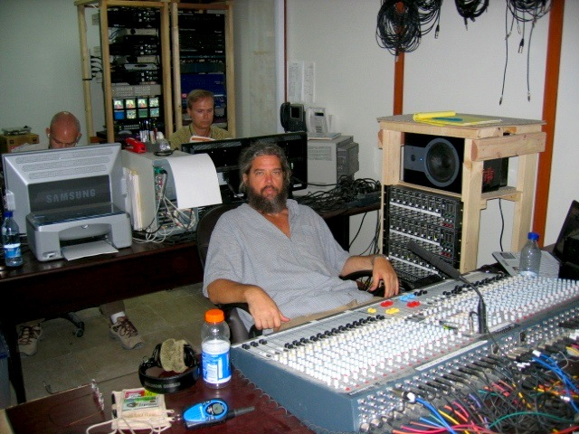
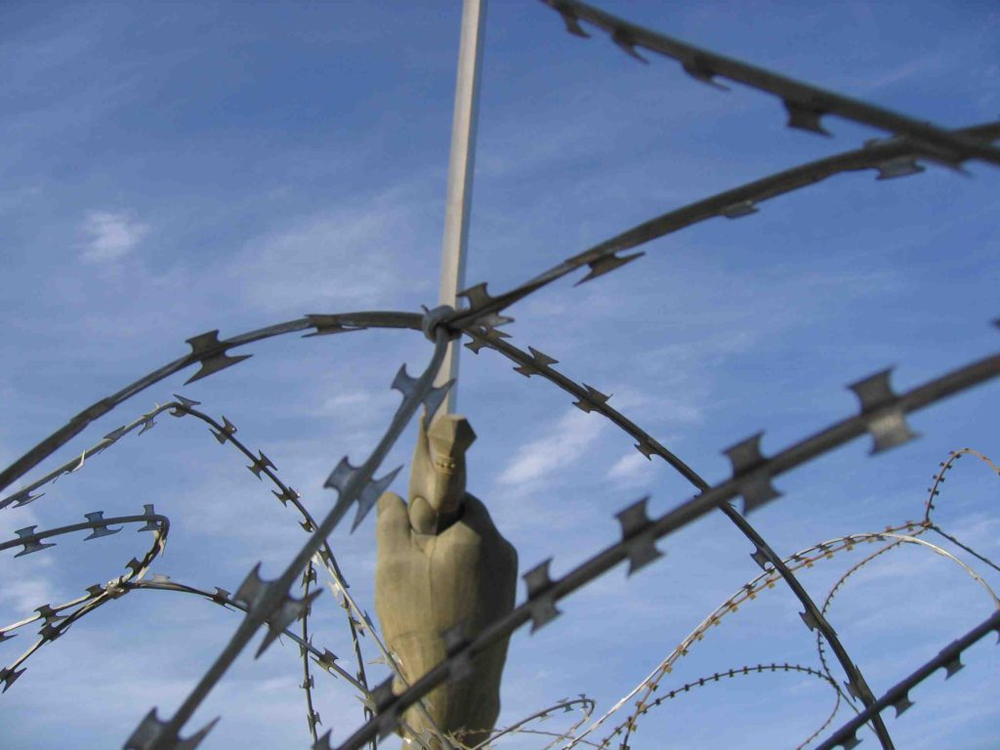
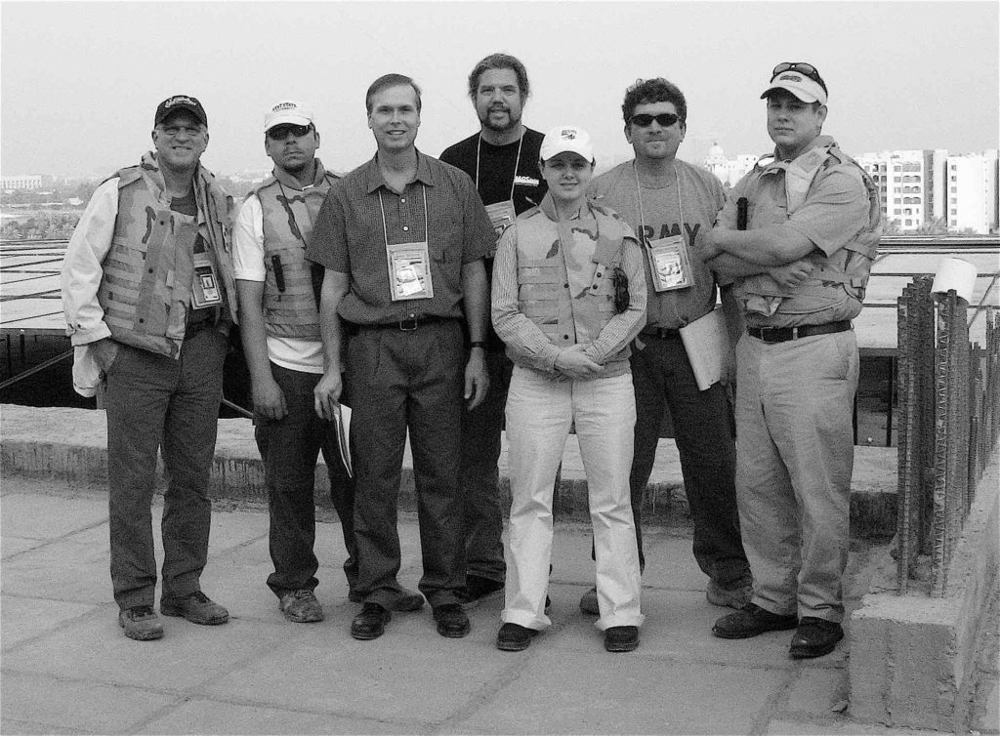
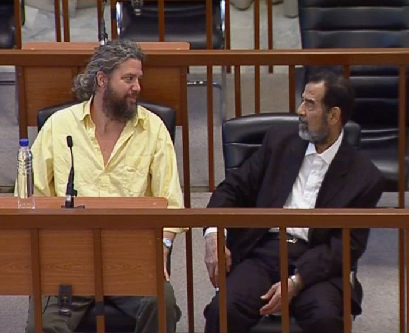
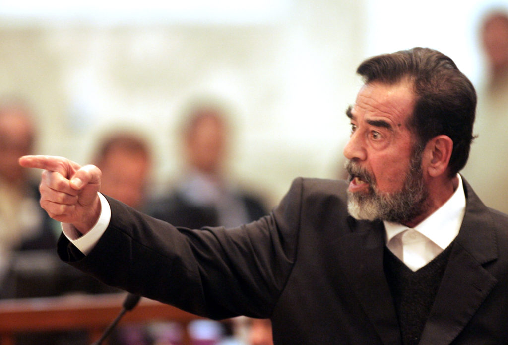

It's Xmas afternoon and I just ate my big meal. I'll wait till chow is  
about to close at 8pm and go eat it again. It's the best meal of the  
year (so I'm told). I don't think I want to be here a whole year to find  
out. My "mission" (that's what I'm supposed to call my job as Sound Mixer for the trials of Saddam Hussein for world TV and Radio) has ground to a halt for the next month. We won't resume till Jan. 24th. I've been here a month and a half and we're only had 6 days of court. The pace is killing me. I've been told that when we resume we are going to go full steam ahead. That still only means 4 days a week. They are afraid that the world is losing interest. They don't want that ("they" meaning Pres. Bush). The time off here is the hardest part. I would rather be at the "office" (that's what we're supposed to call our control room) working.

_Another day at the "Office"_

At least it would give me something to do. There is nowhere to go and nothing to do here. My days consist of laying in bed reading as long as I can and then getting up only in time to get lunch before it ends at 2pm. I walk a half mile to the palace to eat and then get on the computer and email and read the news. I often log onto the "surf-cam" near my house in Cocoa Beach so I can see what my beach looks like. I miss it. Then back to my hooch and do laundry, read some more or watch TV. I work out at the gym 3 day a week. Then I wait for dinner and back home to watch TV. I live in about a one square mile area that I can't leave. The green zone is about a 4 or 5 square mile area but there is nothing to do or see in most of it. Before, this area was the jewel of Baghdad with lush greenery and fountains. The military has come in and destroyed it all. Now it is all brown dirt or mud, cement barricades and razor wire. You cannot find any grass here at all.

They try to have activities for us to do but nobody attends them. I went to join a flag football pick-up game that was scheduled but nobody showed up. Nobody even brought a ball or the flags.

I ask myself all the time "why am I here?" Two reasons I guess. The first one is FREEDOM. Not in the way most of you would think. I'm here for my freedom. Unfortunately, I have to put myself in this jail to achieve it. The money I make over here buys me freedom and lots of it. I get paid whether I'm working or not over here. I'm getting paid to just be here no matter how many days I spend at the "office". After I get done over here I can travel the world for 10 years if I want and pay off my house. If I stay the whole three years, that some say it may take to get through all the trials, I may be able to retire. I don't know if I could take it that long, though. I don't know if Iraq could take it. They may decide to hang Saddam after he's found guilty in the first trial. Many people here want him dead. Many are still afraid of him. The good part is that I can take a break and always come back here for more freedom. If I want to go home for a while or travel through Europe or Asia for a bit I can. Since I was part of the first crew here I get my choice of when I can come and go.

_We dubbed ourselves "The Mercury 7"_

Our group of six did all the work setting up and getting everything going so we get first choice of shifts. Our boss in the States would prefer that we stayed the whole time because of the nightmare of traveling in and out of this country.  
He's the one who has to pay for and figure out all the travel logistics. It's such a burden to him that he's offered us incentives to stay the whole time (new Harley motorcycle). It's temping but I don't think I can make it. I'm already hoping to get away to Dubai for a week or so during this break. The second reason I'm here is HISTORY. What I'm working on here will be seen for hundreds of years. When I'm watching A&E or the History channel, when I'm old, and they talk about Saddam they will show part of my work. Just like when they show scenes from the Nuremburg trials on TV some old guy probably yells at his TV set "I did that".

I'm lucky to be part of something so historic. I'm proud of the work we're doing here. Our whole crew is doing great under all the restrictions and pressure we are under. If someone's face or name gets seen or mentioned on TV who doesn't want to be seen, that person could die. It happened to some of the defense lawyers before we got here. We have lots of restrictions on who can and can't be seen and who's names can't be heard on TV. This brings me to another point that I can't talk about while using a government computer. Censorship. As most of you may know, the world does not see what we see. The TV broadcast is on a 30 minute delay. All I can say (and I probably can't say this) is that a lot of editing can happen in 30 minutes. We've also had a few closed court sessions that the public is not allowed to see.  
I do have a touch of the holiday blues. I don't want you to think that I haven't had any fun since I've been here. I have good days and bad. The food has been pretty good but I'm getting bored with it. They can only cook so many things and I've been through the rotation a few times already.  
I hope I don't get in trouble for anything I've said in this email. I haven't earned enough freedom yet.

On The Road  
Andy

_Former Iraqi President Saddam Hussein gestures during his trial held under tight security in Baghdad's heavily fortified Green Zone, Sunday, Jan. 29, 2006. The Iraqi High Tribunal convened Sunday for the eighth hearing of the trial of Saddam and seven co-defendants, accused in the 1982 killing of more than 140 Shiites after an assassination attempt against the president in Dujail. New Kurdish presiding judge, Rauf Rashid Abdel Rahman, who was not a member of the five-strong panel trying Saddam but part of one of the court's other committees, took over from Rizkar Mohammed Amin who resigned earlier this month. (AP Photo/Darko Bandic, Pool)_
