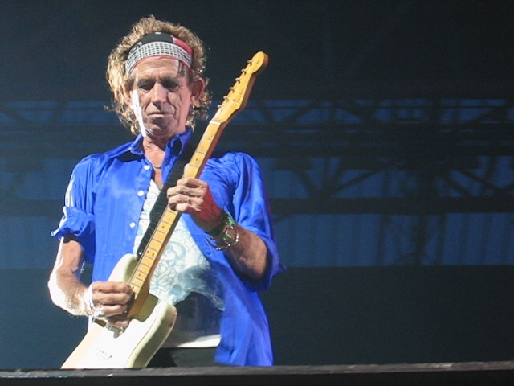
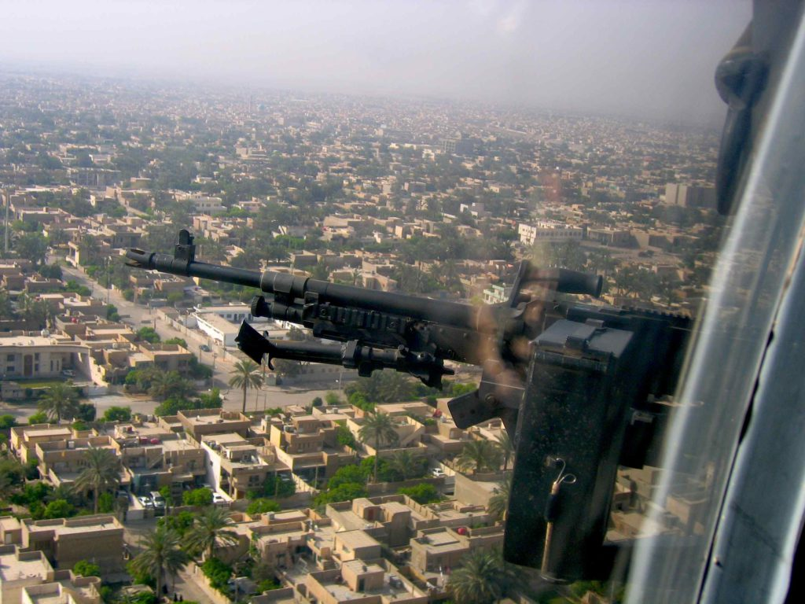
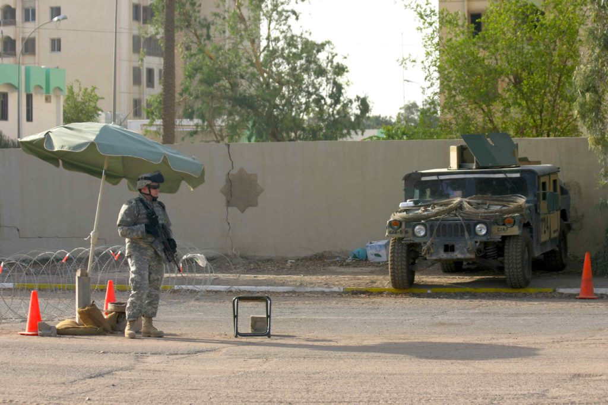
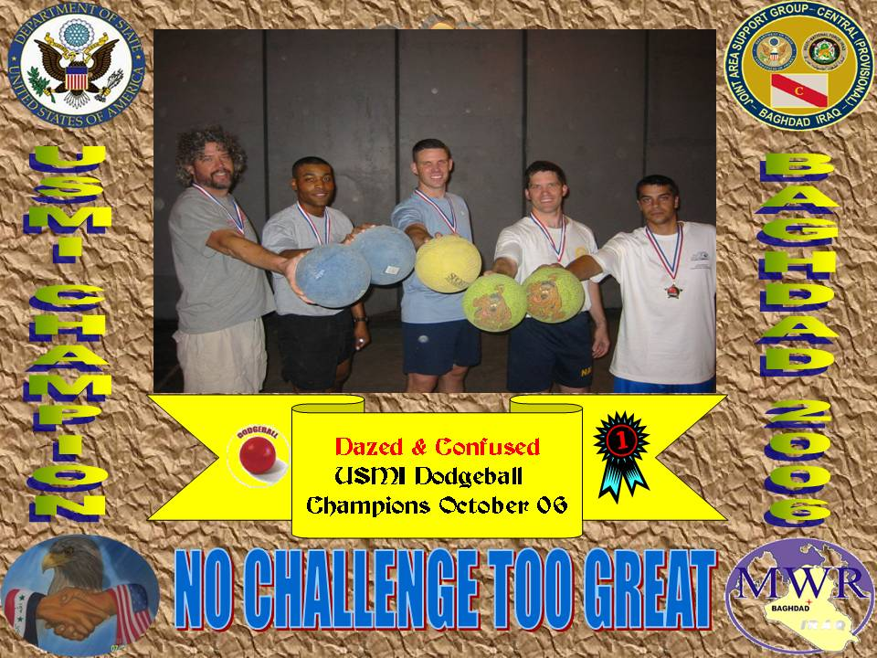
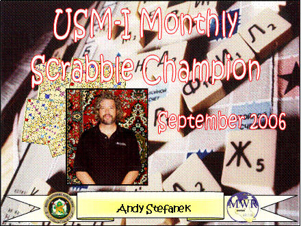
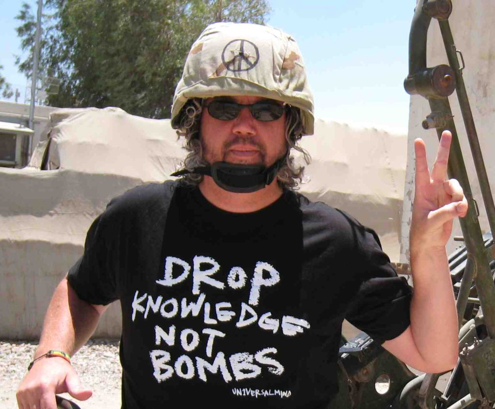
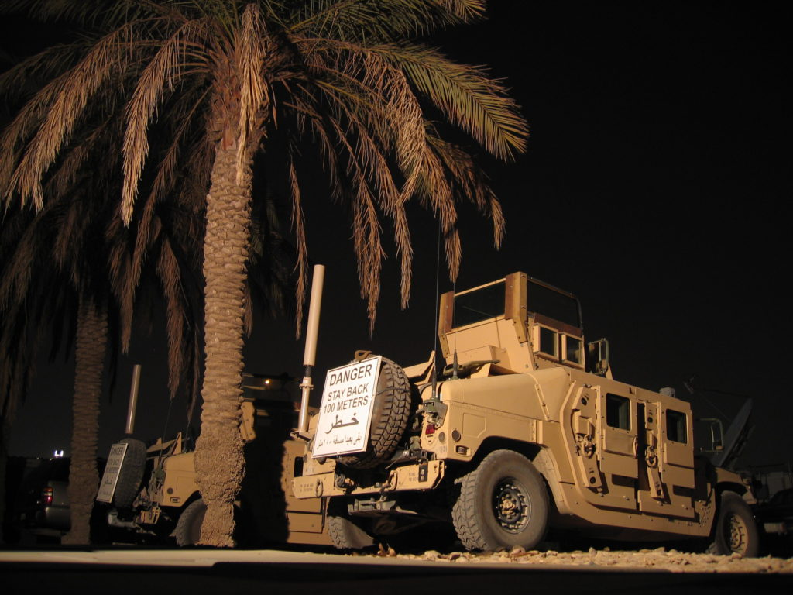

I have been back in Baghdad for seven weeks now but it seems longer. I went back to the states to visit family and friends in Dallas, attend a family reunion in Myrtle Beach, South Carolina and do my taxes and relax at home in Cocoa Beach. I was away from Iraq for 47 glorious days of much needed R&R. I didn’t get to see everyone I wanted to but I tried to see as many as possible. It was GREAT to see the people I did see. Thank you to my Dallas friends and family for their eight days of hospitality and good times. I also drove over to Tyler for a nice visit with my mom. The day after I arrived in Cocoa Beach my sister and her family stopped by for a three day visit on their way to moving to Key Biscayne from Connecticut. It was perfect timing on their part as I was able to take her kids to see the space shuttle launch on July 4th from inside the NASA grounds. It was my first shuttle launch also and we were within a few miles. Two days later I was on my way to Myrtle Beach for the big Stefanek family reunion and I couldn’t have had a better time. It was so good to see all my relatives and catch up on everyone’s lives and see the new additions. A big “shout out” to everyone that was there and to those that couldn’t make it. Thanks for making it so fun. I’m already looking forward to the next one. Back in Cocoa Beach I was visited by a couple of great friends but I pretty much did nothing but enjoy the beach and relax for the next eleven days. Being home makes me appreciate what I’ve got there and reminds me of why I’m working in Baghdad. I want to pay off my house completely. My only debt now is my house and when that’s paid off I want to live a completely debt free life and work as little as possible. I can see my future and it involves lots of travel and time on the beach. I just have to stick it out and make it happen.

After my 35 days in the states was over (I couldn't stay longer for tax reasons) I wasn’t quite ready to go back to Iraq so I headed over to Amsterdam for two weeks. I’ve been there a few times before and always loved it. Great history, art, people and sights, but mostly I went there to see the Rolling Stones again.

_Keef in Amsterdam_

I’ve seen the Stones probably 15 times and I challenge anyone to go see them and not have a great time. They always put on a fantastic show. I stayed with a friend of a friend I knew from my travels in Sri Lanka. I also stayed at a few other hotels in different parts of the city. I really got to know the city, away from all the tourist spots. I hung out with more locals in their local hangouts.  
I had one day to relax at the very posh Hilton in Kuwait before my military flight into Baghdad. As I was sitting on the curb at 2 a.m. waiting for my ride to the air force base all I could thing about was “I can’t believe I’m going back there”. It goes without saying that the flight and transport into the green zone was horrible. It always is.

_Flying over Baghdad in heavily armored Blackhawk Helo_

Even the Blackhawk helo ride wasn’t fun this time, the novelty has worn off. It’s hot, loud and we were packed in too tight. I actually think going home has made it harder for me to be here again. The taste of freedom was so sweet that it has made my experience here more bitter. I find the food harder to eat and the heat (140 in the sun) more unbearable. There is no ocean breeze here. The longer I am here and the more I talk to the soldiers, the more I am convinced that this war is a mistake. I haven’t talked to a single soldier that believes in our cause here. They are dejected and all just want to get out of here and go home. The only ones that want to stay are the contractors because we are all getting well paid while the soldiers get paid very little. I read and hear about the deaths all the time. I talk to a few of the local Iraqis and their life is not better off. Most still do not have electricity or water. Try to imagine living on the tenth floor of an apartment building in the 125-degree heat with no AC or water. It is no wonder they all hate us. I think I might hate someone who did that to me. It is not safe for locals to go outside anymore. Every day they are finding more and more bodies tortured and dumped in the streets (today they found 40). I have a friend here who has the job of photographing the bodies they find. I told her I didn’t want to hear any more of her stories about how they found bodies that were tortured and killed using power tools. These people are determined to torture and kill each other and there is nothing the US forces can do about it. It is getting worse, not better. We are losing this war on terror.

That being said…I am trying to make my life here as enjoyable as possible. I have made many new friends but it’s difficult at times cause once I make a friend it seems that they get shipped out or go home. It has ruined my nightly poker game (and my extra income). Now, I find myself playing beach volleyball most nights. They finally put sand in the court, covering up the rocks and dirt that was there before. I have made good friends at the Italian embassy and go there often for parties and dinner. They are such a fun group of people. They have built their own brick pizza oven. It’s the best pizza I’ve had outside of Italy. I was invited to a very nice sit down dinner at their place last Saturday night and had a great time. The military does organize activities to do during our off time. I am playing in a volleyball league now. I played on the championship dodgeball team last month and am the current scrabble champion.

They have salsa dance night every Saturday night and there is a bar open one night a week within the palace complex that many people go to in order to have a few drinks and socialize. There are two parties that I’m going to tonight (a goodbye and birthday party). Last night I attended what I like to call “scary-oke”. It is so surreal to watch soldiers get up on the large outdoors stage in full uniforms and rifles and sing show tunes or Elton John, usually badly. I try to do as many activities as possible to keep busy.  
The temperature has dipped into the low 100’s during the day and it’s started to be comfortable to be outside during the day. Before I know it the rainy and muddy season will be here. I still struggle with the military and the arbitrary rules they try to enforce. I’ve almost been kicked out of here a few times for not following the rules that I don’t like. Those who know me know that I don’t like to follow rules, especially dumb ones. One rule I don’t like to follow is signing in every time I go to the chow hall to eat. The government pays Halliburton $35 for every signature on that sheet. That’s too much, especially if I only enter to get a bottle of water. I usually try to sneak past the sign-in desk but if they catch me then I only pretend to sign in. I figure I’m saving the taxpayers $100 a day. (of course, if they intercept this email and read it then I’ll be kicked out for sure. So don’t forward this email to anyone that could get me into trouble). I also walk around wearing anti-war T-shirts and I put a PEACE sign on my helmet. I get some dirty looks from soldier and have been told that many are unhappy with me displaying such anti-war slogans, but I don't care.

The first trial has ended and the verdict will be announced at the end of October. In the meantime, we are one month into the second, of what may end up being twelve trials the Iraqi Special Tribunal has designated for possible trial. The other ten are under investigation or waiting investigation and may or may not come to trial. This “Anfal Campaign” trial has to do with the persecution and gassing of the Kurds in the north. Witness after witness takes the stand and tells of family members who died and how they suffered. Some estimate that as many as 182,000 were killed. They are trying to move this trial along faster than the last one but it’s not going smoothly. The first judge has already been replaced because he proclaimed that Saddam wasn’t a dictator. That made a lot of people mad because he was seen as pro-defense. The new judge has been there three days and he has kicked Saddam out of court all three days. All the defense lawyers have already walked out and quit in protest. Yesterday was an especially exciting day when all the defendants starting screaming and shouting and demanded to be kicked out also. The judge wouldn’t let them leave. He finally had to give in when he couldn’t restore order in the court. We are now on a two week break so the defendants can find new lawyers who will probably only walk out on the first day in protest of something else. That is their favorite stall tactic. We all just sit there and laugh at the absurdity of it all. How much money is this costing the American taxpayers, again?

On The Road,  
Andy

