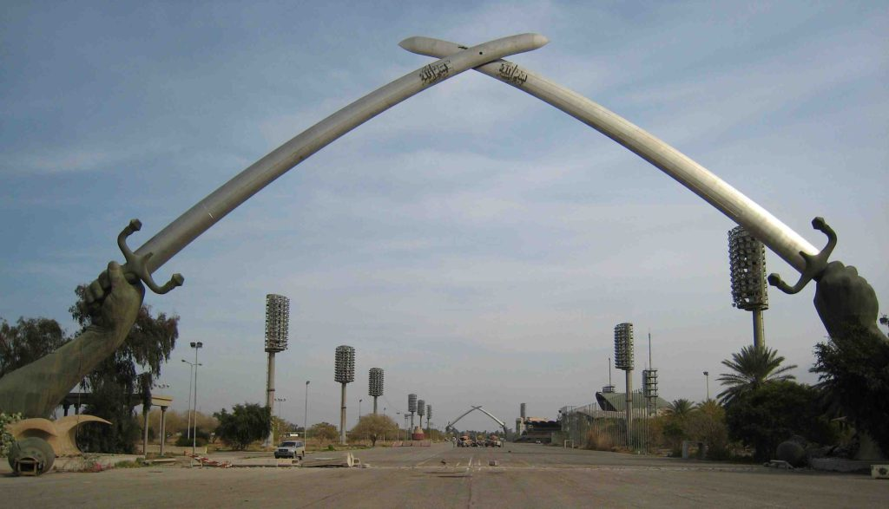

The worst part of going to Baghdad these days is getting into Baghdad. It can be a very harrowing and difficult proposition. If you come in as a military contractor you will more than likely fly into Baghdad from either Jordan or Kuwait on a C-130 military transport plane. It will be the worst hour and a half flight of your life since there are no seats to speak of. You sit on nylon webbing crammed next to about eighty other soldiers, government workers and contractors. Flying into Baghdad BIAP airport on a commercial flight involves a steep spiral decent from thousands of feet above the airport in order to avoid insurgents hoping to shoot down the airplane. The drive from BIAP to the International Zone (Green Zone) on Route Irish usually takes place in the middle of the night on a vehicle called a RHINO. Think of it as a heavily armored school bus able to withstand all sorts of roadside bombs.

The RHINO is escorted by heavily armed military Humvees and Blackhawk helicopters. The journey is only about seven miles but is called the most dangerous road in the world. Once inside the Green Zone you are relatively safe. There are few kidnappings, car bombs or murders inside the Green Zone. The biggest worry is the mortars and RPG’s (rocket propelled grenade) that are continuously lobbed over the high cement walls that surround the Green Zone. Sirens wail and loudspeakers shriek at all hours of the day and night warning everyone of “INCOMING” and telling people to “DUCK AND COVER”.

Traveling outside the Green Zone is not advised and is often illegal without a Personal Security Detail (PSD) team. Everyone must wear a helmet and body armor while riding in a bulletproofed SUV accompanied by a convoy of Humvees. Inside the Green Zone there have sprung up many little market stores called “Haji shops”. Probably the biggest selling item is bootleg DVD’s. You can find a recently released Hollywood movie videotaped off the screen or older movies copied directly from the original DVD’s for only a $1.50 each. Five full seasons of a popular TV show may cost you only $20.00. Another popular item is Persian rugs. You should really study up on your rugs and sharpen your negotiating skills before making this expensive purchase. Too many people pay too much because they don’t know what “quality” is. A 3’x 5’ 100% silk Qum rug from Persia (Iran) of high quality can be bought for about $600. This same rug in the western world may cost thousands of dollars (US).

Inside the walls of the Green zone is an even more secure area called the Embassy Complex. This is where the seat of the coalition government is and the living quarters for most all state department workers, contractors and many soldiers. Armed guards are at all entry points checking government issued ID cards. The focal point of the embassy complex is the palace. This was one of Saddam's most grand palaces. Now it is used by coalition forces as office space and other functions. Inside the grand ballroom is a coffee shop and cafeteria. In another sectioned off area of the grand ballroom yoga, step aerobics and Jiu-Jitsu classes are taught nightly.

Just outside the palace is the swimming pool area with volleyball courts, horseshoe pits and a stage for Wednesday night karaoke. It is very surreal to watch a soldier in uniform with his/her weapon singing Willie Nelson or Britney Spears while helicopters fly overhead.  
Inside the embassy complex there are a few open-air bars to go to and socialize. The US government has been trying to shut them down and is succeeding so far. Outside the embassy complex in the Green zone there are a few bars and restaurants that the US government has no control over.

The Baghdad Country Club is a popular place to go eat dinner and have some adult beverages. The FBI also has a popular bar that is only open on Saturday nights called O’Neills. They have a roaring fire outside and a bar and small dance floor inside. Many other places open and close all within a few months so you always have to keep your ears open for the new place to go.

The only real tourist sights inside the Green Zone are the “Hands of Victory” that were erected in the late 1980’s to commemorate Iraq’s dubious victory over Iran. They are two sets of enormous crossed swords grasped by giant stone hands. The hands are exact replicas of Saddam’s own hands. The other tourist attraction right next to that is the tomb of the Unknown Soldier. I’m afraid that the whole of Baghdad is still many years away from being a safe tourist destination. Baghdad and Iraq has much infrastructure repair to do before it can be returned to any glory approaching what it was when it was called Mesopotamia.
