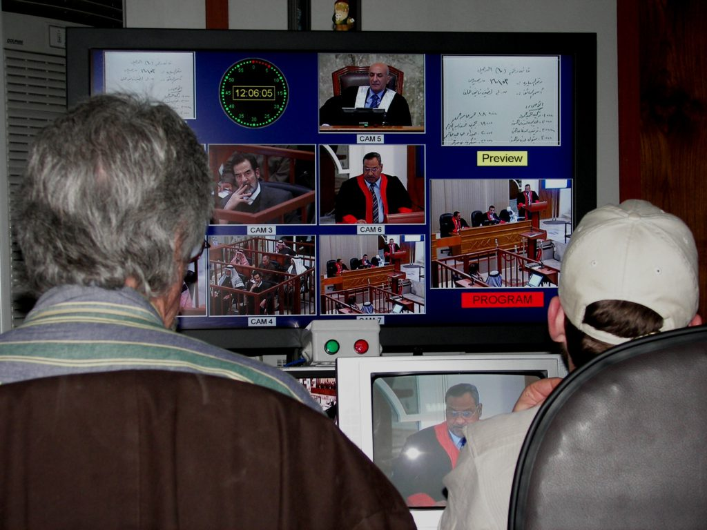
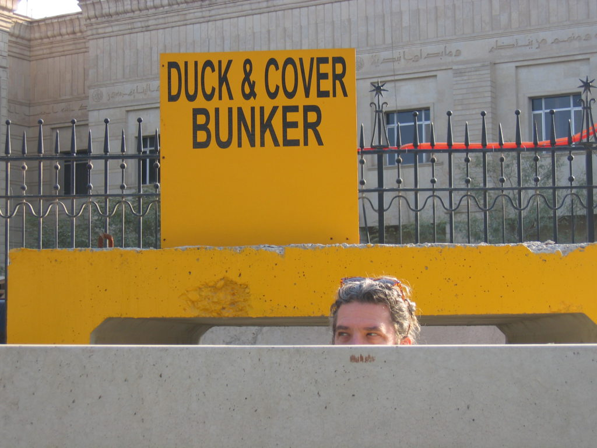
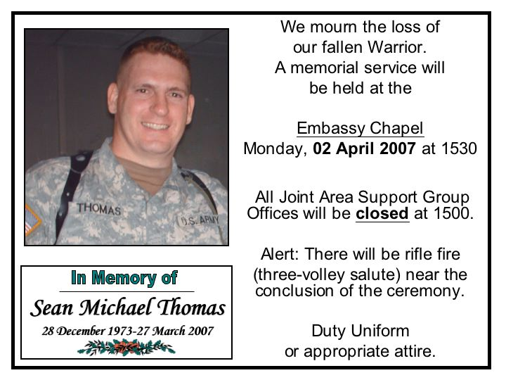
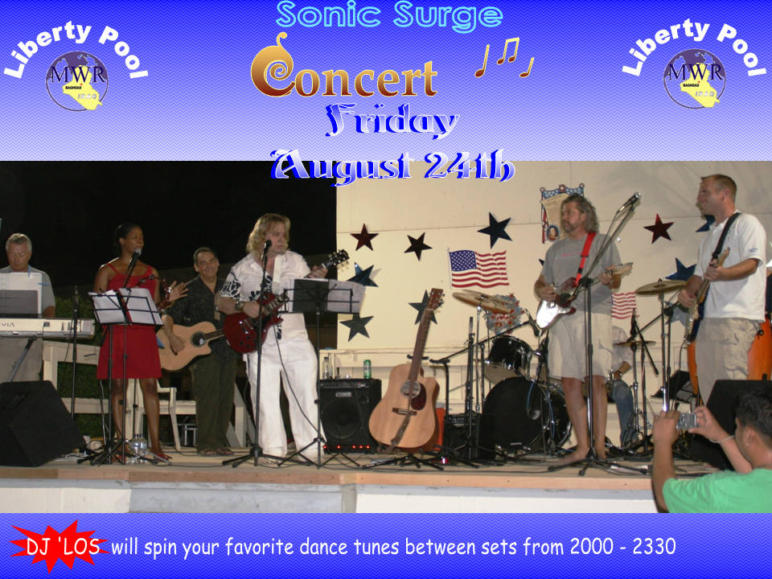
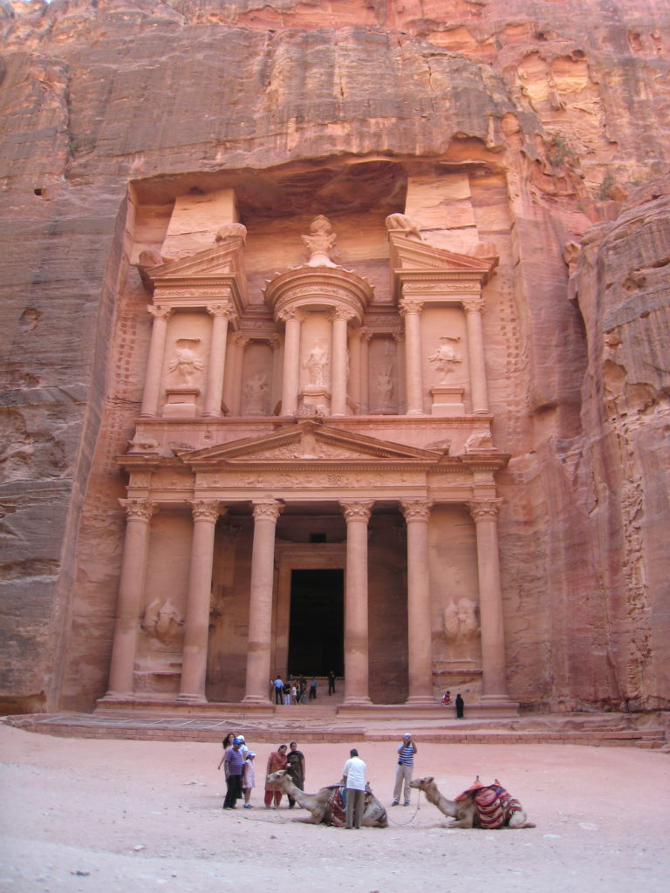
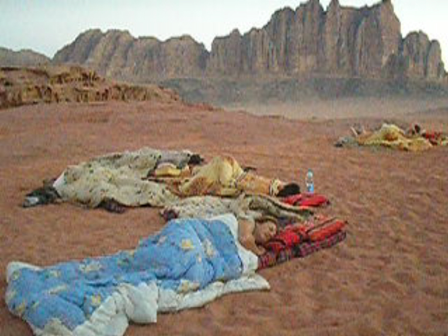

Today is the 700th days since my arrival to Iraq. In some ways it seems to have gone fast, in other ways, slowly. I’m finally leaving here in about a week. I won’t be coming back. Our contract did not get renewed for a third year. I can’t say I’m disappointed. My two years have been a great experience but I’ve had enough. We have packed up and shipped most of our control room home. Just a few odds and ends to wrap up. I have seen many fellow crew members come and go. I am the only original 'Mercury 7' crew member to stay the whole time. I guess I’m either stubborn, determined, greedy or stupid. Maybe a little of each. We finished only two trials and started a third. The Iraqi’s have taken over our job of recording the trials, only on a smaller, limited basis. The head judge didn’t like the fact that he wasn’t in control of what went out over the airwaves. His minions were always wanting us to censor more than what we thought appropriate. They would often call up to our control room and tell us to edit something out within the 30 minutes before it went out to the world on the satellite. I would say “No way! That’s censorship.” It turned into a big fight between the Iraqi’s and the RCLO (Regime Crime Liaisons Office). The Iraqi’s won. Now they record and edit as they please. It’s a step back for democracy, if you ask me.

_View from my desk in the "office"_

Budgets are being cut everywhere and we were a big waste of money anyway. We were paid a lot for very little work. In the two years here we only had 121 days of court. That averages out to about one day a week. I would often have months off at a time. The Iraqi’s don’t like to work very much, especially the lawyers and judges. If you ask any of the top military people here (I would eavesdrop on their conversations in the mess hall) they will tell you that the one big error they made was overestimating the Iraqi work ethic. The Iraqi’s often call in sick or just don’t show up at all. It is the main reason that we can’t train their troops. The Iraqi soldiers will show up for a while and get a paycheck and then not show up again for a few months. If they oversleep and don’t show up to work they simply say “inshallah,” meaning “It’s Allah’s will.” It was Allah’s desire that they overslept, therefore they are not to be held responsible. They are not at fault for anything because Allah controls every aspect of their life. It is maddening to anyone who has to deal with them. We have spent hundreds of billions of dollars fixing their infrastructure and when we try to hand it back to them they refuse to take it back. Why should they run the electrical grid or water system when they know the Americans will do it for them? The few things that they have been forced to take control of they run into the ground and then we have to spend millions fixing again. They don’t take care of anything. We have spent millions refurbishing some of the palaces and when we hand them back to them they go in and loot everything out of them. They will rip the copper pipes out of the walls and take all the light fixtures and everything else. That is why I say this war is lost. Not because our soldiers aren’t doing a great job but because the Iraqi’s are not ready for democracy. They are tribal people not used to getting along with each other. They don’t want to take control of their own country. The politicians are not working towards a better, independent Iraq. They are doing everything they can to keep the American taxpayers dollars flowing into their country.  
The violence is down but it’s only partly because of the surge. The daily bombings have slowed because the city has been divided into Sunni and Shiite. They have bombed each other out of each other’s neighborhoods. All the Sunni’s living in Shiite areas have been killed or driven away and visa versa. I can’t count the number of military people who have said that this country needs a ruler like Saddam, someone strong to keep order. Too late for that, though.

I will say that the surge is responsible for the lowered mortar attacks against the green zone. They happen very infrequently now. Before the surge we were getting multiple mortar attacks every day, it was very unnerving. I spent a lot of time in 'Duck & Cover Bunkers' waiting for the “All Clear” announcement. Occasionally, the military announced that it was mandatory to wear our helmets and vests at ALL times. Everyone would laugh at me cause I’d wear mine with my shorts, flip-flops and Hawaiian shirt. A good friend of mine was killed by a mortar attack near the palace pool. He was a soldier and one of my poker buddies. His memorial service was packed. I’d never been to a military memorial service before his. There weren’t any dry eyes in the chapel. His boots, helmet, rifle and dog tags sat positioned in front of the alter. Then his commanding officer did the roll call for his unit. When his name was called repeatedly and there was no answer it put a lump in my throat.

Sean Thomas had a three month old daughter that he never got to meet. It’s sometimes hard to remember that I’m living in a war zone cause I feel protected by the giant cement walls surrounding the green zone but that really brought it home for me. War is hell.

My time here has been a mixture of boredom and parties. Since I’ve had so much time off I’ve had to find ways to entertain myself. I go through phases of activities that I participate in. I was playing a lot of poker last year but don’t play anymore. I have been through many different sets of friends. The military people get shipped out, the state dept. and contractor friends go home. Most people here work 12 hours a day, 6 or 7 days a week. They all wish they had my job. I tell everyone that I have the best job in Baghdad. I work less and make more than most people I know. I wake up at 11am, head to the gym to work out six days a week and then swim laps in the pool. Sunday is my day of rest. There is usually some activity at night to do. There are different bars open on certain nights of the week. They really aren’t bars but only outdoor spaces where they will serve drinks. Many companies will have parties at their villas. The Italian and Danish embassies are famous for their parties. People need an outlet to blow off steam and the parties serve that purpose. I joined up with two different bands to mix sound and play guitar on a few songs.

We would play different parties, bars or poolside at the US embassy. I also joined the Baghdad Hash Hound Harriers. Hashing is a worldwide activity started in 1936 and in over 160 countries. We are billed as “A drinking club with a running problem.”

I have made a lot of great friends through hashing and will continue to hash around the world and when I get back home to Cocoa Beach.  
Speaking of Cocoa Beach…I am very excited to be going back to my beach house, but not yet. I plan on traveling around this part of the world for a while. I’m going to travel around the Middle East, India, S.E. Asia and down into Australia. I’m going to finish the trip I started in 2000 when I ran out of money and had to come home. I still have a lot of countries to explore. I don’t expect to be home until March or later. I’m just going to go where the wind blows me and stay as long as I want. I’ll have no itinerary as usual. I’ll do email updates along the way. I did manage to leave Iraq for a weeklong trip to Jordan in July. It had been my desire to see Petra for many years. It just made the list as one of the Seven Wonders of the World. It was amazing. I’d put it up there with Angkor Wat in Cambodia and the pyramids of Egypt. I also went down to Wadi Rum to camp out in the desert and then to Aqaba to scuba dive in the Red Sea.

_Petra_

_Wadi Rum desert sleeping_

When I leave here next week I’ll take a Mil-Air flight into Amman and do some more exploring around Jordan. Then…?

One of my traveling buddies I met in Africa works for LONELY PLANET in Australia. LP is the travel book that I travel with always. It is my bible and guide. It tells me everything I need to know about the countries I go to. He contacted me about writing a story about Baghdad. I jumped at the chance to have my words and photos published and get paid. I titled the article BAGHDAD KAROKE.

It will be bittersweet to leave Baghdad, but I am ready. I will miss all the friends I’ve made here but won’t miss this place, the food, my cramped hooch or the weather. Plus, I know it’s time to leave cause my trusty steed that had faithfully carried me around for over a year and a half was stolen a few days ago. Yes, my bike, The Great Red Shark was taken from me. That bike was my freedom. It took me everywhere in the green zone. Everybody knew my bike and me. We were inseparable. Now I have to walk everywhere and I hate it. Time to go.

Almost On The Road,  
Baghdad Andy  
Mayor of Baghdad (unofficial)
