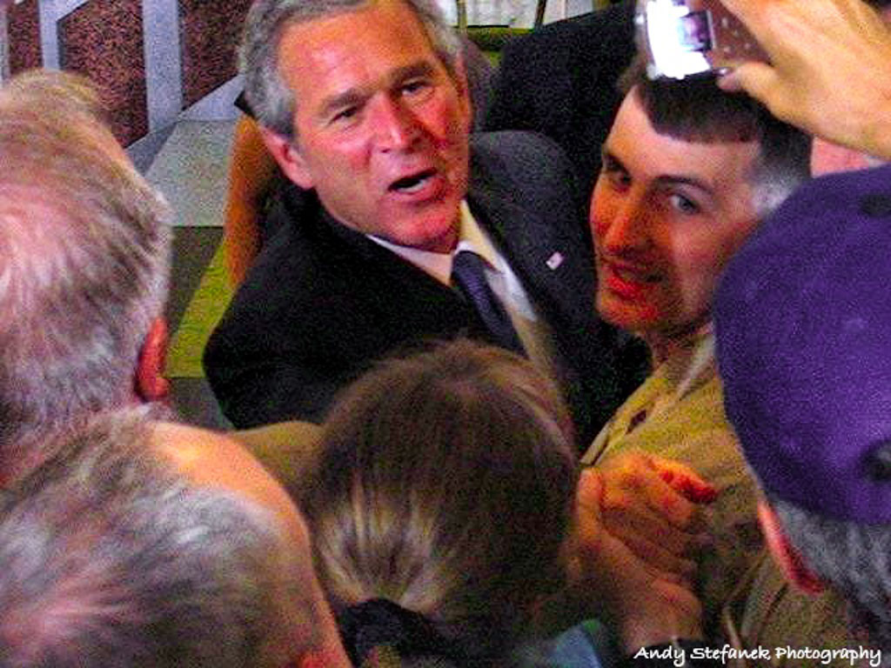
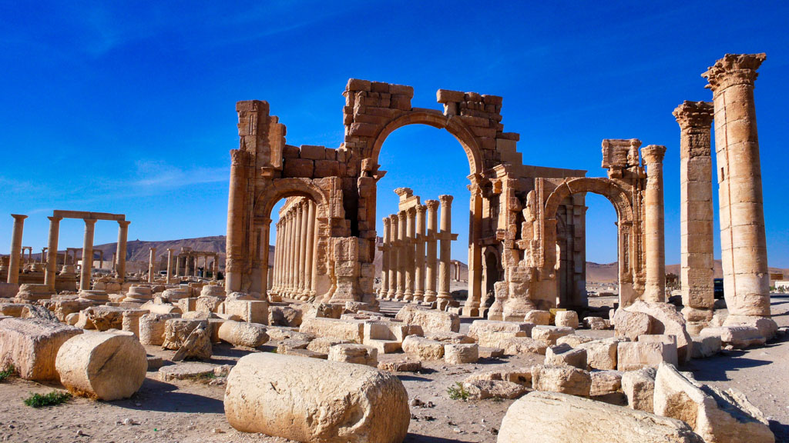
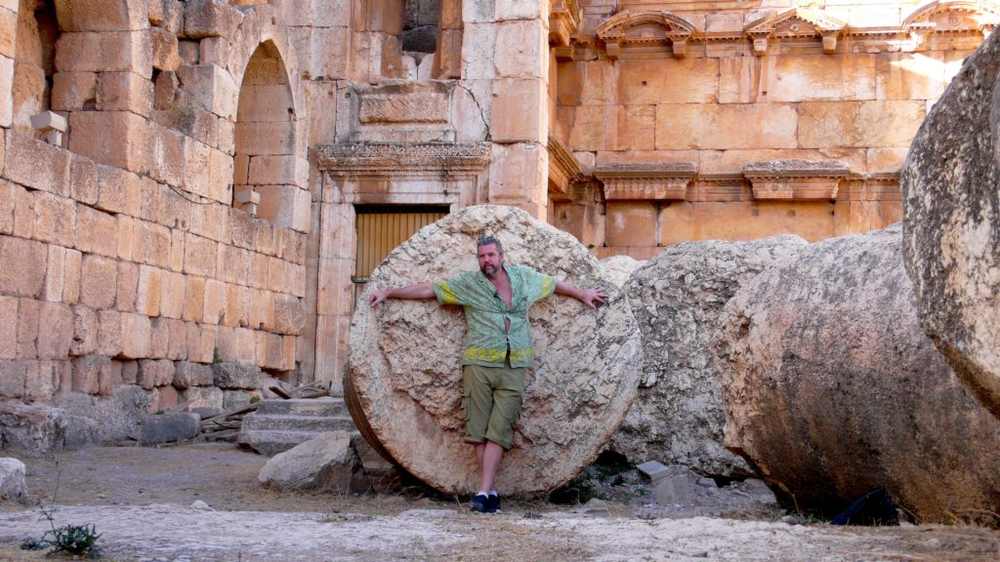
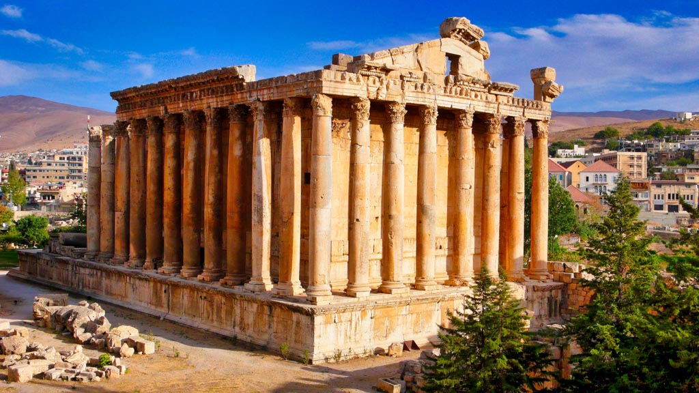
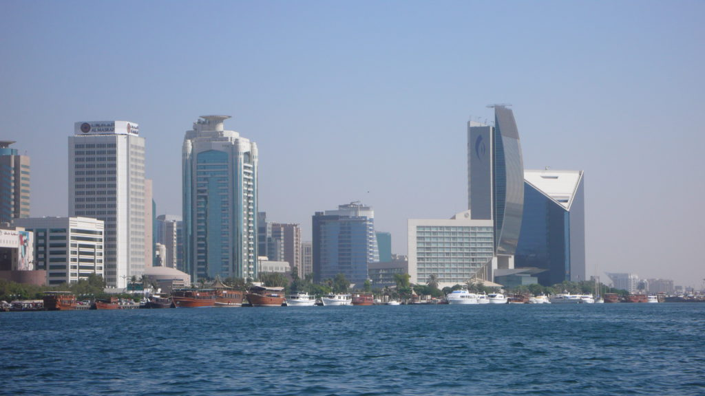
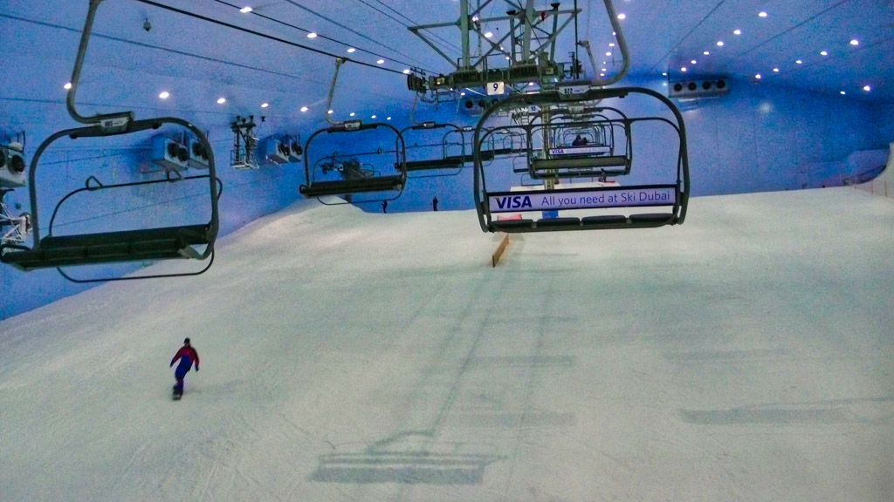
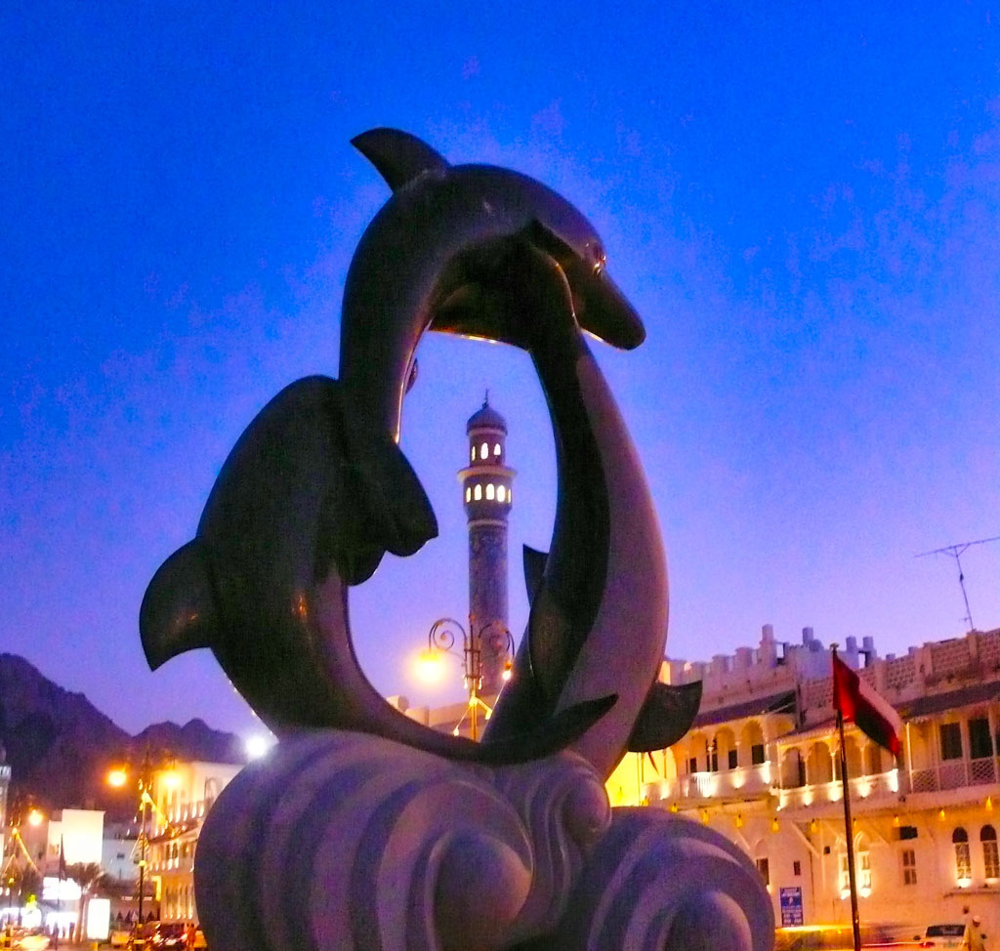
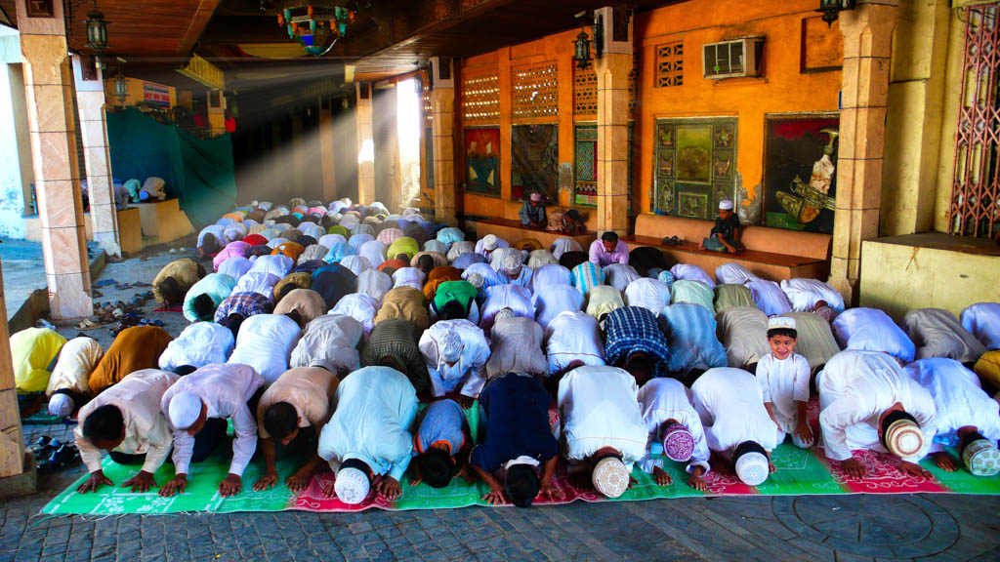

I’m finally out of Iraq for good. I’ve known many contractors that have left and went back for various reasons. Although, it is dangerous, it is also a no-brainer to live there. Everything is taken care of for you. I never had to worry about meals, laundry or paying bills. Just go to work and collect a fat check. I met many married men that said they liked it there because they got to escape from the wife, kids and pressure of home life for a while. Some contractors go back because they burned through all the money they made the first time around. As I was about to board my C-130 airplane I ran into one of my old poker buddies who had been gone for six months and is now coming back. He burned through all his money gambling and partying. He went through $30,000 a month. That’s just not me, any of my friends can attest to that.

My path out of Baghdad was anything but uneventful. Instead of taking a Blackhawk helo or military convoy, I opted for a pre-dawn Lo-Pro Red Run. This means I’m traveling in a low profile vehicle through the red zone, down Route Irish, without escort, like a bat outta hell. This is highly illegal. My driver and I would be fired and kicked out of the country instantly if we were found out, but I’m not worried about being fired anymore. When we got to the military airport checkpoint we were stopped and told to go back cause my drivers ID was expired. There is no way that I’m going to miss my military flight out of this country. I HAVE to get out but the soldiers will not budge. We do a U-turn and head back towards Route Irish when we hear ourselves being called on the loudspeaker. Their commanding officer has taken pity on me and allowed us to proceed. My wheels lifted off Iraqi soil at 10:23am. I’ve never been so happy in my life. I’ve already traveled thru Jordan so I was only in Amman long enough to go to the Syrian embassy to try and get a visa. They refused me. So now I’m forced into option two. I got a taxi and headed to the border and hoped they’d make an exception and give me a visa there. I had to wait for six hours but they finally gave me my visa. My taxi drove me into Damascus and dropped me off. Now, many people might consider countries like Syria, Lebanon and Oman dangerous. I don’t look at them that way. If there’s one thing I’ve learned from traveling it’s that people are NOT their governments. Just because our governments might fight and bicker doesn’t mean that the people feel the same way. Syrians, Lebanese and Omanis have been some of the nicest people I’ve met. They love Americans. They are as curious about us as we are about them. Just as I may not agree with their leaders and they don’t agree with mine, it doesn’t mean we have to dislike each other.

_Pres. Bush visit to the Green Zone_

I have yet to meet a single person who likes George Bush. That includes Europeans, Asians and S. Americans. He is an embarrassment that I have to constantly live down because everyone wants to talk about him and what an idiot he is. When Bush was in Baghdad he did reach out to shake my hand and thanked me for being there. I said "thanks for paying me so much to be here." To sum up my feelings I just use the phrase “Love my country but appalled by my government.” I entered my war experience a Republican but am leaving a Democrat. War does that to many people. Getting to know the young men and women who fight and die in war while the rich profit from it changes a person, or at least it should.


The ancient souqs of Damascus are a maze in which I got lost many times. Just small alleys with people selling just about anything and everything you could think of. From Damascus I took the bus to Palmyra to see some of the best Roman ruins anywhere. The Romans occupied the Middle East for centuries and left some of their most impressive architecture.

_Palmyra_

The best ruins aren’t in Rome or even in Italy, they are in the Middle East for a few reasons. First of all the weather is hot and dry so water erosion hasn’t decimated them. Also, many of the ancient cities have been covered by sand and preserved for over a thousand years. Most have only been discovered in the last hundred years or so. I had a great hotel room with a balcony that overlooked the ancient city ruins. At night I would sit there sipping tea, listen to my music and look upon the lit up ruins. It’s nights like that that reinforce my love of travel. From there I traveled to north Syria to see a very well preserved and huge crusader castle. The crusades are a very touchy subject in Islam. Many fear that Bush is trying to repeat history. I’ve heard this from quite a few Muslims. I caught another three-hour taxi and entered north Lebanon and traveled south into Beirut. This is the first country since Iraq that I’ve seen the military in full force. We passed many tanks on the side of the highway with gunners in place and turrets pointed at oncoming traffic. The enemy here isn’t as much the USA as it is Israel. The Israelis bombed Beirut just a few years ago but you could never tell. They have rebuilt fast and modern. This is the most western city I’ve been to in the Middle East so far, with designer stores, nice restaurants, high fashion and a beautiful downtown. These are resilient people with a half Christian and half Muslim population. I spent Halloween here and was surprised how many people dressed up in costume. The bars were full of people dressed up. I met up with a few people from my hotel and had a great time at one of the local taverns. Seeing locals dressed in costume and dancing on the bars was truly a surreal sight. I stayed in Beirut for five days and used it as a base to do day trips to other parts of Lebanon. Traveling around these countries is always a challenge. There are no trains to speak of. Every Middle Eastern country has different modes of transportation. Sometimes it’s long distance shared taxis, old buses, or shared mini-vans. Sometimes it’s all three. My trip to Baalbek involved three shared mini-vans and a taxi. If you stand on the side of the road a mini-van will stop to pick you up and take you as far as he’s going and then let you out, only to be picked up by the next one going your way and so on and so on. The whole three-hour trip may only cost a dollar or two. I had heard that Baalbek had the best Roman ruins of anywhere in the world and I have to agree. Two thousand years ago Baalbek was the envy or Rome and its ruins prove that out. The Romans built their largest and grandest building here.

_Columns from Temple of Jupiter_

_Temple of Bacchus_

The temple of Jupiter had over 40 columns that were 7 feet across and over 70 feet tall supporting a huge roof. How did they construct these building using only donkeys and ropes? The buildings that I’ve seen around the world build by ancient civilizations without modern tools never ceases to amaze me. Next, I went to the city of Byblos but their ruins were a disappointment compared to the ones at Baalbek, although they beautifully sat on the Mediterranean Sea. I went here mostly to visit the family restaurant of my Lebanese driver from Baghdad. I met his two brothers and had a great meal. We struggled to communicate but we had a fun time. My driver Emile’s English isn’t very good and his brothers was worse.

From Beirut I flew to Bahrain in the Persian Gulf, a small, rich, but unremarkable country. Next, I flew to Dubai in the UAE (United Arab Emirates). Dubai is the city where most Iraqi contractors go for R&R. It’s a big modern city with all the luxuries of any big US city. It’s kind of like the Vegas of the Middle East without the gambling.

_Dubai_

It’s gaudy, ostentatious and VERY rich. It’s known for it’s modern and unique buildings. It’s where the world’s architects go to make the buildings that they only thought possible in their head. They have completed 150 of the 175 floors on what will be the world’s tallest building. The skyline is littered with building cranes erecting one magnificent building after another. The Mall of the Emirates is the nicest mall I’ve ever been in. It’s a huge reminder of what oil money can buy. One designer shop after another catering to the uber-rich oil sheiks and their wives.

_Mall of the Emirates indoor ski slope_

This mall even had an INDOOR ski slope. Shoppers could watch the skiers through the glass as they shushed their way down the slopes. This is something I had to try. It was just like real skiing, my feet and hands froze just like when I ski in Colorado. I can’t even imagine how much it costs to keep that whole indoor ski slope below freezing and to make all that snow in the 130 degree heat of the summer. It’s no wonder that the UAE is one of the top three polluters per capita in the world. On the other side of town, where I stayed, is where another completely different kind of shopping goes on. This is where the world comes to buy in bulk and ship home for resale. The Africans from Nigeria, dressed in their colorful clothes, are here buying textiles and fabrics. People from most every other nation this side of the globe is buying everything from car parts to kitchen sinks in bulk to ship home on boats. I’ve never seen such unabashed consumerism in my life. It’s a frenzy of buying. I resisted for as long as I could but finally gave in and bought sinks, faucets, vanities and shower units for my house at a fraction of the cost. It cost me more to ship it than it did to buy. I was stuck in Dubai for 9 days waiting to get my visa from the Indian embassy. I wished I’d chosen a cheaper city in which to get my visa. Emirati’s only make up about 20% of the population. Just like in Kuwait, Oman, Qatar and Bahrain the indigenous privileged population doesn’t work. Foreign laborers do all the jobs. Every nationality seems to have their own jobs. The Indians run the hotels, the Pakistani’s drive the taxis, other poorer Arabs run most of the stores and the Bangladeshi’s peddle flesh. They are the ones who stand on the corners and whisper “girls, girls” as everyone walks by. The Filipinos are the hardest working of them all. They’ll do any job and with a smile on their face. It was the same way in Iraq and everywhere else in the world that I’ve been.

_Mutrah, Oman_

_Afternoon prayers in Oman_

Next, I was off to the city of Muscat in Oman. What a wonderful little seaside city. I stayed in a hotel right along the corniche in Mutrah. I walked along the coast from town to town and saw all the old hilltop forts left by the Portuguese when they were ousted in 1650. I would have liked to explore the interior of Oman further but that takes a 4x4 vehicle and a navigator co-pilot and I had neither. I flew onto Doha, Qatar but didn’t find it nearly as charming as Oman. It’s a small country with a lot of oil money also. Downtown Doha is building like crazy. Just like Dubai, all new modern glass and steel building going up everywhere, at least thirty of them just along the large seaside corniche. I have finally left the Middle East having spent over two years here. Between this time and the time I was here 13 years ago, it is enough for me. I’ve been to almost every middle eastern country except Saudi Arabia, where I’m not allowed, and Iran. I was planning on sneaking into Iran via a backdoor route but I was foiled in my attempts at the last moment. It seems that most every other nationality can get in except Americans. I can honestly say that I don’t think I’ll ever come back to this part of the world. There are too many new places to explore and other better places to go back to. For example, I’m back in India again right now and enjoying the beaches of Goa. India is a country to come back to over and over. But, more on that later…

On The Road  

Andy
