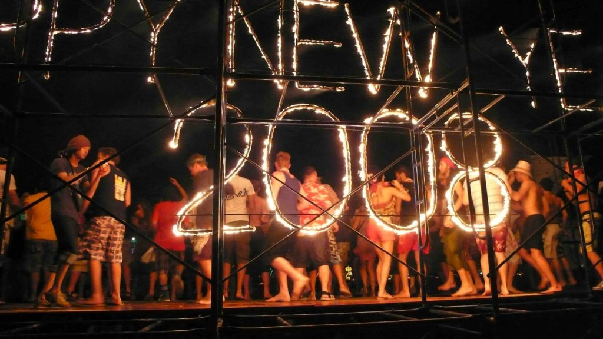

As my travels continue I fly from the Middle East to India. I've traveled to many places in India before so I headed to the beaches in the state of Goa in the Southwest part of the country. It was one of my favorite places last time I was there and I'm meeting an old travel friend in the town of Candolim. Goa is where I spent my fourth Thanksgiving in a row outside the USA. To celebrate this Thanksgiving my friend Inge (she's German) and I did a cleansing fast which involved drinking water with epson salts and olive oil and nothing else for 3 days. Not much of a feast. I broke the fast by eating at an Indian restaurant and getting some sort of food sickness. I think my defenses were low cause I've never got food sickness before in my life. The next three days were spent in bed. After two weeks in Candolim I moved up to the Northern Goa town of Anjuna. This place is more to my liking. Candolim was nice and had good beaches but the people there were older Europeans and the town went to sleep at dark. Anjuna is more for the young and active. They have hang gliding and beach clubs that hold trance parties almost every night. It's also the home of the Wednesday hippie flea market where I bought lots of stuff very cheap. I met a great group of young Germans and we had a fun time exploring other beaches on our scooters and enjoying the nightlife. After another two weeks I decided it's time to move on so I went to Mumbai (Bombay). I was planning on really exploring the city and getting to know it better but after two days of pollution and masses of people I decided to move on. India is a large and wonderful country that deserves a lot of time to explore. Each region is so different from the other. I'm thinking that I'll need to come back here for a whole year just to see what I want to see of it. Another future trip.

I flew from Mumbai to Bangkok. Another big polluted, crowded, hectic city that I couldn't get out of fast enough. The more I travel the more I dislike the big cities. I think to really know a country you have to leave the city and get to the smaller places and if possible off the tourist trail. In Thailand that is difficult because this country is crawling with tourist. To me, the best part of Thailand is the islands in the south and the mountains in the north. I caught the overnight bus and then sunrise ferry to the island of Koh Phangan just in time for the Dec. 24th full moon party. This is the biggest party in South East Asia each and every month. This party was even bigger than normal because it was around the holidays. I met up with one of my Baghdad friends named Steve.

_Full moon party on Koh Phangan_

The beach is packed full of bright neon painted dancing kids from all over the world drinking buckets filled with Thai whiskey, Red Bull and coke. It is quite a sight. I ended up losing Steve about midnight but found him again at 7am. We stayed and danced and partied till 1pm on Xmas day when we finally had enough. I met up with him later and went to a big Xmas dinner pig roast that was at my guesthouse.

The next day I took the ferry to the nearby island of Koh Tao to take my open water PADI course for SCUBA diving. I've been diving for 20 years all over the world with a fake PADI card so I figure it's about time to get a real one.

_Koh Tao Scuba Diving_

Koh Tao is the cheapest place in the world to get certified. I want to dive the great barrier reef in Australia and I figured they would scrutinize my fake I.D. more than the third-world countries I'm used to diving in. After four days of great diving I took the ferry back to Koh Phangan to meet another Baghdad friend for New Years Eve. It was the same madness all over again but bigger. I didn't think the beach could hold more people but it did. I was here seven years ago for New years eve with my cousin Jeff but it was hardly the same.

_If you pass out on the beach you will be protected in this area_

The island has changed so much and the parties have gotten even bigger. It's not the same little backpacker island is was in 2000. Big resorts have been built to handle more upscale tourist. I've heard that Thailand is trying to get away from the backpacker scene and trying to get more of the big dollar tourists. The locals seem to be getting tired of the kids and the whole vibe seems more aggressive and less peaceful than it was. I had rented a scooter to explore the small hidden beaches along the north and west coast when it happened to me again. The first time I wrecked on a scooter was in Greece over ten years ago. This time I flew right over my handlebars onto the dirt and gravel road. The road changed from pavement to dirt at the bottom of a curved hill and I couldn't slow down fast enough before I hit the huge potholes. Just like on the Greek island of Mykonos, I again received road rash along my right side and still have scars to prove it. The worst part was having to pay the damages for the scooter. Ouch. Luckily, I was able to talk him down a bit.

With my pride and body aching I took a ferry and then bus ride across the country to the west coast island of Koh Phi Phi.

_"The Beach", Maya Cove, Koh Phi Phi_

Koh Phi Phi is famous for being the location for the film THE BEACH with Leonardo DiCaprio. It is one of the most beautiful places I've ever seen. I met up with my friend Steve again and we met a great group of international friends and did nothing for a week but hang out on the beach all day and go out at night. We never could seem to make it home before 5am.

We each stayed in little thatched bamboo huts just a little larger than the mattress that was on the floor. A very simple existence that I liked very much. From here I took another ferry to a less touristy island called Koh Lanta. This island is even more relaxed and I spend days in a hammock on the beach reading and talking to new friends I made there. My month long visa was about to expire so I either had to do a visa run to Malaysia or get moving along to another country. Most people just cross the border for five minutes and then come right back into Thailand for another 30 days. I took the bus to Bangkok and got my visa for Myanmar (Burma) and flew to Rangoon.

I'm sure everyone has seen in the news the problems they've had there. The government is so oppressive and corrupt. I had mixed emotions about going there. I don't want to support the government by giving them any money but I did want to see this beautiful country unspoiled by tourists. I did everything I could to minimize the money I spent that went to the government. Instead of paying any government entrance fees to see the sights I either sneaked in or paid a local guy to show me where to sneak in. I could always tell when an establishment was government run. The government will only accept US dollars. They won't even accept their own currency. That should tell you something. I didn't ride any government trains, buses or planes. I used private companies everywhere. The government hasn't spent any money on infrastructure so the roads are terrible. The road between the two main cities of Rangoon and Mandalay is filled with so many potholes that it made reading or sleeping impossible. Most of the way it was just a single lane dirt road that you could only go 20 mph on. I had to take an 18 hour and then another 12 hour bus ride that was only a few hundred miles in length. My backside paid the price. Sometimes my convictions are a pain in the ass...literally. I felt safer in Burma than in most other places. The people are some of the kindest and most honest anywhere. When I accidentally dropped a $20 bill in my hotel room they chased after me when I checked out to give it back to me. It was quite the opposite in tourist-weary Thailand where someone actually entered my hotel room and stole money out of my backpack. The only kind of danger I could have got into was if I was caught by secret government agents talking bad about the their leaders or trying to rally the people to revolt against their government oppressors. Or course I did both. Many people were scared to talk about how much they didn't like their leaders but many others would openly discuss how much they hated them. I talked to some people who witnessed the soldiers coming in and shooting and beating the monks. I tried to encourage them to rise up against their oppressors but they simply explained to me that they had sticks while the soldiers had rifles. I got their point.

_Inle Lake_

The best places to visit were Inle Lake and Bagan. Rangoon and Mandalay are big cities without much charm, although they did have many impressive temples and pagodas. This country is Buddha crazy like no place I've ever seen. They have them everywhere and everyplace. They worship at Buddhas feet non-stop. Each pagoda will have hundreds of Buddha statues, large and small tucked into every nook and cranny. Inle Lake is a charming area in the north where life revolves around the lake. Food and transport is supplied by the lake. People live in houses on stilts over the water. The schools, temples and shops are all on stilts. They row their boats with their feet and are pretty fast about it. Much of Burma lives at least 100 years behind the times. They get around the countryside and transport goods with horse or ox carts.

_Bagan traffic jam_

_My little tour guide inside the Reclining Buddha pagoda_

The highlight of Burma is Bagan. This is where 1000 years ago the rulers built over 3000 temples, monasteries and pagodas. The whole countryside is littered with them. Some are very large and some are small. They each have many Buddhas inside them. I explored this area for two days on my bike and climbed to the top and inside many of them. I am officially Buddha'ed out.  
From Burma I flew to north Thailand where I am now. I first went to the sleepy little town of Mae Hong Son, close to the Burmese border. Here I rented a scooter and CAREFULLY rode into the hills to see the Karen women in their villages.

_Karen tribeswoman_

The Karen women are the ones who wear those brass rings around their neck so it appears to stretch their necks out. They actually don't stretch their neck, it's an illusion. They are actually pushing down their rib cages so it appears their neck is stretched. I am currently in a well traveled town called Pai. Lots of young travelers stop here to do treks into the mountains and stay overnight with the hill tribe people. I think I'm going to save my trekking for Laos, where I'm headed next. There is a great live music scene here and it's a lot of fun. I'll stay here a few days before moving on.  
One last bit of news. Bad news for me. My laptop crashed on me last week and I had to send it home. I'm hoping that some computer geek can get all my data back when I get home. All my photos from this trip are on there. I sure hope it's not a lost cause. If my photos can't be recovered the sound you may hear next is the sound of me crying.

On The Road  
Andy
