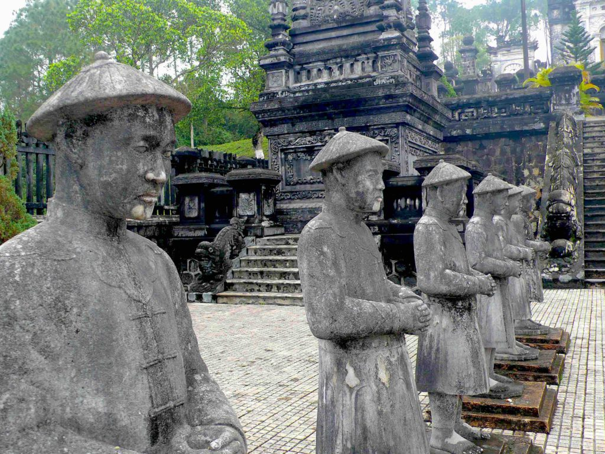

From Thailand I started my communist bloc part of my trip by flying to first Laos and then Vietnam. Although, they may both be communist countries they are also surely capitalist countries. I was hounded at every corner by touts who wanted to sell me something. I first arrived in Luang Prabang, Laos. I was greeted by cold and rainy weather. I had planned to visit more places in Laos but I was anxious to escape the weather so LP was the only city I went to. Laos is a country still struggling with the remains of the Vietnam war. Much of the country is still unfarmable and many historical sites are too dangerous to visit. America dropped over two million tons of bombs during it's 580,344 illegal bombing raids in Laos. America carpet-bombed most of the eastern and northern part of the country from 1964 to 1973 while denying it to the world. Thirty percent of the bombs failed to detonate, leaving a legacy of death that still continues today. Vietnam seems to be a war that just keeps on killing as innocent victims, even today, lose life and limb from the unexploded ordinances left behind. I was in Laos just long enough to do what I really wanted to do, which was become a 'mahout', even if it was only for two days.

_Washing my elephant in the river_

'Mahout' means elephant trainer or keeper. For those two days I went out to an elephant preserve and had my own elephant. I would ride him, bathe him in the river and feed him. I had to take him to the jungle at night to sleep and then go find him again the next morning. I have come across many elephants in my travels and they have become one of my favorite animals. They are strong but so gentle and playful. I also had time to fit in a nice kayak trip to visit some waterfalls and ruins.

While trying to flee the rain in Laos I flew into Hanoi during it's coldest winter in over 30 years. It also happened to be the Tet holiday (Vietnam New Year). My hotel was right downtown in the old city where all the celebrating was about to take place. I rushed down to the lake to watch all the fireworks and masses of people whooping it up. They sure know how to party. I couldn't beleive my dumb luck in arriving in town for this big party...or so I thought. My luck wasn't all that good because the whole city shuts down for five days. There were no stores open and very few restaurants. Everyone stays home to be with family. There was nothing for me to see or do. I had to stay there for five days until I could arrange transportation further south. The cold weather is really getting to me. I am traveling with only one pair of long pants and one long sleeve shirt and one pair of socks. I was tired of wearing the same clothes every day. One of the sights that was open was the 'Hanoi Hilton'.

_John McCain flight suit_

This was the prison where American POW's were held and is now a museum. John McCain was held here for years and they have photos of him and his flight suit on display. Of course the museum was all propaganda. The only photos they showed of the POW's were ones of them playing volleyball, eating big meals and smiling and having fun. The photo captions made it sound like they were on holiday at a five-star resort. I guess whoever wins the war gets to tell it's history however they see fit.

_Ho Chi Minh Mausoleum_

The only other tourist sight open was the Ho Chi Minh mausoleum complex. I was allowed to respectfully (they make sure of this) file past the preserved body of 'Brother Ho'. Now I've seen plastic Mao in Beijing and plastic Ho. All's I need to do is go to Moscow and see plastic Lenin and Stalin and I'll have completed my tour of plastic communist leaders.

_Minh Mang Tomb_

I finally got a bus south to the small city of Hue but it wasn't much warmer. I only stayed there long enough to take a dragon boat down the Perfume River to see the royal tombs of the kings of the Nguyen dynasty. Further south to the city of Hoi An it was a little warmer but not much. Hoi An is like a living museum. The old town had been faithfully restored to it's original beauty. It is a UNESCO heritage city. The reason that most people come to Hoi An is for it's tailors and seamstresses.

You can get measured, pick the material and style and get hand made suits, dresses, pants or shoes made custom for you in one day. Needless to say this city is very popular with the ladies. They go crazy with retail fever. They get that glazed look in their eyes when they are told that they can custom make any pair of shoes or dress they want. It was funny to walk into a store and see some woman sitting on the floor with all kinds of different color leather, different shape heels and different kinds of straps and buckles scattered all about her so she can make the perfect pair of shoes. Pure nirvana. Since I wear mostly shorts and flip flops I resisted and didn't buy anything but I had fun shopping with a few different women who bought plenty.

_Alex and I in Hoi An_

I finally make it further south and to warmer weather when I hit Nha Trang. It sits right on the ocean and has a beach town vibe to it. I rented a scooter with Alex, a Brit friend of mine that I've been traveling thru Vietnam with, and we saw the sights. She has been one of the best friends I've met along the way. She's a musician from London who's toured as a back-up singer with many big acts and we became good friends. I was sad to say goodbye to her after Nha Trang but that's the nature of traveling. I hope to meet up with her again in Australia. I took my last bus ride south to the bottom of Vietnam to the hot and humid city of Saigon. Saigon is a big, crowded polluted city. There are millions of people riding scooter.

They outnumber cars at least twenty to one and make lots of pollution and noise.  
I don't know how people can stand to live in the small cramped spaces with no air conditioning. Maybe that's what made them such fierce fighters. The 'American War' (that's what they call it) is getting a lot of attention here since it's the 40th anniversary of the Tet Offensive. This was the turning point of the war when the American public finally realized that they weren't going to win the war. As surely as America won the Revolutionary war by driving the British out of America, the Vietnamese won the war by driving its invaders out of Vietnam. I used to like to think that America didn't lose the war, but that we only decided to not fight anymore. But being here and seeing the embassy gates that the Viet Cong tanks crashed thru after their long sustained march from the north to the southern tip of Vietnam made me see the light. I went to the War Remnants Museum (it used to be called the American Torture Museum but they weren't getting many tourist to visit it so they changed the name) and saw even more horrors of the war. They had many display and photos of the effects of agent orange and napalm. The chemical warfare the American government used was brutal and long lasting. The photos of birth defects and burned bodies were horrifying. The My Lai massacre and other atrocities were well documented. Of the more than one million people killed during the war, over 70% of them were civilians. We had no smart bombs. The bombs hit crowded cities, schools and hospitals. War is hell. It's something that always seems to be forgotten. I wasn't sure what my reception would be as an American in this country but I found the people to be nice and pleasant. Nobody seemed to be holding a grudge.

_Old US Embassy_

I hate to end my emails with bad news (at least for me) but here it goes. I was standing on a corner in Saigon getting ready to cross the street while listening to music on my iPod and a guy on a scooter drove past me and ripped it right off my hip and the earphones out of my ears. I was stunned for a split second and that's all he needed to make his escape. I gave chase on foot and even forced myself onto a strangers scooter to give chase but it was to no avail. All my 13,000 songs, photos, movies and address book was gone. I was hard pressed to think of a time when I was so bummed out. I never travel without my music. It's the only thing that makes the long bus or train rides bearable. Now it's all gone. I have all the music backed up on my computer at home but it doesn't do me any good right now. I bought a new iPod in Bali but I only have about 1000 songs that I got from someone else. It's just not the same.

On The Road  
Andy
