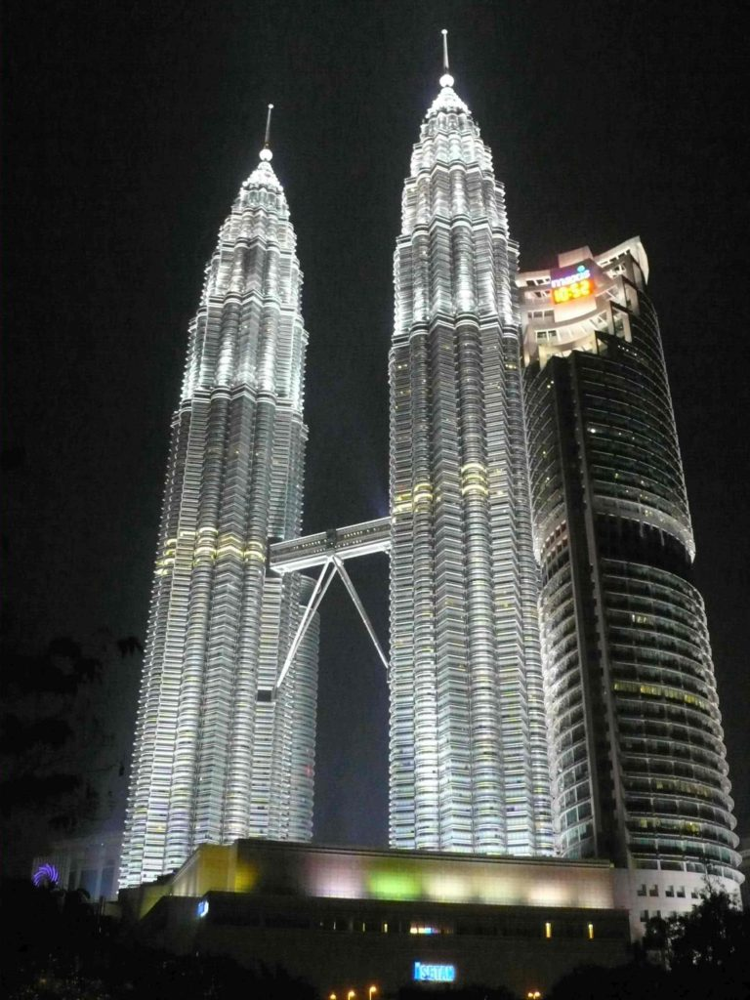
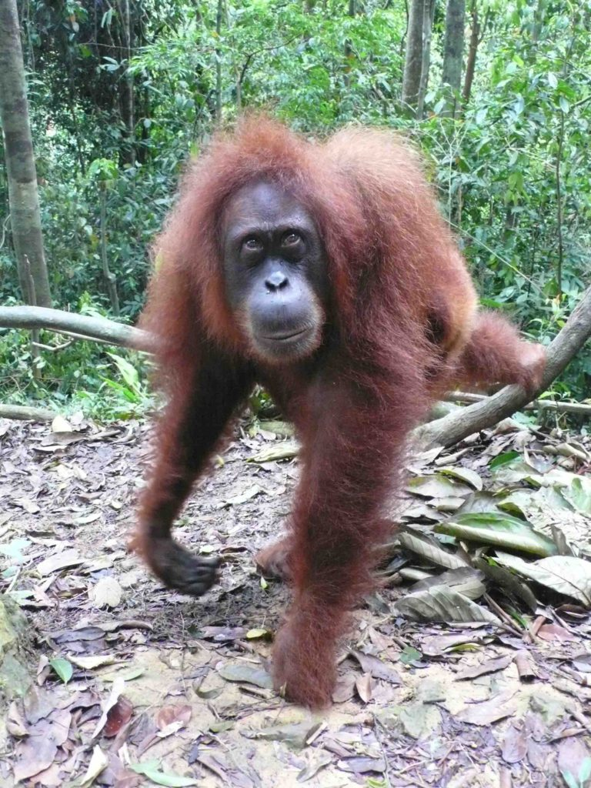
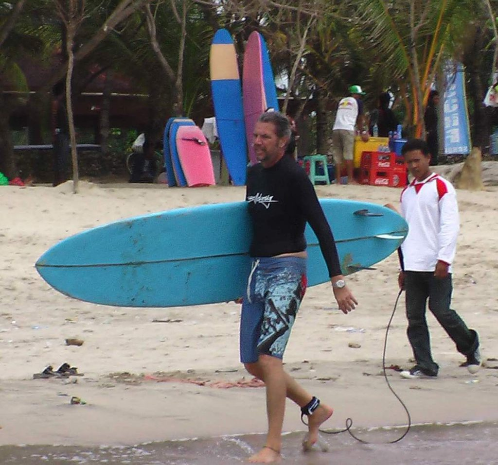
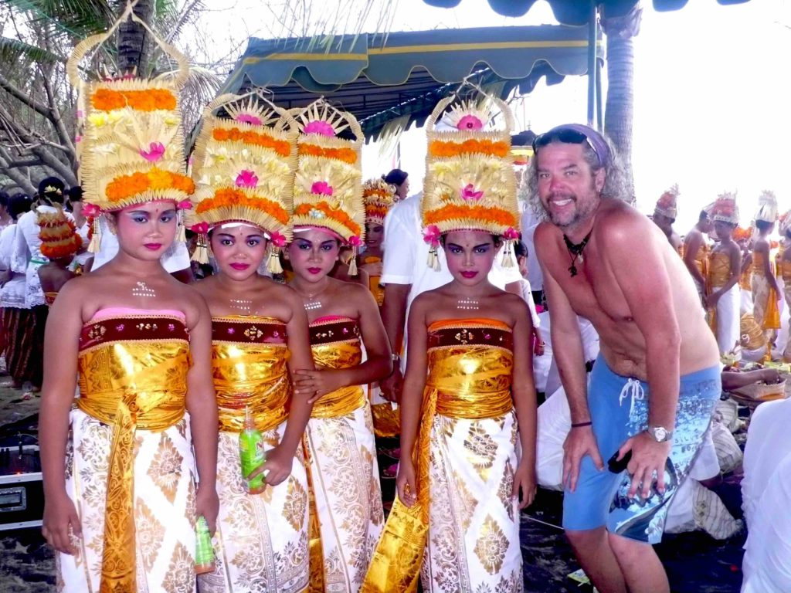
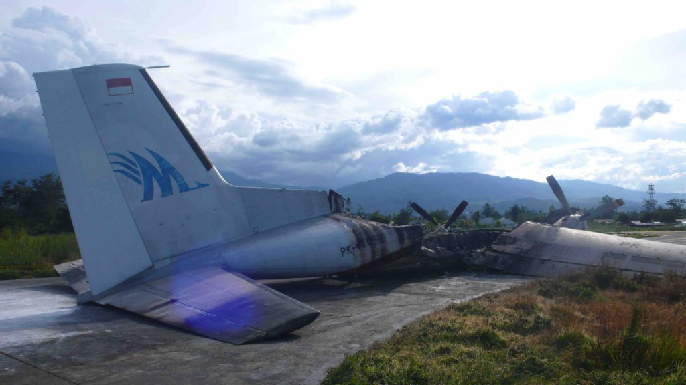
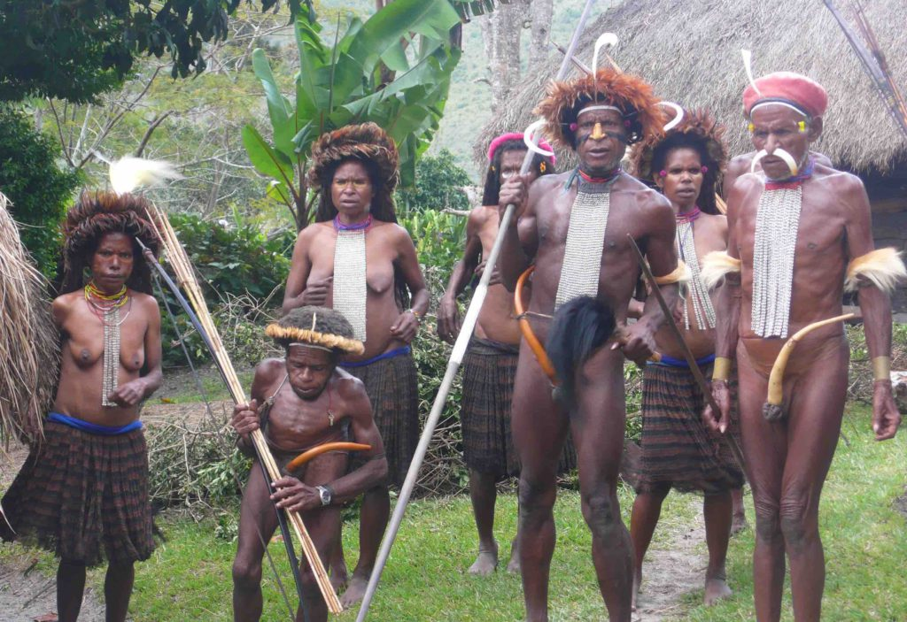
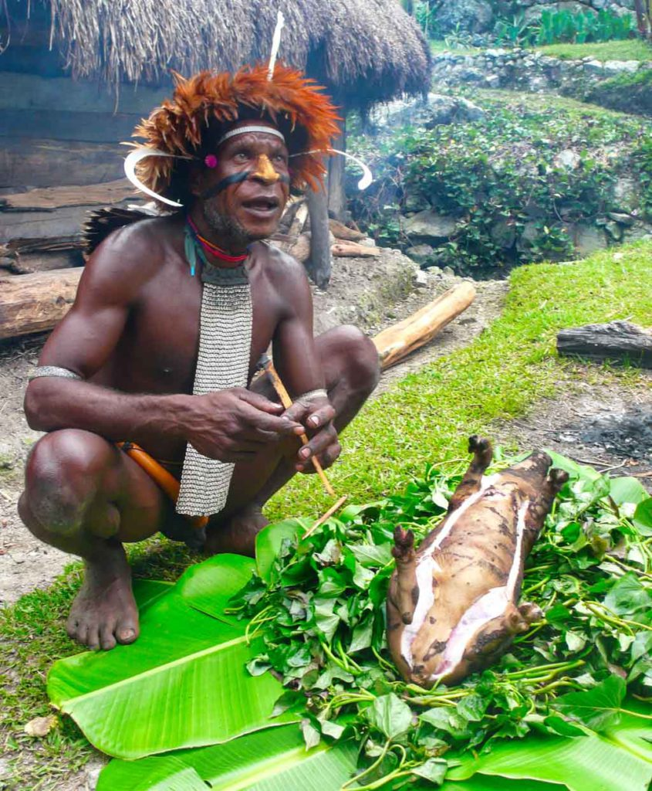
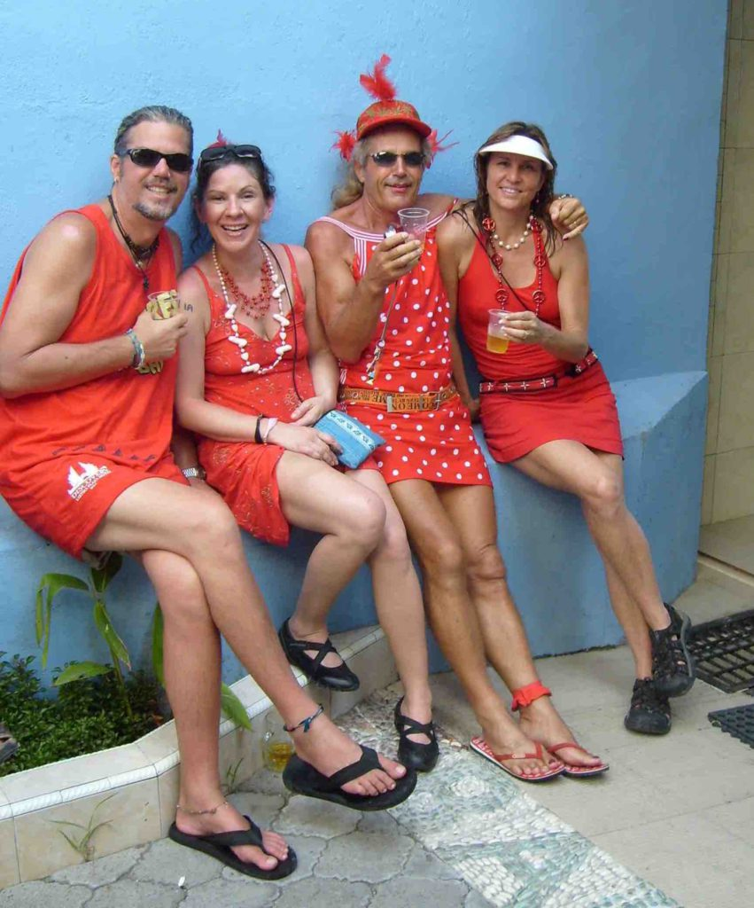

…From Saigon I flew into Kuala Lumpur, Malaysia. KL is just another big modern city. I went there for one reason and that was to run with the “mother” hash. This is where the Hash Hound Harriers were started in 1938. Running with “mother” is akin to going to Mecca for Muslims. It will be my first hash run outside of Baghdad and it was completely different. We ran through a forest, up hills and through creeks. Much different than the streets of the green zone. Everyone was surprised when they found out that I was a hasher from Baghdad. I walked around KL for a few days and went to the “other” twin towers. The Petronas twin towers are the tallest twin towers in the world and the second tallest buildings in the world, having just been passed up by a building in China.

_Petronas Towers_

I had planned to go to the island of Borneo to see the orangutans but heard from other travelers that it was better to see them on the island of Sumatra. So I left Malaysia and flew to the city of Medan on the island of Sumatra in Indonesia. I left Medan the next day for the small riverside village of Bukit Lawang. I stayed in a great funky little hotel along the river right across from the orangutan preserve and rain forest. It was one of the coolest hotels I’ve stayed at. Each room had a different theme. I bathed in the river (it was warmer than my cold shower) and made friends with the other guests and staff and had a great time. The next day I went on a trek through the jungle in search of the endangered orangutans.

[http://www.orangutans-sos.org/orangutans/](http://www.orangutans-sos.org/orangutans/)

It didn’t take long to find them. I think they found us. You can hear them before you see them. They come crashing down from the treetops to greet us. They know that most trekkers have bananas and pineapples and they want it. They are so agile in the trees for such large animals. They are the only tree dwelling ape. They build a different nest to sleep in every night. They are docile and friendly for the most part. We were warned of a few orangutans that like to bite tourist. When we came in contact with them we gave up our pineapples right away and moved on while they were occupied eating them. Others were so friendly they would come right up and sit next to us as we gave them bananas. Many of the females had small babies that would cling to their fur. The babies were curious and liked to play with us. They were the cutest things. Throughout our day long trek we encountered many different orangutans and other monkeys and wildlife as well.

Next, I flew to the island of Bali. Bali, is to Australians is like Cancun is for Americans. It’s only a three hour plane ride for them. It’s very touristy and most of the tourist are Aussie. I stayed in the backpacker area called Kuta beach. This area is backpacker and surfer heaven. I only paid $3 for my room and was able to find cheap food everywhere. I stayed there three weeks. I did a lot of surfing and hanging out with some new South African friends that I met at the airport in Jakarta. We stayed at the same hotel and had a great time.

There were great waves every day and we rented surfboards on the beach for $3 a day. I was a little surprised at how polluted the water and beach were. It seems like I was always getting some sort of plastic bag stuck to me while surfing, too bad. People in third world countries don’t seem to see pollution as a problem. It can be very frustrating to see locals just throwing their trash down on the ground when a trash can is only a few feet away. Bali is very different from the rest of Indonesia, it is mostly Hindu instead of Muslim. But the Hindu religion they practice is very different than the Hindu's of India. They have their own special brand of it.

I was there right before and after their holiest day and was able to see their traditional beach ceremony performed at sunset with all the music and dancers. It was a great sight. I was happy to miss their holy day of silence. I escaped for a week to Papua New Guinea but my friends told me about it. Everyone is locked into their hotel and not allowed to leave their rooms, turn on any lights or make any noise. My friends had to buy all their food ahead of time to eat in their room and they huddled around their laptop and silently watched movies all day. They were bored.

It has been one of my dreams since I attended a lecture a few years ago to go to Papua New Guinea and see the tribe people. Papua New Guinea is the Indonesian side of New Guinea and was formerly called Irian Jaya. It is a remote mountainous island covered by 30,000 square miles of almost impenetrable forest. It is one of the planets last truly wild places. Most of the tribe people live in the Baliem Valley. This valley wasn’t discovered until 1938 and little has changed. It is proof positive that pockets of this planet remained hidden from view even in the age of aviation. I had to island hop from Bali to get to Papua New Guinea and then when I got to Papua New Guinea I had to fly from the main coastal city into the interior on a small commuter plane to start my journey. I was delayed a day because a plane had crashed on the runway at my destination of Wamena the day before.

_This plane crashed on the runway the day before I arrived_

We could all see the burned out plane still sitting off the side of the runway when our plane landed, a little unnerving. I hooked up with a Danish girl and a Norwegian guy who also wanted to trek into the wild. We rounded up a guide, two porters and a cook and headed off the next day. We drove as far as the road would take us and then got out and started hiking. We (when I say we, I mean our porters) had to carry all our food and most of our water for the three day, two night trek. We were able to boil water along the way to replenish our water bottles. After a few hours of hiking up and down steep hills, crossing rivers and balancing along narrow hillside paths we came to our first tribal village. This was the Dani tribe. The Dani tribesmen are polygamous and they buy their wives with pigs. Not sure how many pigs it takes to buy a wife but we only brought one so I didn’t get married. We actually bought two pigs but the first pig died before the feast so one of our porters had to go back to town and get another pig. It was quite an ordeal. We (the Scandinavians and I) decided to buy a pig for the tribe so we could have a feast with them and join in their celebration. It was one of the best decisions of my trip.

_Dani tribesmen and women_

The Dani men were all dressed up in their penis gourds and …..well, that’s about it. Aside, from some feather head dresses and jewelry they only wear a long thin gourd over their penis that attaches with a string around their waist. I felt a little uncomfortable, at first, trying to communicate with a man wearing only a gourd but I got used to it. The Dani women were dressed in their grass skirts and ….that’s about it. Funny, how I felt more comfortable being around topless women. We watched as they slaughtered the pig, started the fire with only sticks and cooked the pig and all the vegetables using only hot rocks that were heated in the fire.

_Pig roast_

It was quite a learning experience and some really tasty pig. They also showed us some of their war dances and did some singing for us. It was a great day and I was sad to leave them. Even though we couldn’t speak with them we communicated through hand signals and facial expressions. They were some of the nicest people I’ve met along the way. They were full of laughter and kindness. I think they were sad to see us leave also. Next, we walked over mountains and across raging rivers on wobbly rope bridges to see the Yali tribe. The Yali tribe were known as cannibals until the government made them stop. It was bad for tourism. In fact our guide was a Yali and his father took part in the killing and eating of American missionaries in the 1970’s. I was hoping that I wouldn’t look tasty to them. We started our trek too late in the day (because of the dead pig incident) so we didn’t make our destination before dark and before it started to pour rain on us. When it gets dark it really gets dark out there. We came upon a house and huts and were generously put up by the family and fed. These people have nothing but they were willing to share their food with us and give us the warm hut while they moved to another one. We slept on straw next to the smoldering fire and had a great night. The next day was a long trek back to where we started. We came in contact with many Yali and Dani tribes people along the way and were always greeted with smiles and handshakes. My whole time in Papua surpassed all my expectations and I will recommend it to anyone who has a desire to make the long trip. It was well worth it.

I made my way back to Bali for more surfing and in time for the interhash pre-lube. Interhash happens every two years and is a worldwide event. It is the gathering of all hashers far and wide from around the globe to run and drink lots of beer.

[http://en.wikipedia.org/wiki/Interhash](http://en.wikipedia.org/wiki/Interhash)

I decided that I couldn’t miss it so I’ll be in Perth, Australia in a week or so for interhash 2008. (More on that in my next update) There are many pre-interhash events all over the globe. I joined in the Bali events. There were over a hundred hashers from all over participating in the three day event. On one of our runs we all bussed out to the country and ran through the monkey forest in Ubud. It was full of great scenery and some very aggressive little monkeys. There was much beer drinking and shenanigans had by all. The next day was the big red dress run.

_Bali Red Dress Run_

EVERYONE wears a red dress, men and women and some of the dresses are hilarious. We did a red dress run in Baghdad in the green zone last year and the best part of the whole run is watching the faces of the people as we run past them. In Bali, it was more of a pub crawl than a run. We walked thru the streets of Kuta and along the beaches from bar to bar. We finished with a great dinner at a nice beach resort at sunset. I made lots of new friends that I’ll be seeing in Perth next week. I can hardly wait.

On The Road  
Andy
