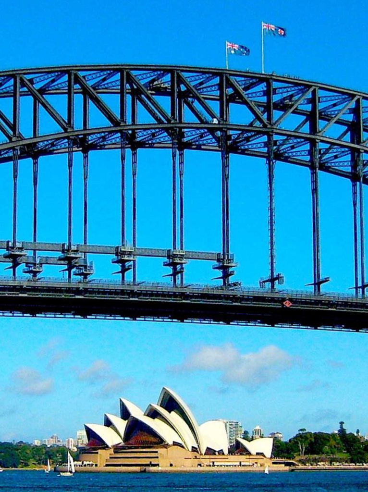
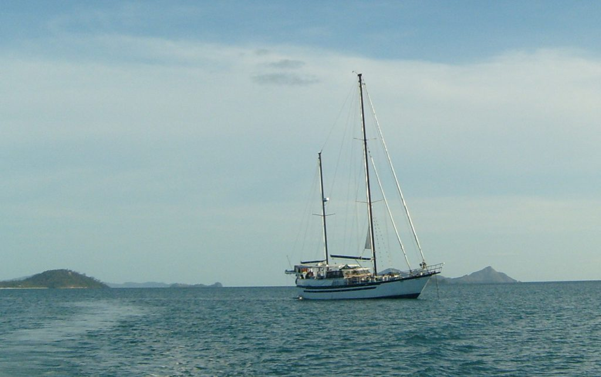
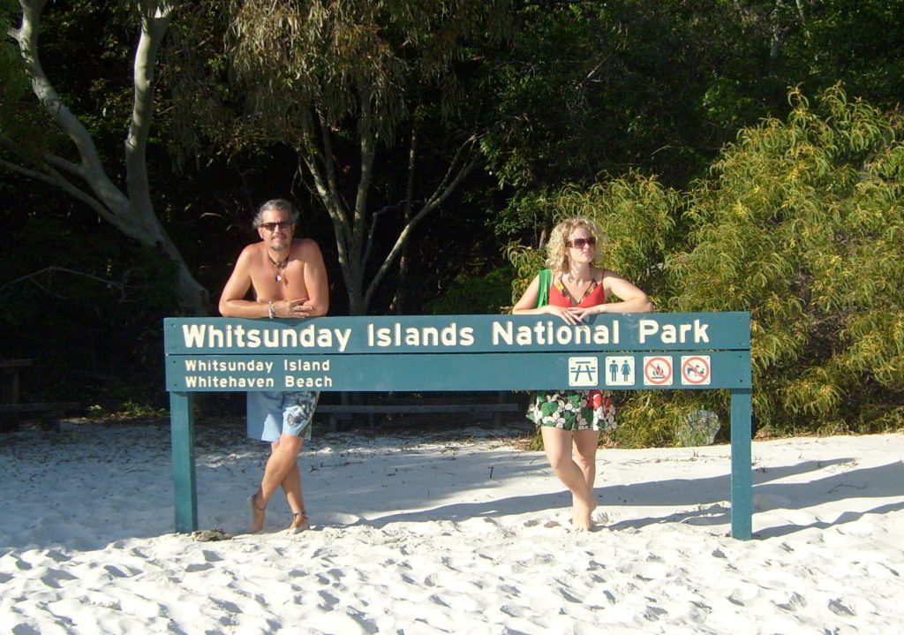

I arrived in Perth, Australia in time to make the three day World Interhash event during Easter weekend. The World Interhash happens only once every two years. It's for beer drinkers with a running problem. I met up with eleven of my fellow Baghdad hashers and it was great to see them all again. I really miss all my Baghdad friends. We really had some great times under stressful situations. Our 'Baghdad 12' were the youngest group of hashers. Most of the other hashers there from around the world were older because those are the ones that can afford to travel the world to all these events. It really makes my heart glad to see so many older people getting together, drinking beer and acting like total juvenile delinquents. I've never seen so much immature behavior from such an old crowd. It reinforces my belief that age is only a state mind. You can be as young as you want to act. I plan on acting young forever. The weekend kicked off with the traditional Red Dress Run through the streets of Perth. Over 4,000 women and men wearing red dresses and running through downtown Perth was quite a sight. In true hasher fashion, the men wore the most risque dresses. The 'Baghdad 12' made an immediate splash by getting on stage and making a mock bid to host the 2010 interhash in Baghdad. We were well received but only received 7 votes. That seems strange since even our own 12 members couldn't sober up enough to fill out their ballots and vote for ourselves. Our T-shirts were the most popular of all, selling out fast and commanded top dollar and making good trade material. For the next two days we did our runs/walks during the day and then ate well and were entertained at night, all while drinking as much free flow beer as possible. I made many new friends that I'll see again around the world at other hash events. Borneo won the bid for 2010 and I'm going to try to make it there. It was hard to say goodbye to all my new and old friends as the weekend drew to a close. Many people came up to us and thanked us for keeping the hash spirit alive in the Baghdad war zone. Most people didn't even know there was a hash club in Baghdad.

_Sydney_

From Perth I flew across the country to Sydney and met up with another old friend from Dallas. Elizabeth is traveling around Oz and New Zealand for a month. We spent two days together before she had to move on to NZ. She acted as my tour guide in Sydney since she'd been there for a few days already. When she left I looked up another old friend that I'd traveled with thru Africa twelve years ago. Just as I was going to meet him he received a phone call of a death in the family. Our reunion only lasted a half hour but it was great to see him again. We're going to try and meet up again in the states somewhere when his business takes him there. With his family emergency taking his full attention he was now unable to use his tickets to the opera at the famous Sydney Opera House. He graciously gave them to me. I was thrilled to get the chance to see my first opera in this grand venue. The iconic opera house is the symbol of Sydney. I wore my best clothes, which included my only pair of long pants and my only long sleeve shirt (flannel). The inside was as beautiful as the outside. There was a full 100 piece orchestra and a 200 person choir. It was all so spectacular and amazing and........I was asleep within five minutes. I ducked out at intermission and didn't return. I can safely say that opera just isn't my thing.

Australia is the most expensive country I've traveled thru so far. Therefore, I'm staying in larger hostel dorm rooms with many people and still paying about $25 a night. I am having to take the good with the bad. It's much easier to make friends but sometimes it's difficult to sleep with people coming and going at all hours. I am able to save money by cooking in the hostel kitchens. I stayed at a nice big hostel right on the famous Bondi Beach and even got some surfing in.

I traveled up the east coast to Airlie Beach. It's a funny name for a city with no beach. They have a marina and a rocky shore but you can't really swim in the water. The water is infested with deadly poisonous box jellyfish. I went there to meet up with some new friends I'd made at interhash and do some sailing around the Whitsunday islands.

_Sailing around the Whitsunday Islands_

We boarded our huge sail boat with 24 other passengers and 3 crew members. We were all going on a three day cruise thru the beautiful islands. We had a great time eating great food and laying out on the deck at night and staring at all the thousands of stars. We would stop on different islands and snorkel in their coves. The snorkeling I did here was better than most of the scuba diving I've done around the world. We are right on the edge of the great barrier reef. The color of the fish and coral were amazing. The fish seemed unafraid of us as we swam around. I was able to feed a large five foot Humpheaded Maori Wrasse from my hand and grab him around his thick body.

We stopped at the famous Whitehaven Beach. The sand on this beach is most pure in the world. It's 99.5% silica. The super fine white crystals were the ones used to make the glass lens for the Hubble Telescope. Glass made from these sands are 50% more pure than the finest Bavarian crystal. It is so pure that when you walk on the sand it squeaks beneath your feet. It's an odd sound to hear.  
One of my main goals for Australia was to dive the great barrier reef. I tried three times but failed. The ocean was too rough to make the fifty mile boat ride to the outer reef. One time we got about half way and had to turn back. All the locals said it was the worst year for weather they'd ever had. I already had my flight booked to Auckland, New Zealand and couldn't wait any more days for the ocean to calm down. I guess that means that I'll just have to come back here another time...

On The Road  
Andy
