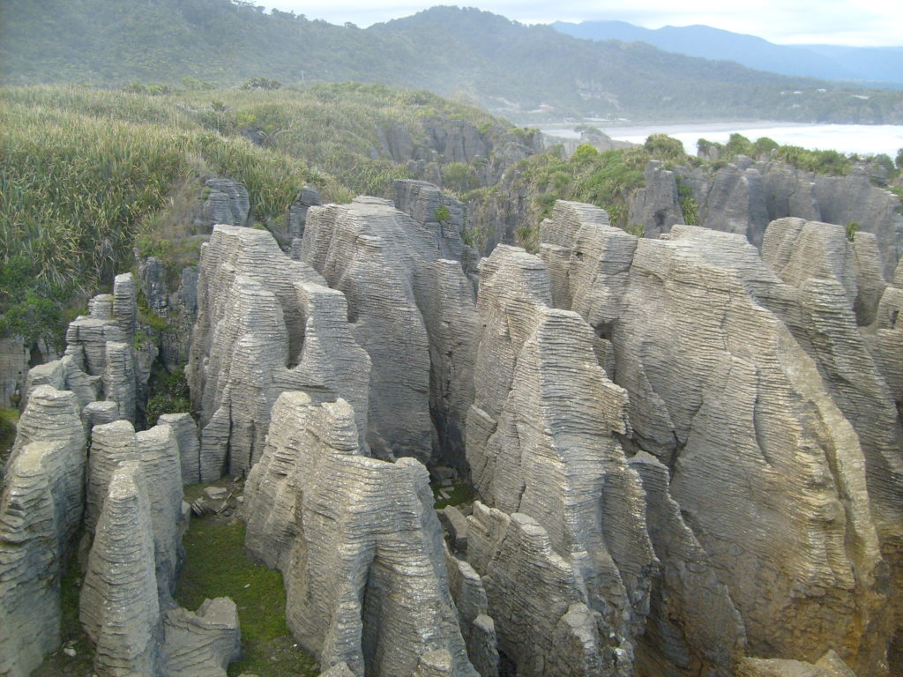

I flew into Auckland on the North Island of New Zealand. I was told by many people to skip the north island completely and just go directly to the south island but I was afraid I'd miss out on something in the north. It turns out that I probably should have followed their advice. I didn't spend much time in Auckland, it seems to be just a launching pad for other parts of the north island. New Zealand is a country that, more than any other, has 'the need for speed.' It's a playground for adrenaline junkies. They have everything you can think of and more. Skydiving, bungee jumping, whitewater rafting, jet boat rides, and rock climbing. If there is a tall building or mountain around they have figured a way to jump off it in some way or another. There was one activity that caught my attention on the north island. I took a bus an hour outside Auckland to Waitomo to go blackwater rafting.

This involves getting an inner-tube and floating thru underground rivers full of glow worms. It was something totally new and exciting to me. We had helmets with lights on them but when we turned them off it was pitch black inside the underground caves. We could only hear the rushing water of the rapids and waterfalls that we had to navigate and launch ourselves over. The roofs of the many caves had thousands of glow worms that looked like little stars. You would have thought that someone had installed little LED lights all along the roof. The glow worms are unique to this part of the world.

After three days on the north island I flew to the south island city of Christchurch. I was able to spend one evening with my Dallas friend Elizabeth before she flew back home. She told me that her ten day trek she did through the south island was the ten best days of her life. I was skeptical of such a bold claim. I'm not skeptical anymore. Although I'm not gonna make the same statement, I will say that the south island of New Zealand has the most natural beauty of any place I've been to on this planet. The USA may have a lot of the same natural beauty but you'd have to visit all fifty states to find it. Here, it is all packed into a very small area. If you want to get an idea of what this country looks like then watch THE LORD OF THE RINGS trilogy, which was filmed here. Of course film can never duplicate the actual sights but at least you'll have an idea. I decided the best way to see this place was to rent a camper van and to hit the road.

_My personal Spaceship_

I picked up my Spaceship (that's what the company calls its vans) on my birthday equipped with a bed and propane cooker and headed south out of Christchurch. It took me twelve days and about 2000 miles to circle the entire coast of the south island. The only drawback was the cost of gas, it's over $7.00 a gallon here. It took me a while to get used to driving on the 'wrong' side of the road. I kept turning on my windshield wipers when I wanted to turn on my blinker.

My first stop was the Otago Peninsula. I was awed by the mountains and cliffs that just seem to rise up from the water. New Zealand also has some of the most diverse wildlife in the world.

I was able to walk among the sea lions and seals on the beaches and sit and watch the most rare of penguins (yellow-eyed) swim out of the ocean each evening and return to their nests up on the cliffs. This peninsula is the only mainland place on earth where the albatross nests and breeds. The beaches here are pristine with huge waves and stunning rock formations just offshore.

My next major stop was Milford Sound, which is actually misnamed because it's not a sound but a Fjord. The deep inland waterways were cut by glaciers millions of year ago. This is one place where it can be said that it is not only about the destination but also about the journey (although the destination would be enough in any other circumstance). The 80 mile drive from Te Anau to Milford Sound is one of the most scenic roads you could hope for. I traveled through Fjordland National Park and the Eglington Valley, stopping many times to take numerous hikes into the woods to see spectacular waterfalls or other natural wonders.

I traveled through the mile-long Homer tunnel that was blasted thru the middle of a mountain, only to exit on the other side to a spectacular high-walled ice-carved amphitheater with waterfalls on either side that seem to fall for a mile. Words cannot describe. It took me all day to drive the 80 mile road and I could have taken many more days if I wanted. I slept in my van by the water of Milford Sound and got up early to go Kayaking into the pristine waters.

_Kayaking in Milford Sound_

I was dwarfed in my kayak by the sheer cliffs and waterfalls that fell from upon high into the cool deep black waters. We were even joined along our trip by a few curious seals. I've traveled thru the Fjords in upper Norway and have to say that these are at least as awe-inspiring.

Next, I stopped in the adrenaline capitol of the world, Queenstown. This place is teeming with backpackers and fun seekers. It's set among the mountains along a beautiful lake and has a sleepy ski town feel but is anything but sleepy. This is where most of the thrill seekers come to get their fix. Pretty much anything you can think of, thrill-wise, you can do here. I never knew you could ride down raging rapids in a wetsuit with only a small boogie board to hold onto, but you can do that here. I never knew you could ride thru a narrow gorge in a jetboat at breakneck speed just barely missing the rocky cliff sides doing 360 spins along the way, but you can do that here also. That and many other new and unusual thrilling adventures all happen here. If you want to be boring you can always just skydive or bungee jump from the tallest bridge. None of these come cheaply so I only chose to do two of them. First, I opted for the jetboat ride down the narrow canyon. These jetboats can travel thru just four inches of water, which is good because they have been having a drought here and the river was low. We often raced over the gravel riverbed in only inches deep water.

_Jet boating through the narrow canyon_

Next, I signed up for the huge canyon swing.

This is basically a bungee jump but instead of getting bungeed at the bottom of the 180 ft. freefall you swing out 600 ft. over the canyon below at 100mph. This was AWESOME. So much so, that I did it twice. The first time I jumped I did a full back gainer, the second time I did the straight pin drop. This was the most scary as you watch yourself drop the whole way down. The guys who run the adventure amuse themselves and the spectators by messing with you and eroding your courage. Just as you're about to jump they yank you back and tell you that they forgot to hook up your harness correctly. They will do this several times until you're actully not sure if you can trust them at all. When you actually do jump you are only hoping that you're going to survive. One more note. If you do it naked, it's free. It was cold and I wasn't that brave but many people are.

http://www.youtube.com/watch?v=yES02E8huXI

My next major destinations were the Fox and Franz Josef glaciers on the west coast. Only one other place on earth (Patagonia) do glaciers travel thru a temperate rainforest and advance this close to the sea. They are probably the most accessible glaciers on earth and are definitely the fastest traveling. They travel about five feet per day, that's over ten times faster than any other glacier. They are exactly what you'd expect glaciers to be. Mighty cascades of ice tumbling down a valley towards the sea. Basically, large very slow moving rivers of ice. I first stopped at Fox Glacier, the less popular of the two. I decided to forgo paying the $150 for the mandatory guide and headed out on my own. I found the secret path that accesses the glacier and climbed the mountainside till I reached the place where most of the guided tours begin. I hid out until all tour groups were out of sight and then climbed down the hill and onto the glacier. I didn't venture very far onto the ice since I wasn't wearing the spiked crampons on my shoes to assure good footage. I didn't want to fall into one of the deep crevasses.  
The next day I drove the 40 miles to Franz Josef glacier and hiked to the terminal face where the glacier stops and the raging river of icy cold water flows from beneath it towards the ocean. The water is milky colored from all the ground up rock mixed into it. I debated for a while but decided to pay for the expensive heli-hike onto the glacier and I'm glad I did. Money well spent.

_Helo to Franz Josef Glacier_

A small group of us loaded into a helicopter and took a scenic tour around the glacier and then finally landed about half way up the massive moving ice flow. From here we put on our crampons and hiked on top of the glacier for a few hours. The pristine ice towards the top is actually blue because the suns rays have caused many ice caverns and tunnels. We tramped through tunnels and slid down natural ice slides as we listened to the crackling, moving flow. We could see large ice chunks as tall as building break off and tumble over as they made their slow descent down the valley. We came upon a small glacial pool filled with ice water. It was our guides last day so it was tradition that he jump into the icy water. I didn't want him to feel lonely so I stripped off my jacket and shirt and jumped into the deep frigid water with him... pants, boots, crampons and all. I think 'refreshing' is the word that most people use to describe cold water, well this was beyond refreshing. The worst part was having to finish the trek in wet pants and boots but I'd do it all again. At least it makes a good story. On our helo ride off the glacier we could really see how close the glacier comes to the ocean. These glaciers are actually advancing, meaning they are getting bigger rather than shrinking. The terminal face is getting closer to the ocean and has been for about the last five years. Glaciers are constantly either advancing or retreating depending on how much snowfall they get on the top. They never stay the same.

_Pancake rock formations of Punakaiki_

After leaving these glaciers I traveled along the coastal highway the rest of the way around the island constantly stopping to take photos and admire the many spectacular sights along the way. The south island has many geologically unique wonders and animals only found here. After twelve days I finally landed back in Christchurch and explored the city for three days till my flight to Fiji.  
New Zealand has become one of my favorite places on earth. I'll always love Italy but this place is magical. I would recommend it to anyone who has the time and money to explore this wonderful island.

On The Road  
Andy
