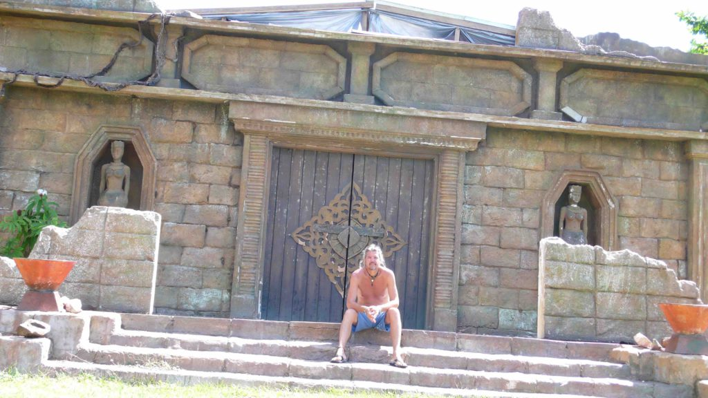
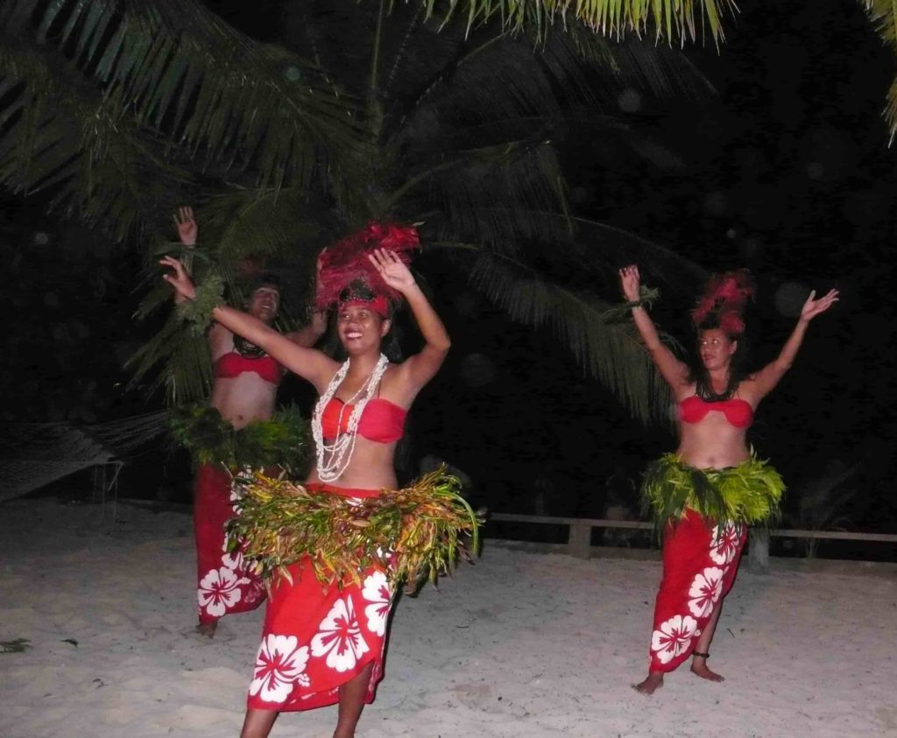

\[et\_pb\_section admin\_label="section"\]  
\[et\_pb\_row admin\_label="row"\]  
\[et\_pb\_column type="4\_4"\]\[et\_pb\_text admin\_label="Text"\]

Fiji was a stopover place to break up my long flight from NZ to America. My flight had a short scheduled layover there anyway so I decided to turn it into a four day vacation. One last hurrah before getting back to the real world. I wanted to get away from the main island so I caught a small local boat to a tiny island called Mana. This is where the real Fiji is. My budget accommodations included all meals. It has to be that way because there are no stores or places to eat on the whole island. It was a very rustic place. I took a walk along the beaches of the whole island stopping to explore and swim and it only took me two hours to encircle the whole island.

_Fake buildings from SURVIVOR television show_

A season of the TV show SURVIVOR was filmed on this island. The film crews living quarters and the remains of the Tribal Council set still stands. My first night there I did a night scuba dive. It was my first night dive and it was fun. Exploring the pitch black abyss with only a flashlight was exciting and mysterious. Certain fish only come out at night. We dove a coral reef wall that dropped off into the deep ocean.

The next night some dancers arrived from another island and gave us a show of local hula and fire dancing. My days were spent snorkeling in the crystal clear waters of the coral reefs and making new friends on the beach. It was a perfect ending to my long trip.

I flew from Fiji to Denver to visit friends and some family for a few days and then flew onto Dallas to see more family and friends. I hadn't seen my mom in almost two years so it was good to spend Mothers Day with her and see my two brothers and their kids. I finally arrived back in Cocoa Beach and looked at the mess that was my house. Over two years of mail stacked in boxes. Foot lockers and huge boxes sent home from Baghdad and other places around the world. Opening these boxes was like the Xmas that I didn't get to have for the last three years.  
I have been home for a few weeks now and finally getting into my normal routine. I'm back playing tennis a few times a week and going to the beach to surf or just walk the shore.  
I'm going to Key Biscayne tomorrow to see my sister and her kids and then back to Denver for a week of business. I don't have any plans to go anywhere exotic right away...but I'm already planning a trip to South America and Antarctica. I'm already excited to get back ON THE ROAD.

On The Beach  
Andy

\[/et\_pb\_text\]\[/et\_pb\_column\]  
\[/et\_pb\_row\]  
\[/et\_pb\_section\]
