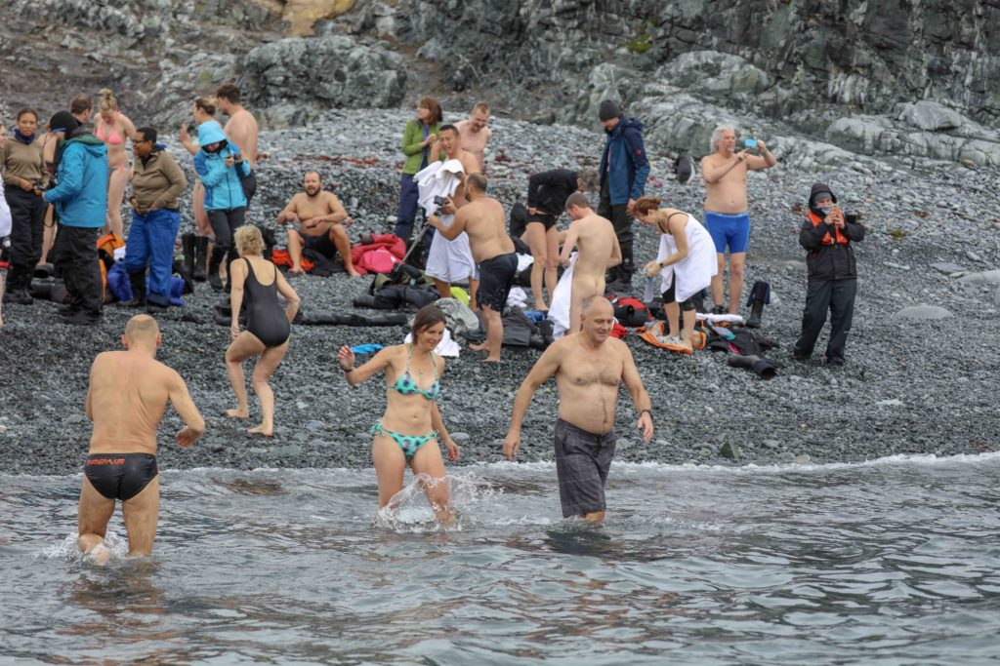

Antarctica is a once-in-a-lifetime adventure, at least for me. It is the seventh continent I’ve visited and completes my lifetime goal of visiting every continent on this blue marble we call Earth. 

https://youtu.be/8dcjHtfdNO8

We started our journey by boarding the Russian icebreaker _Ortelius_ in Ushuaia, Argentina, on March 3, 2018. I shared my two-bed cabin with my Dallas friend, Elizabeth. A seasoned traveler herself, it would also be her seventh continent to visit. We had about 110 passengers on our ship with us. I was a bit fearful of the voyage to Antarctica because I tend to get seasick, and I’d heard horror stories of crossing the Drake Passage.  
The Drake is where the Atlantic Ocean meets the Pacific Ocean and can cause very rough seas. The north-flowing cold waters collide with the warmer sub-Antarctic seas to form Antarctica's natural boundary.  I took my seasickness pills as a precaution, but was happy that the seas were more of a "Drake Lake" instead of the 30- to 40-foot swells they had seen the trip before mine. It took about two days to finally see land and icebergs. During that time, we would meet in the spacious bar for lectures and Q&A sessions about what we were about to experience.  
       Our first stop was Culverville Island. We boarded our inflatable Zodiacs and were ferried to the shore, where we were greeted by  
thousands of Gentoo penguins. Hatching season was a few months before, and the Gentoo chicks were getting big and starting to lose their fluffy feathers. They didn’t stray far from their mothers because they are the only source of food for the chicks.

_Gentoo Penguin_

 The penguins have no fear of humans. They would come right up to us, stare at us and even give us a curious peck sometimes. They were playful and fun to watch.  We stayed for hours observing and taking photos. We returned to the ship for lunch as the ship moved to a new location in Orne Harbour.   
  
We boarded the Zodiacs again and cruised around the harbor and saw more penguins and also humpback whales diving deep for krill, the shrimp-like crustacean that is the mainstay of their diet. Their flukes (tails) rose above the water as they dove straight down. It was a thrilling sight to see.

  The whales would often dive down in teams and work together to catch their food, using circles of bubbles to surround and trap the krill inside as they rose to the surface and swallowed a mouthful. It was fascinating to watch them work in tandem. I would get nervous when the bubbles surrounded our little Zodiac, because I thought they would lift our tiny boat out of the water and toss us overboard, but they never did. I guess they knew where we were, because they would surface just a few feet away and never tossed us overboard.

_Humpback Whale_

  We returned to the _Ortelius_ for dinner and then drinks in the bar in the evening. This was our schedule every day: a morning expedition, lunch, and then an afternoon expedition in a different location. I purposely chose this particular ship and trip because it was the one with the most activities. 

Some ships come all the way to Antarctica and the passengers never leave the ship. I can’t imagine traveling all that way and never setting foot on land and getting the “up close and personal” experience with the wildlife.

We were off the ship and on land most of the day, exploring new areas and seeing different species of penguins and sea lions. We stopped and explored the Antarctic peninsula, as well as Danco Island, Neko Harbour, the Argentine Islands, Pleneau Island, Foyn Harbour, Wilhelmina Bay and the Neumayer Channel.  We stopped and visited the researchers at the Ukrainian Vernadsky Research Station, where I mailed a postcard to my mom at the Southernmost Post Office.   
I kayaked in the beautiful Lemaire Channel among soaring mountains on either side and icebergs with ancient blue ice all around us.

One afternoon I strapped crampons onto my boots and did some ice climbing with our guides, and then at night camped under the stars with no tent on one of the Argentine Islands. I also specifically chose this trip so I could camp on the continent. It’s not enough to actually visit all seven continents; I wanted to sleep on all seven.  
       Our last stop before heading back to South America was on Half Moon Island, which was used by sealers and whalers as early as the 1820s, as evidenced by an old wooden boat from this period that still lies on the rocky beach. This is the location that was chosen for our polar plunge, something I would not miss. 

_Polar Plunge_

This fearless leap into the icy cold Antarctic waters was made by about half our passengers. We stripped down to our undergarments (one friend went naked), while nearby sea lions looked on and we ran into the icy water and dived in. We didn’t stay in for long, just long enough to brag about it later. Then we were off on our way back home. 

The Drake was a little rougher on the way home, but still not too bad.  My pills worked; I never got seasick.  In a few days we landed back at Ushuaia on March 14. We disembarked and went our separate ways, but met up again later that evening at an Irish pub, with new friends met on the voyage, for drinks and to relive memories and exchange photos.

Most of the friends I met on the ship were flying back to their home countries, but this was only the start of my long journey through all of South America and beyond. I plan on traveling for the next few years.

On the Road,  
Andy
