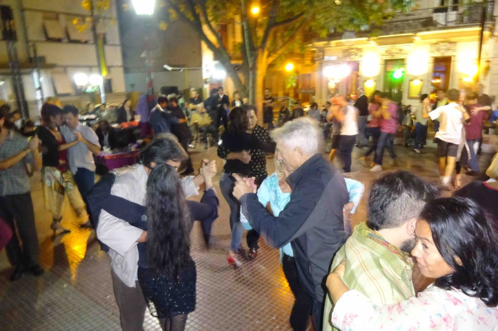
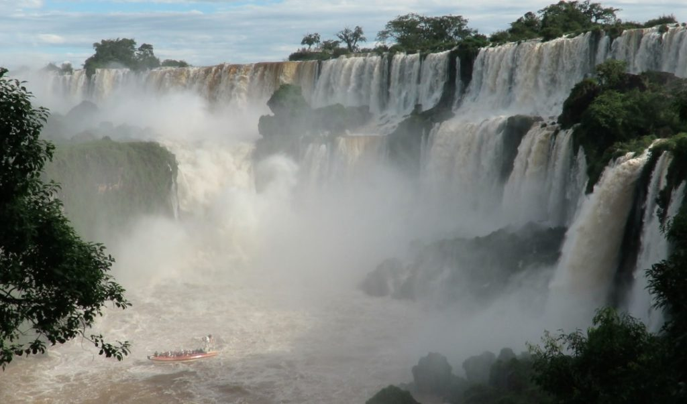

I started my trip by flying from Dallas to Buenos Aires. This multi-year trip will take me all over South and Central America and Antarctica. But, my first stop is Argentina. 

https://youtu.be/keLpbiT8\_Qw

I didn’t explore as much of Argentina as I would have liked, but what I saw was magnificent. I was only in Buenos Aires for a couple of days before heading down to Ushuaia, which is the largest city in Tierra del Fuego. 

Tierra del Fuego, a group of islands off the southernmost tip of South America, is often referred to as “The End of the World” and it sure feels like it. I went there only to catch my ship to Antarctica. This is where all the ships set out for the icy lost continent. 

Ushuaia is a small town, with the frigid Atlantic Ocean on one side and snow-capped mountains on the other. Lots of businesses and attractions bill themselves as “the southernmost” this or that. Southernmost golf course, southernmost Irish pub, etc. 

Before I left Dallas, I hunted through the thrift stores for cold weather clothing I’d need for Antarctica. Unfortunately, I forgot my big winter coat and its pockets stuffed with my hat and gloves at the airport in Buenos Aires as I went thru security on my way to Ushuaia.  Luckily, my friend and Antarctic travel partner, Elizabeth, was flying through Buenos Aires on her way to Ushuaia and was able to grab it back from lost-and-found for me. 

When I returned from Antarctica, I took most of the clothes and gave them away to the locals or donated them to the church. I didn’t need them for the rest of my trip. I plan on staying in warm climates. 

I arrived back to Buenos Aires at a great time. The city streets were full of music as a large festival was going on at multiple locations.  I don't consider myself a foodie but the steaks in Argentina are the best and what this country is known for. I met up with a fellow Antarctic traveler and we went out for a superb steak dinner in the chic Palermo neighborhood. At the hostel where I stayed, there was a rooftop barbecue grill where a bunch of us guests had a huge beer-and-beef-a-palooza. 

I made some great friends at that hostel. But what comes to mind most when I think of Buenos Aires is tango. The people here are obsessed with the passionate dance. I even took a tango lesson with a group of friends from the hostel. It’s a very technical dance which involved very close dancing with subtle touches to guide your partner. 

_Outdoor Tango Dancing_

 There are tango dance clubs everywhere and lots of people even dance it on the streets. On Sunday evenings after the wonderful San Telmo flea market closes, the small square turns into an outside tango dance floor. Some really expert dancers whirl their partners around all over the floor, while some prefer a slower, more sensual version of the dance. 

I also visited the famous Recoleta cemetery, with all its very ornate mausoleums and artistic headstones. It’s the final resting home to the richest and most privileged of Argentina, including the country’s infamous former first lady Eva Perõn. I stayed there for hours taking photographs.

_Evita's Tomb_

I flew from Buenos Aires to the northern tip of Argentina on the borders of Brazil and Paraguay to witness the splendor of Iguazu Falls. Iguazu Falls collectively make up  the largest waterfall in the world, and probably the most amazing natural sight I’ve ever seen. 

I’ve been to Niagara Falls a couple of times, but as Niagara has two large waterfalls, Iguazu has over 275 separate falls. Reportedly, when First Lady Eleanor Roosevelt saw the falls, she had pity for the American/Canadian falls, exclaiming “poor Niagara!”

Unlike the _Maid of the Mist_ boat at Niagara, the boats here really go into the falls. The crazy boat drivers take daredevil runs right up to the falls until the front of the boat has water crashing down upon it. 

_Iguazu Falls_

There are two different paths to explore the many falls. One path, complete with overwater foot bridges, leads you above the falls. The other path takes you around the bottom of the many falls. The biggest fall is called the Devil’s Throat. The rush of water all around as I stood next to the Devil’s Throat was intoxicating. I just wanted to stay and stare and not leave. It drew me in. 

I spend a whole day walking around and then the next day crossed the border into Brazil to look at the falls from that side also. The walkways both countries have built to get as close as possible to the rushing water are spectacular.

I flew back to Buenos Aires in time to celebrate my birthday with some friends I’d met along the way. It was a rainy night, but that didn’t stop us from staying out until after 5 a.m. I rested a few days before leaving with a friend from the hostel to catch a ferry to Uruguay. I think someday I’d like to come back to Buenos Aires and Argentina. There is still a lot to discover in this wonderful country.

On the Road,

Andy
