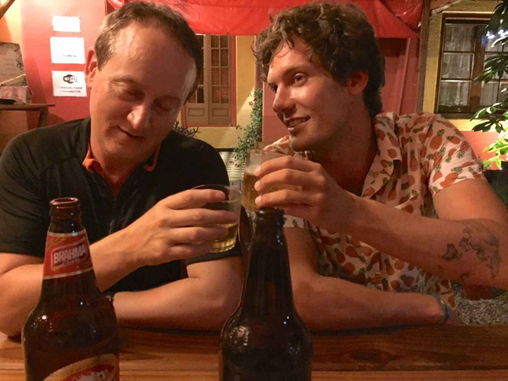
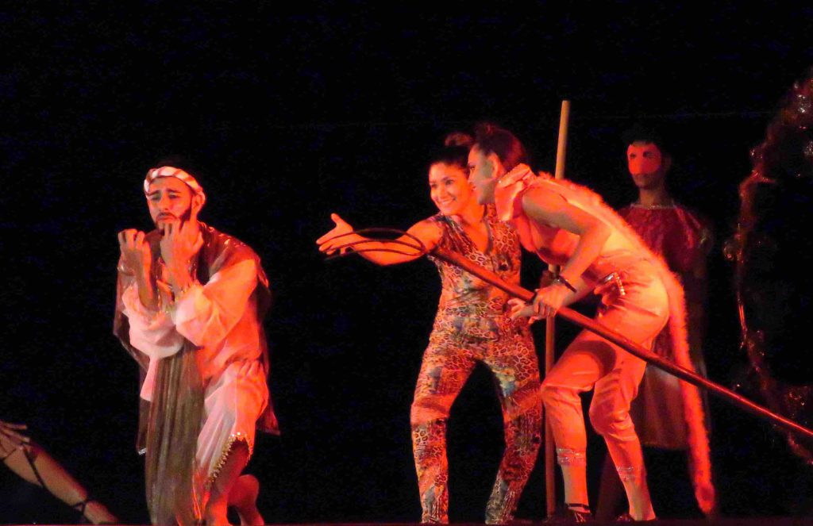

What stays in my mind most about Paraguay is the good friends I made there.

https://youtu.be/dviyK73Zdek

I entered Paraguay by walking across the bridge, that spans the river that divides Argentina and Paraguay, into the commercial city of Ciudad de Este. The borders of Argentina and Brazil both meet here also.  Ciudad de Este is the city to buy cheap and counterfeit products.  It’s an open secret that when the border guards change shifts the illegal products are allowed to be brought across the border from Brazil and Argentina.  Paraguay has no laws against selling fake products like Argentina and Brazil have.  I bought a few electronic products and a new backpack at a very cheap price.  The shopping malls here are as nice and new as any in the USA and very busy.  The sales people glide around the large stores wearing roller blades in order to assist the many customers.  I didn’t stay in this one-trick city for long.  I took a bus west all the way across the small country to Asuncion.  The hostel I stayed at is where I met my friends that I traveled with for the rest of my time in Paraguay.  We would go out exploring during the day and then play some drinking games at night or just sit around and chat about our travels and where we should go next.

One evening we had a “guys night out” and joined up with a pretty rowdy pub crawl.  The last stop was a very popular nightclub that kept us busy until 4am.  The hostel we all stayed at informed us that they would be closing down in a few days to do some remodeling so we all had to figure out where to travel to next.  Before that happened I took two pairs of my favorite travel pants to get some mending done. These pants have been around the world with me.  When I went back on the day I was told they’d be finished I found them closed, and then closed again the next day.  I eventually had to leave town without my favorite pants and now only have one pair of long pants.  That’s how it happens sometimes but I’m not worried.  I don’t plan on going to any cold places for a while. When it was time to leave Asuncion most of us boarded a bus to Encarnacion a few hours away.  Encarnacion is separated from Argentina by the very wide Paraná River that was great for swimming and keeping cool. 

We arrived just before Easter.  A group of us took a day trip to the small village of Trinidad to see the ruins of an old Jesuit Missionary.  The Jesuits were very active here during the 17th century.  If you want to know more just watch the very good movie THE MISSION with Jeremy Irons and Robert DeNiro.  We spent the day wandering around the well preserved ruins and stayed until night to see the light show.  We weren’t sure how we would get back to Ecarnacion.  We stood an hour along the lonely road until we could flag down a passing bus to take us the two hour trip back.  After a few days most of my friends traveled on but I decided to stay in Encarnacion for the Easter weekend holiday and I was glad I did.  Along the river, stages were set up for three days of music, cultural dancing and even a modernized Passion Play complete with music by Queen, Justin Timberlake and others. 

_Easter Passion Play_

I ate good food and enjoyed the wonderful sights.  My hostel that I was staying had an all day craft fair and party.  Muralist, tattoo artists, musicians and other artist performed and sold their home made items.  It was great fun and I met so many more interesting people.  Eventually, it was time to leave Paraguay and head back to Buenos Aires.  Although, Paraguay doesn’t have the great sights of other countries, I arrived there at the right time to meet great people and enjoy the festivals.

On the Road,

Andy
