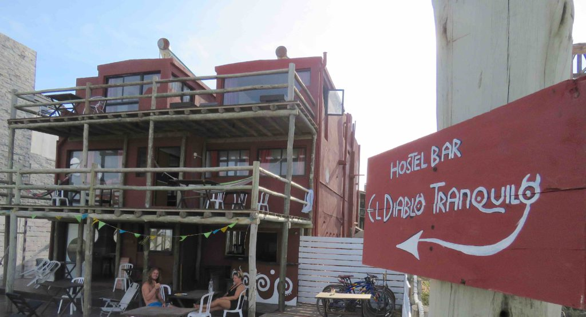

I left Buenos Aires with a friend to take the hour long ferry across the wide Plata River to the city of Colonia del Sacramento in Uruguay.  I could still see the hazy skyline of BA in the distance while sitting on the shore in Uruguay.  The major cities in Uruguay are all along the coast so that’s where I stayed.  I traveled up the coast stopping at five different places on my way to Brazil. I soon found out that Uruguay is one of the most expensive countries in South America so I moved thru the whole country in about two weeks.

https://youtu.be/cbfH49Vyh64

Colonia del Sacramento is one of the oldest towns in Uruguay.  Between the years 1680 and 1828 the town changed hands between Spain and Portugal ten times.  It’s downtown historical quarter is a UNESCO World Heritage Site complete with cobblestone streets, old city walls and an impressive lighthouse.

Next, I moved on to the capitol city of Montevideo. This big city didn’t hold much interest for me so I moved on after a couple days to the city of Punta del Este.  This city is known worldwide as a scenic resort area with miles of beautiful beaches, luxury hotels, trendy restaurants, glittery nightlife and an upscale summer population.  Unfortunately, I arrived during off-season and the town was mostly a ghost town. Most clubs were shuttered and many restaurants were closed.  I had a hard time finding cheap places to eat so I moved on after a few days to the very small coastal hamlet of Cabo Polonio. 

This place is backpackers’ heaven with a population of less than 100 people.  There are no roads leading to it and the only electricity is used for the lighthouse.  In order to get there, I had to board a huge double-decker 4x4 dune-crosser vehicle that only travels a few times a day.  I arrived at night so as I walked thru the small hamlet I chose where I’d stay by who had the best campfire.  I chose wisely because the hostel was also flying the Jolly Rogers flag.  I met an interesting cast of fellow travelers and locals.  During the day I’d explore the coast, chase the wild horses, climb the lighthouse and watch the colony of sea lions that inhabit the rocky shore nearby.  Nights were spent eating by candlelight, sitting around the campfire of different hostels and listening to people play music.  Sometimes we’d make our way to the dark beach and go skinny dipping.  I loved it here even though it was low season and mostly empty.  No restaurants or shops were open.

http://blog.global-exchange.com/en/cabo-polonio-unconventional-in-uruguay/

After a day and night of constant rain I got tired of being inside so I trudged thru the rain and caught the dune-crosser back to civilization. My last stop in Uruguay was Punta del Diablo, which didn’t have many more people than Cabo Polonio during this off-season period.  It’s a sleepy little fishing and surfing village off the beaten track but popular with backpackers.  It was a place to relax and lay in hammocks and look out at the ocean.  After a few lazy days I was ready to hit the road and head into Brazil.

I wonder how different Uruguay would have been during high season.  I guess I’ll never find out…or maybe I’ll come back some day and find out.  Did I mention that marijuana is legal in Uruguay?

On the Road,

Andy
