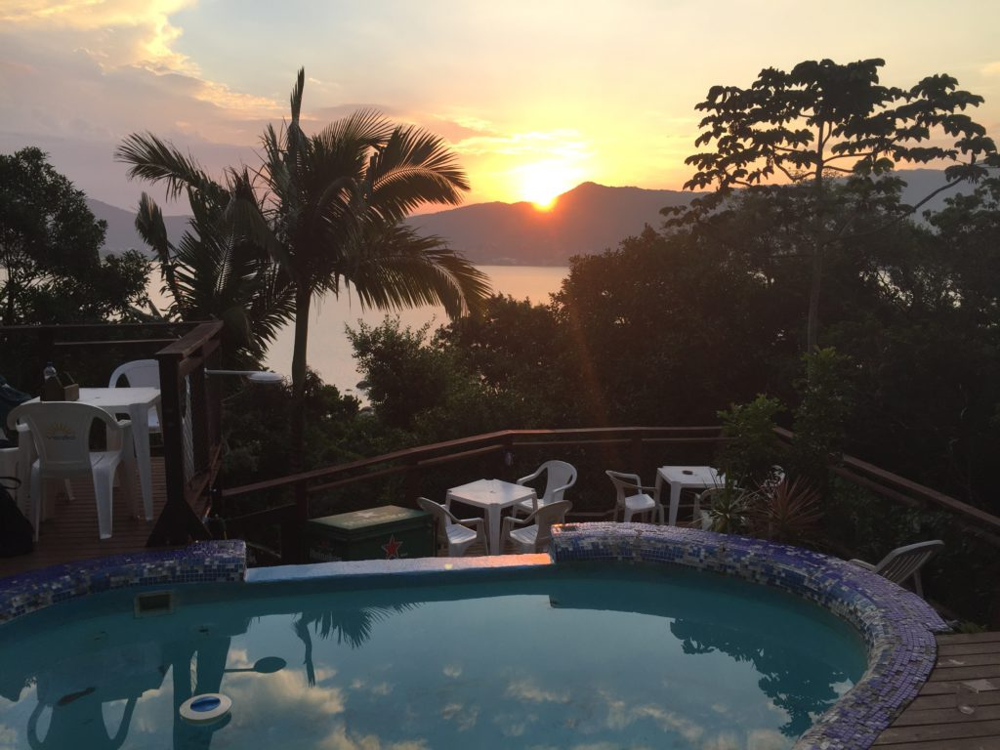
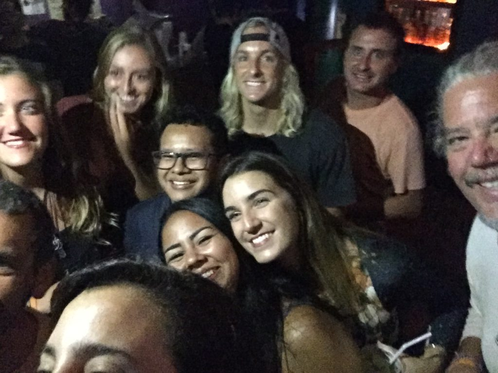
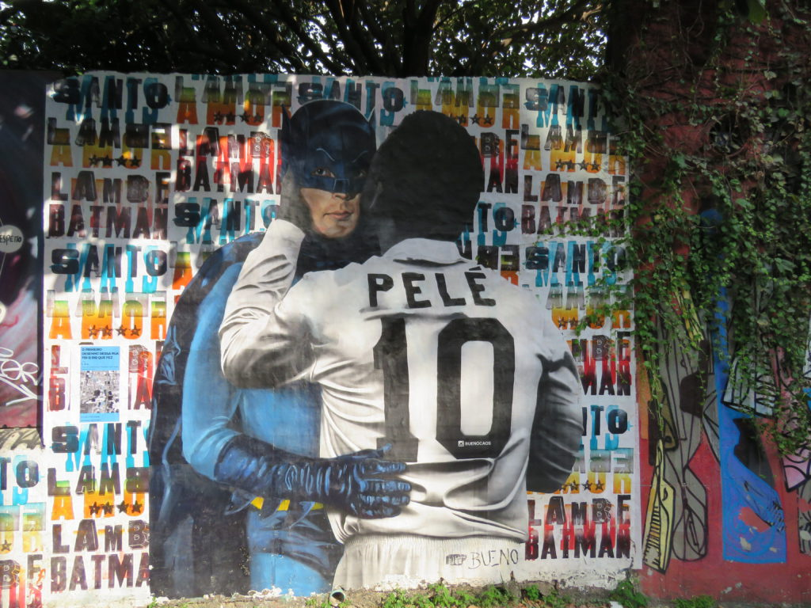
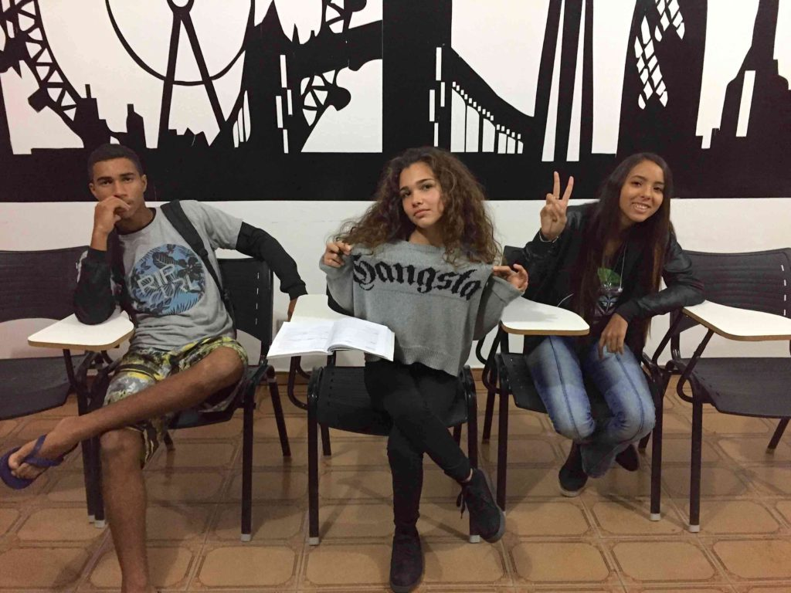
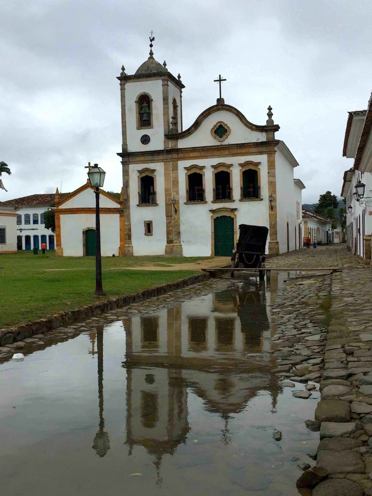
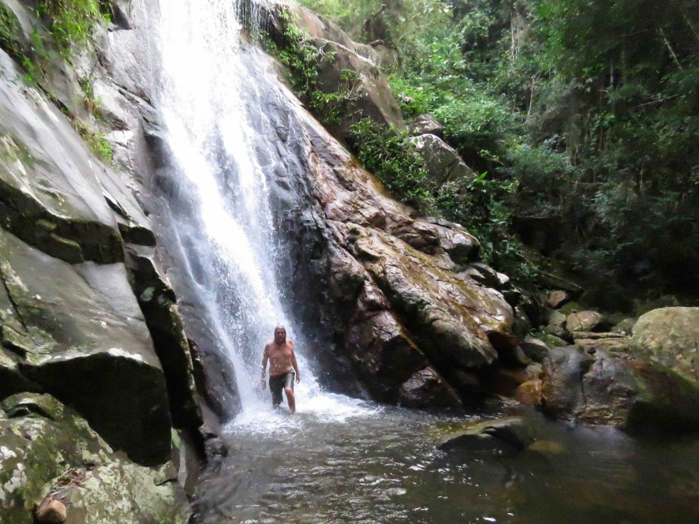

https://youtu.be/oyrAWMCcVFw

As in Uruguay, I stayed along the coast in Brazil. I went only slightly inland to visit the largest city in South America, São Paulo. 

My first stop was only 80 miles inside the Brazilian border to the city of Pelotas. I met up with two German travelers on the bus and we decided to go to the same Airbnb when we arrived late at night in the pouring rain. We got soaked trying to find the well-hidden place. 

The host was a wonderful lady who immediately made us some tea and something to eat. I only stopped there because I didn’t want to ride the bus all night. I left the next day after breakfast and got back onto the bus to the further north city of Porto Alegre. I was trying to avoid the extremely long bus rides, so Porto Alegre is as far as I got in one day. 

I spent only two days there. I used my time to figure out where I wanted to go next and to spend a few hours looking around this big, dangerous city. It has a higher than normal incidence of violent crimes, most notably murder and armed robbery. 

Next, was another long bus ride to the beautiful city of Florianópolis. I stayed on Santa Catarina Island, right on the shore. This became home to me for a couple weeks. I stayed in a wonderful cliffside hostel that overlooked the beautiful waters of the bay, complete with swimming pool, restaurant and bar. 

_View from my hostel bedroom_

This is where I discovered the intoxicating Brazilian national drink called caipirinha. It’s made with the rum-like Brazilian liquor named cachaça, and sugar and lime, and can really pack a punch. Our hostel bar would give us free caipirinhas every evening for a half hour. 

After getting all fueled up, we were ready to go out and hit the clubs or down to the pool to mix up another batch of our own caipirinhas and then go out. I fell in with a crew of about 10 fellow guy and girl travelers from other parts of Brazil and from around the world. 

One of my roommates was a great guy from Ireland named Eoin (pronounced Owen).  He always carried around a deck of cards to show off his many tricks. He found it a great icebreaker with girls. 

We became a tight crew who always went out together to the many different bars and clubs of the island. We spent our days at the pool or taking difficult hikes to secluded beaches that were boxed in by steep hills.  At night we always met at the bar for our free drinks, and then went out to soak up the nightlife. 

_Party Crew_

When it was finally time to move on, Eoin, a French friend and I took an overnight bus all the way to São Paulo. São Paulo is a monster. It’s the biggest city I’d been to since Buenos Aires, and I was ready for some big city life and culture. I was not disappointed. 

Eoin and I settled into a hostel in the chic part of the city called Vila Madalena. It’s near where most of the nightlife happens. Also, I’m always happy to visit a city with an extensive subway system. A subway is a cheap ticket to everywhere and I always take full advantage of that. 

We both went downtown, where we were able to get onto the roofs of the two tallest buildings in São Paulo. The spot afforded a great view of the urban jungle for as far as I could see. I visited the many grand churches, parks and well-curated museums around the city.

_Batman Alley mural_

I especially liked the Central Park-ish Ibirapuera Park and Batman Alley, which was full of creative murals and graffiti. A cultural arts fair was set up all around the city while I was there. Lots of interesting music, videos, art and listening parties were happening everywhere. I criss-crossed the city, trying to attend as many of the events as I could.  

Eoin told me about volunteering as an English teacher at a small Oceanside village called Boicucanga, not far from São Paulo. He had done it months before and highly recommended it, so I contacted the owner of the school and arranged to go volunteer. 

I ended up staying at the school for three weeks, teaching students aged 8 to 50. It was so rewarding and fun to bond with the students. I was teaching with a nice young couple from Great Britain. We got a free room and food while teaching there.

The school owner would have us over to her place for dinner and the older students even threw a barbecue party for us before we left. I miss all my students. 

_My students had attitude_

My next stop was the preserved Portuguese colonial municipality of Paraty. This well-designed town on the coast has a unique feature: When the full moon happens every month, the tide rises and floods the cobblestone streets, flushing out the garbage and cleaning the city streets. 

_Paraty_

Paraty was built in 1597 but exploded in population in 1696, when the world’s richest gold mine was discovered nearby and its port became very valuable. Those days are long gone and it’s now a sleepy little town again, but its rich tradition and culture remain. 

 While I was there, the World Cup soccer matches started. All shops closed while Brazil played and the bars and restaurants became packed. A Brazil win meant partying in the streets, horns blowing and wild celebrations. I caught the fever and adopted Brazil as my new favorite team.

My next stop was Ilha Grande (Big Island). It’s only about an hour or two drive to Rio de Janeiro once you get the hour-long boat to the mainland. I was glad to hear from Eoin that he would join me there and that he was also bringing his younger brother, Kieran, with him. I got what I expected: Two wild Irishmen, who loved to have a pint … in fact, a lot of pints. We had a great time all staying at the same hostel, with the very entertaining hostel owner and employees. We staggered home a few nights from the local clubs after lying out at some of the wonderful beaches all day. 

Brazil is all about the “bunda” or butt. Men go wild for them and the woman feed their desires by wearing the tiniest string bikinis to the beach. I saw some grotesquely artificially enhanced bundas on a few women that did not look good. They took a good thing and just went too far.

Eoin and Kieran went back to Rio after a while, where I’d meet up with them later. This gave me time to explore more of the island. 

Ilha Grande has a long and strange history. Starting in 1884, it was used as a quarantine stopover island for Europeans during the cholera epidemic. Then it served as a federal penal colony in the 1940s and ‘50s. I went and explored the ruins and also the ancient elevated aqueducts that still operate today, bringing water from waterfalls in the hills to the small town. 

 There are many waterfalls in the hills of the island. I set out the see the largest one a little too late in the afternoon. It was a two-hour hike in my flip-flops through the woods filled with muddy trails and steep hills. I was rewarded with a beautiful 45-foot waterfall to bathe in. I met up with a couple that was already there and hiked to the nearby beach that was a pick-up point for a boat to take us back to a small town on the other side of the island. We waited and waited, but the boat taxi never showed up and darkness fell upon us. We start our two- and-a-half hour hike in the diminished light. All our phones were almost dead, so we didn’t have much flashlight time. 

I was doing pretty well until I slipped in some mud and landed on my ass, right on a large root. I thought I broke my tailbone. I had the deepest, reddest bruise on my butt that I’ve ever seen. I couldn’t sit right for days. I needed to rest it a few days before I took the boat and bus ride to Rio. It hurt all the way there.  

On The Road,

Andy
