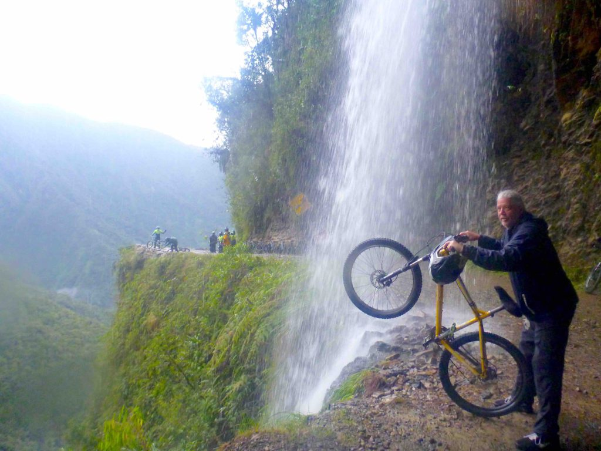

When I think of Bolivia I think of death.  From the desolate Salar de Uyuni salt flats where nothing can live, to the Death Road bike ride I did in the mountainous outskirts of La Paz.  This country and their culture seems obsessed with death. They have an accepted practice of keeping the skulls of their loved ones in their homes and even carrying them around in public on certain holidays.  The elevation is so high in many parts of the country that not many trees grow so the landscape looks rocky and gray. Images of death are everywhere.  It’s even the place where Butch Cassidy and the Sundance Kid met their demise, or so the legend says.

https://youtu.be/d\_Fa70mbH0Y

I arrived by flight to the capital city of La Paz from Santiago, Chile. La Paz is the highest altitude capital city in the world sitting at almost 12,000 feet above sea level.  The airport where I arrived is even higher at 13,000 feet in the neighborhood called El Alto.  For this reason, I immediately started drinking coca tea and chewing the coca leaves in order to stave off altitude sickness.  I also bought pills for the same reason.  I experienced altitude sickness in Tibet and never wish to repeat the blinding headaches and sleepless nights caused by this malady.

La Paz is divided into two distinct parts; El Alto and downtown.  The two are connected by numerous aerial cable cars called the Teleférico that began service in 2014.  El Alto is the higher altitude section where the poorer residents reside and the downtown area is where the more affluent live. I stayed in the downtown area near many of the famous churches and landmarks but ventured into El Alto to visit their interesting markets.

On my first day I was walking down the main busy street of La Paz and came across a large herd of zebras, or at least people dressed in zebra costumes. The 50 or so costumed zebras played music, danced, did an zumba class and just milled about in the large center median of the busy street.  This is something I’d see often in other Bolivian cities. They seem obsessed with zebras.  They act as crossing guards and walk the children home from school.

_Zebra Zumba_

I joined a free walking tour and got my bearing in this strange geographical city.  I easily got tired walking around in the high altitude from one spectacular church to the next museum. 

Bolivians believe in a mixed religion of Catholicism and traditional Andean gods.  The most worshipped local god is Pachamama (mother earth).  In the very interesting ‘Witches Market’ you can purchase dead baby llamas used in ceremonies and sacrifices to please Pachamama and bring good fortune.

_Dead baby Llama's for sale_

Sunday is the day for families to go to the cemetery to visit and celebrate with their deceased loved ones.  Many people take picnics and hang out all day. It was the best day to take my camera and photograph all the rituals and celebrations as well as all the murals of death painted everywhere. 

On my last day in La Paz I joined a group of adventurous travelers to try my luck biking down the very treacherous Death Road. It’s estimated that 300 people a year die on the Death Road.  We rode in vans a few hours to our starting point at 15,400 feet to begin our 38-mile downhill plunge of almost 12,000 feet to the village of Yolosa sitting at 3,608 feet above sea level.  To make matters worse it poured rain most of the trip, which made it even more dangerous because the dirt road became muddy and visibility was poor.

_The Death Road_

I wouldn’t say that I have a death wish, it’s more like an adrenaline wish. My goal was to go as fast as I could without crashing.  That way I would keep my adrenaline up and excitement high.  I almost wiped out a few times but always managed to recover in time.  The mountain scenery was amazing as we traveled underneath waterfalls caused by the rain and thru rushing rivers on our way to the bottom.  The first 12 miles of the trip is on winding steep roads where I could really gain some speed but then it became a rocky muddy road for the rest of the ride.  I saw a few of my fellow bikers fly over their handlebars but they avoided plunging over the steep cliffs.  At the bottom we were treated to lunch and beers and a T-shirt proclaiming “Death Road Survivor”. 

[https://www.dailymail.co.uk/travel/article-2729754/A-15-000ft-descent-sheer-drops-300-deaths-year-Welcome-Bolivia-s-Death-Road-terrifying-route-tourists-love-cycle.html?fbclid=IwAR3dMMOoTzMjA2pgVrkq0EBq936d1MybiNvFghETlBBTZCb-6N7XTJIhth8](https://www.dailymail.co.uk/travel/article-2729754/A-15-000ft-descent-sheer-drops-300-deaths-year-Welcome-Bolivia-s-Death-Road-terrifying-route-tourists-love-cycle.html?fbclid=IwAR3dMMOoTzMjA2pgVrkq0EBq936d1MybiNvFghETlBBTZCb-6N7XTJIhth8)

I took a long bus ride to the southern highlands city of Sucre.  I came here because it was a cheap place to study Spanish and I needed to brush up since I hadn’t studied Spanish since college.  Within a few days of arriving I got a job working at a hostel, which gave me free room and food for the month I was there.  I worked alongside some really friendly fellow volunteers from around the world. I found a great Spanish tutor named Carla and she taught me Spanish for 4 hours a day.  She turned out to be more than my tutor, she also became my friend and would invite me out to different social events throughout the city with her large group of friends.  It made my time there so much more enjoyable. The city was jubilant with street dances and festivals during the time I was there from Thanksgiving to right before Christmas.

My last destination was the very desolate Sal de Uyuni. These are the largest salt flats in the world measuring 4,086 square miles. It’s the legacy of a large prehistoric lake. The only thing to do in this area is to visit the salt flats, so that’s what I did. I organized a tour with a few friends I’d met and we headed on our way.  On the outskirts of the salt flats is an antique train cemetery.  The rusted trains and tracks were abandoned 80 years ago when the mineral mining industry collapsed and now has been turned into a tourist attraction before entering into the vast whiteness.

_Cactus Oasis in the Salt Flats_

We drove for hours thru the crunchy salt surface, stopping along the way for photos.  We reached somewhat of an oasis, not of water and palm trees but, of cacti.  These were the only living plants I saw during the whole trip.  I felt like I was on a different planet while visiting these salt flats.  A barren desolate planet.  From here I boarded another bus for a brutal 26 hour drive all the way to Cusco, Peru.

On The Road,

Andy
