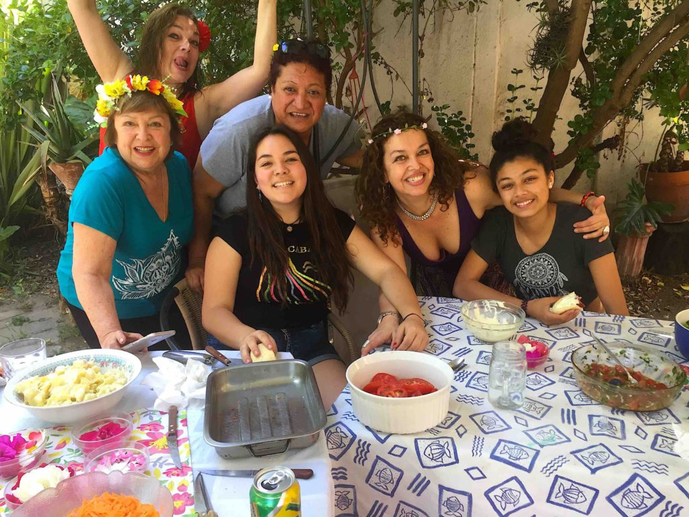
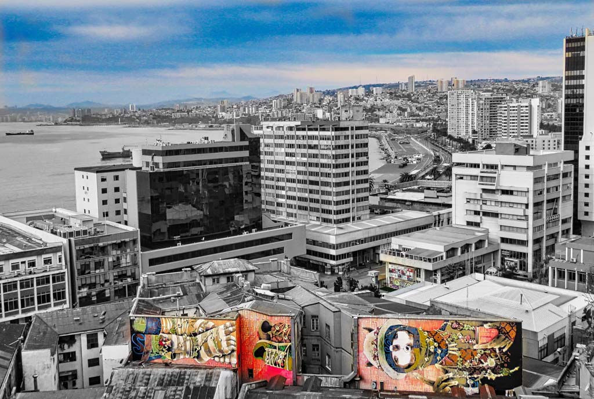
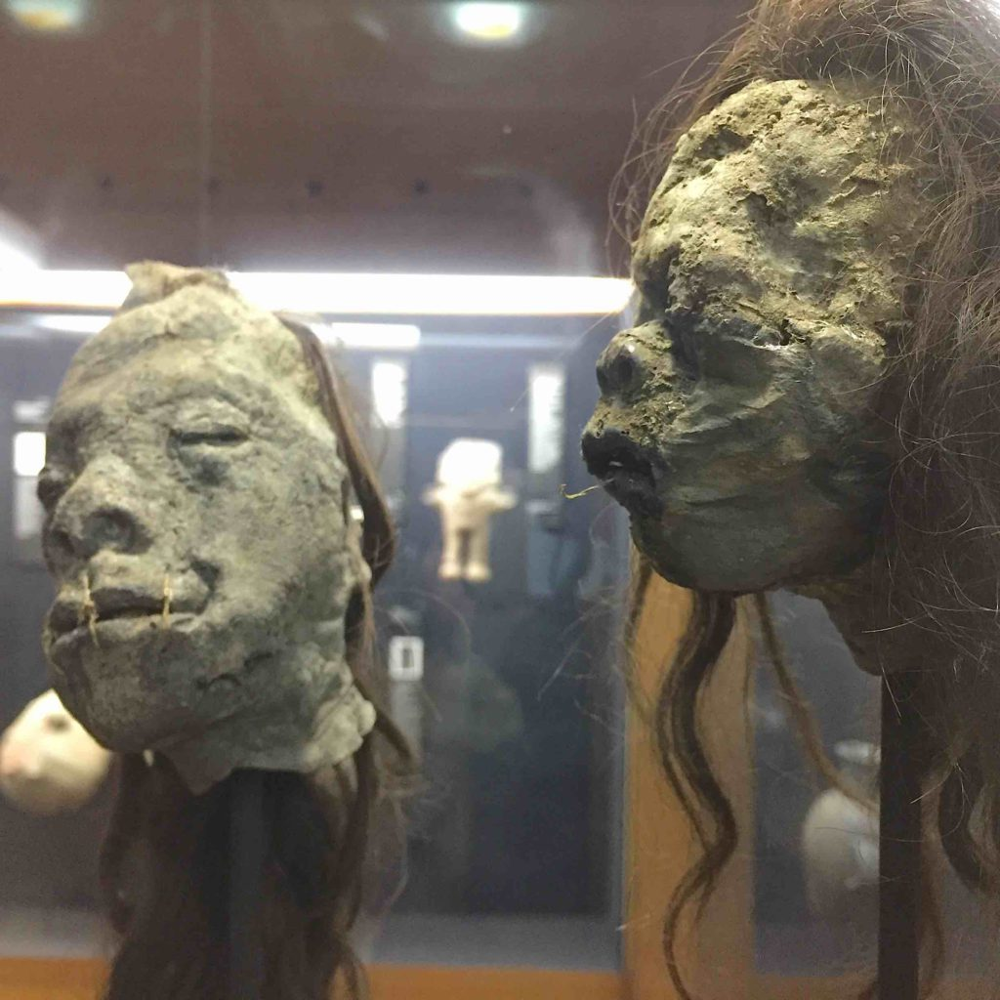
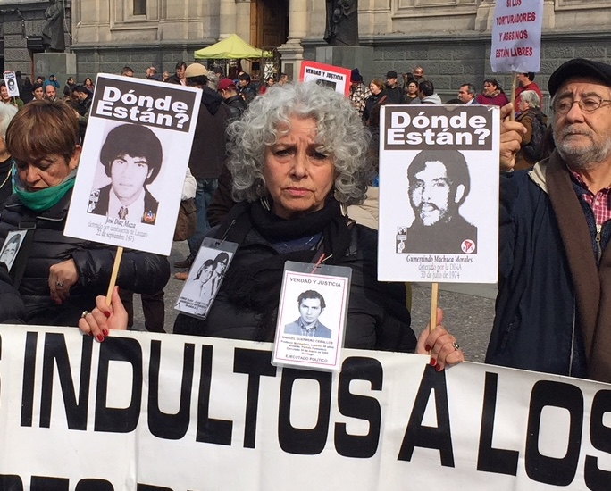

Chile! The country so nice I visited it twice. The first time I flew from Rio de Janeiro to Santiago I was only there for two weeks.  It was still too cold and I didn’t have the right clothes for winter so I went back to Rio and waited a few months until the weather got warmer in October and I returned to Santiago.  It was nice not to have to wear every stitch of clothing I owned every day just to stay warm this time around.

https://youtu.be/kqEdriYvO48

Santiago is a nice big city with plenty to see and do.  Chile is the most economically stable country in South America with its low levels of corruption and efficient government.  It’s clean and safe to walk around.  The Andes mountains are visible as you look east over the rooftops of the downtown buildings. I found a cozy hostel on the top floor of an old building on the main plaza in town.  The elevator was broken down so I got good exercise every day climbing the six floors. The hostel patio overlooked the Plaza de Armes, which is surrounded by historical buildings and contains many palm trees, fountains, statues and a subway entrance.  It was also the main hangout for the city’s working girls.  I was propositioned every day until they figured out I wasn’t buying what they were selling.

Their limited subway system allowed me to get close to most places I wanted to visit but I also don’t mind walking long distances as long as I have my iPod. Walking around the city was interesting.  This is the first city where I came across kids in the parks engaged in rap battles.  Someone would lay down a beat and then the two combatants would take turns rapping at each other.  My Spanish isn’t good enough to understand most of what they said but I knew when someone scored a good insult by how the assembled crowd reacted. I also liked to watch the street performers do their thing for spare change at stoplights.  They don’t just hold up signs asking for money. They perform juggling acts, synchronized traditional dance routines and other interesting ploys to earn your spare pesos. While exploring I always came across little neighborhood street fairs with delicious food and even a _STAR WARS_ convention complete with numerous costumed Wookie’s, Vader’s and Lea’s.

I made a really good friend in Santiago named Erika.  I was honored to be invited to many celebrations at her family’s home including birthdays and barbeque cookouts.  Even though the language barrier was difficult at times I really enjoyed talking with her mother, sisters, daughters, cousins and friends.  I was warmly greeted by all. I especially liked when instruments were brought out and music was made.  I had a lot of fun in that backyard.

_Erika and family_

We went out on Halloween night and met up with her sister to see a quirky punk band.  A small intimate show and lots of fun.  Erika and I went out together to many different events throughout my time there.  One highlight was the _Fiesta de la Luz_ (Festival of Lights).  Throughout the downtown area scaffoldings were set so projectors could shine light shows and videos on ten different historical buildings and museums, all set to music.  Dancers repelled from the top of the National Arts Museum while doing dance routines at the end of their ropes to the pumping music and colored spotlights.  Crowds followed maps to the next location to witness another spectacular show. 

Just an hour east of Santiago lies the seaport city of Valparaiso.  The hillside city is served by many Funiculars or _Acensors_, as the locals call them. They stay busy carrying passengers up and down the steep hills.  The city’s historical district has been remade into an artist colony of sorts.  Most shops are filled with art and many of the buildings have outstanding murals painted on them.  It is a very colorful city and a joy to walk thru the labyrinth of cobbled alleys in search of the next hidden mural or piece of art to marvel at.

_Valparaiso Murals_

Just a short train ride up the coast is the city of Vina del Mar.  I took a day trip here to walk along the beach and to visit the very interesting Fonck Museum.  The archaeology and history museum featured many original shrunken heads and the only giant stone moai head from Easter Island on mainland Chile.

_Shrunken Heads_

Back in Santiago, I visited a place I visit in almost every big city, the cemetery.  I love walking thru cemeteries and photographing the ornate mausoleums, statues and interesting headstones. The Cementerio General de Santiago is one of the largest in Latin America with an estimated two million burials.  It also houses a memorial for the thousands of residents that ‘disappeared’ during the dictatorship of Augusto Pinochet.  Mothers and family members are still marching in public to put pressure on the current government to get answers about their loved ones that disappeared over 30 years ago.

_Protestors want answers_

San Cristóbal Hill rises to 900 feet on the north side of Santiago.  It’s an hour to climb up but I took the funicular cable car to the top to view the vast city skyline.  It’s beautiful when the city is all lit up at night.  Also, at the summit of the hill is a massive 60-foot tall statue of the Virgin Mary, an amphitheater, a few chapels and other works of art.  The most moving summit section was a prayer wall where loved ones could leave mementos of loved ones that have passed on.

_Prayer Wall_

I was sad to finally leave Chile but it was time to move on to my next country.  I caught a flight to Bolivia and as I flew over the impressive Andes mountains I wondered if I’d ever come back to this wonderful country.  We’ll see.

On the Road,

Andy
