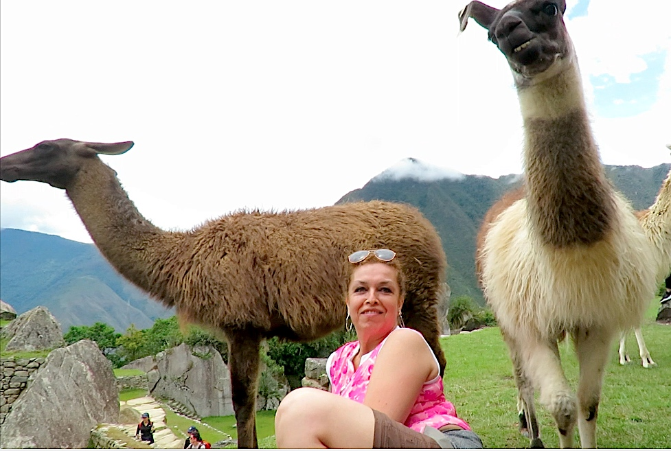
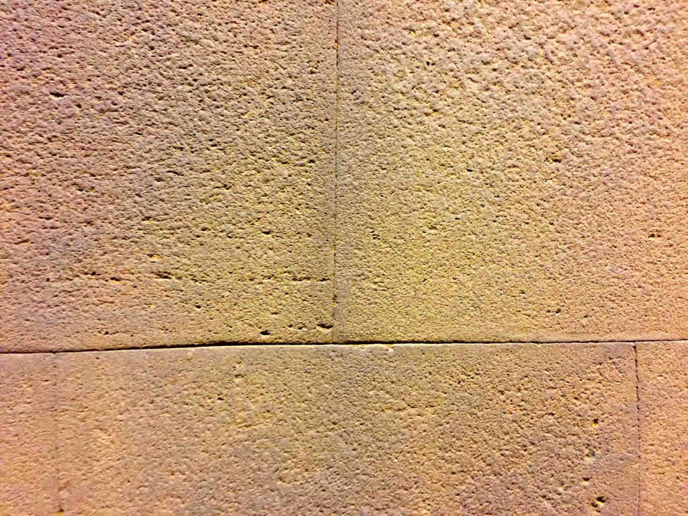
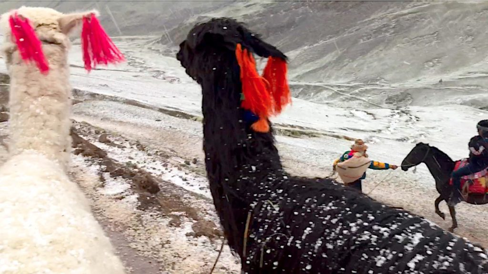
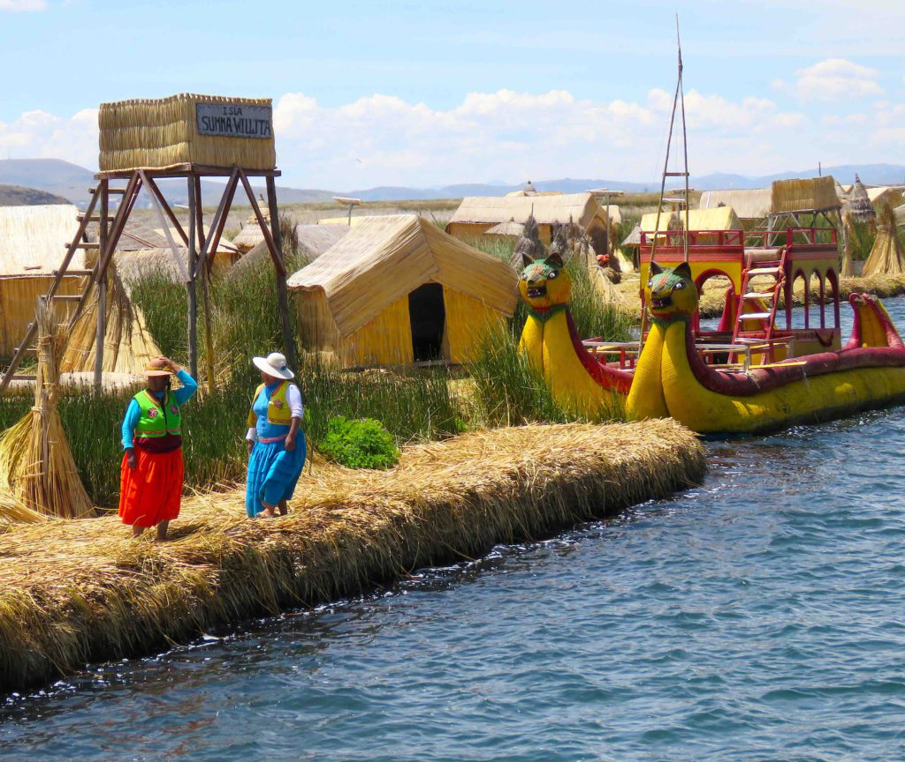
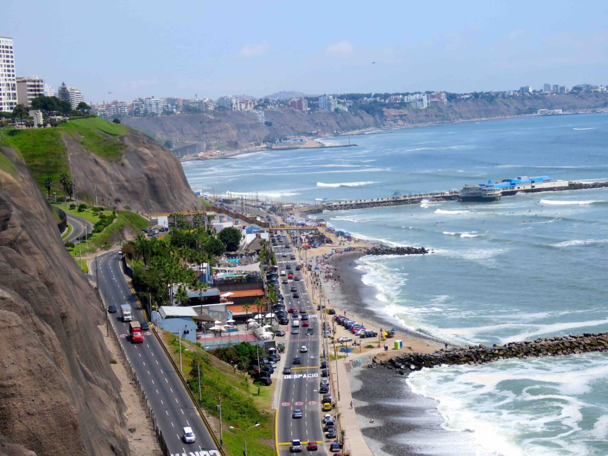
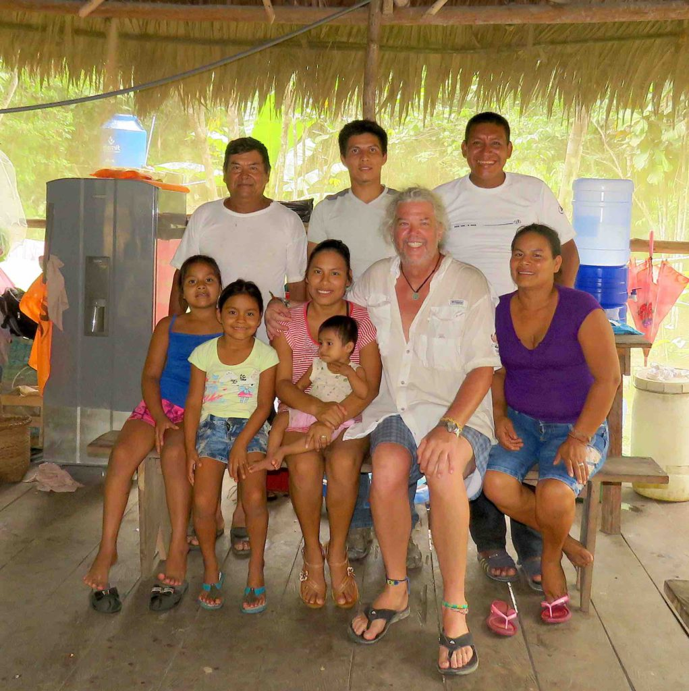
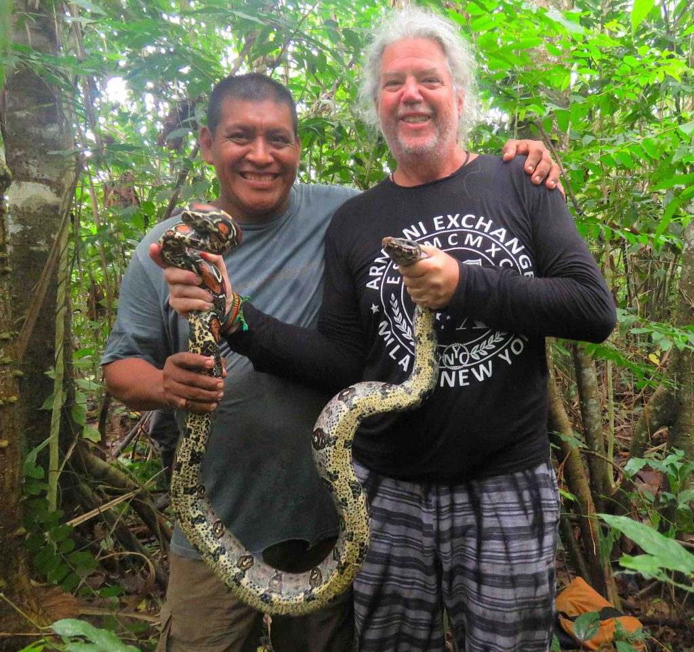
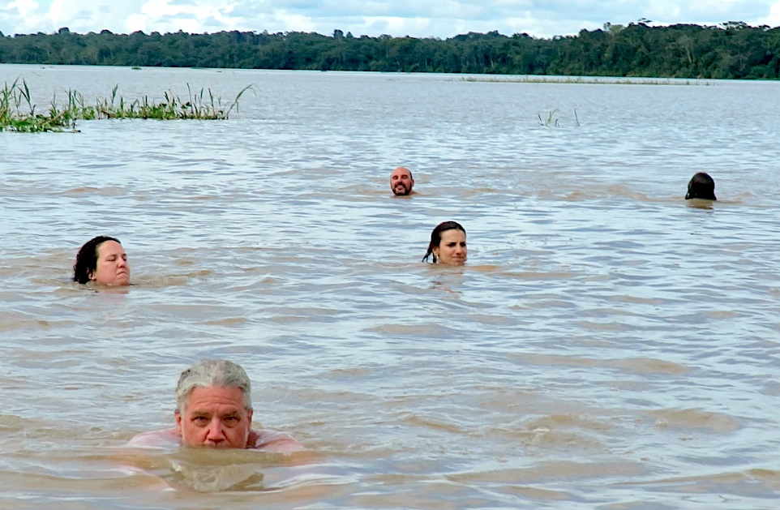

My journey to Peru started on a bus in southern Bolivia and ended 26 hours later in Cusco, Peru.  It’s always difficult to get any sleep on the mountain buses because the constantly curving roads throws me from side to side in the seat.  I arrived in Cusco the day before Xmas and settled into a nice hostel very close to the main square.  I was excited because my friend Erika arrived the next day from Santiago and we headed to Machu Picchu the day after Xmas.  I had to buy tickets for the train trip and entrance to Machu Picchu a month in advance because of such high demand.

https://youtu.be/eDyHigTwiXc

I met Erika at the airport and we immediately took a taxi to the mini-van pick-up location and stuffed ourselves in and took a two-hour trip to the Sacred Valley town of Ollantaytambo.  We arranged for our guest house to make us a boxed breakfast for the next morning since we needed to be at the train station very early to catch our train to the town of Aguas Calientes.  Aguas Calientes is the gateway town at the foot of Machu Picchu. The very expensive train ride is the only viable option for getting to Machu Picchu. It winds thru the Sacred Valley along a rushing river on one side and mountains on the other.  Instead of making the long hike up to Machu Picchu from the train station we chose to take the winding scenic bus that drops us near the entrance.  We were there early enough to be one of the first groups to enter Machu Picchu.  This was important to me so I could get as many photos of the ruins without all the crowds ruining my photos.  We spent a nice half day hiking around the famous Inca ruins.  We rested near some llamas and alpacas that tried to steal our food. 

After exploring everywhere and finding all the interesting vantage points to photograph the spectacular ruins we boarded the bus back down to Aguas Calientes in the afternoon.  To kill time before our evening train ride back to Ollantaytambo we had a delicious meal and then a massage.  The return train trip was delayed hours because of a landslide on the tracks. that needed cleared. We arrived back to our hotel in the dark and pouring rain.

The next morning, we hiked in the hills around Ollantaytambo among other Inca ruins before taking an afternoon taxi ride back to Cusco.

Cusco is the Peruvian Andes city that was once the capital of the Inca Empire.  The main plaza boasts carved wooden balconies and Inca wall ruins.  We did a free walking tour and got a good overview of the city and its history.  The Incan stone work is second to none.  You cannot even slip a piece of paper in the crack between two stones, they fit together so tightly.

_Amazing Inca stone work_

The next day we took an all day exhausting trip to see Rainbow Mountain.  It was a three-hour bus trip from Cusco and then a difficult few hour hike to actually get to the multi-colored mountain range locally known as Vinicunca or Winikunka Mountain.  It was only discovered a couple of years ago because of global warming.  It had been covered for thousands of years with a glacier cap of snow and ice. The long hike there in the high altitude was difficult enough, but on the hike back it started to sleet and hail. 

The stinging ice caused some pain but didn’t seem to bother the many llamas or alpacas roaming around. The multi-colored and striped mountain range is an extraordinary sight very unique in this world.  I’ve never seen anything like it anywhere I’ve been.

Unfortunately, Erika had to leave before the new year’s eve celebration.  She had to return to Santiago for a day and then move herself and daughters to Amsterdam to start a new job.  I did the best I could to celebrate the new year in style by going to the central square called Plaza de Armes.  There are numerous new year celebration traditions in Cusco but the main one starts at midnight and involved walking around the large square seven times counterclockwise in order to have good luck for the coming year.  On cue, at midnight, the crowd started circling at an excited run but eventually calmed down to a walk as fireworks exploded in the sky.  Cusco has been rated as one of the top places in the world to spend New Year’s Eve and I can see why.  The party went well into the morning.

I took a twelve-hour bus trip near the southern border to the small lakeside city of Puno.  Puno sits on the shores of Lake Titicaca which hold the famous floating islands.  Lake Titicaca is the highest lake in the world sitting at an elevation of 12,507 ft. above sea level. The residents create the floating islands but binding reeds together and then stacking them on top of each other until an island is formed. It takes continuous maintenance to keep the islands itact.

_Floating Islands on Lake Titicaca_

The locals of the floating islands live a very interesting and primitive life.  Some fortunate islanders use solar power for electricity that may get them an hour of radio time or maybe use of a small appliance.  They have no internet.  They are very cut-off from the main world but when they found out that I was an American they knew enough to say in their very broken english “Obama good, Trump bad”.  It’s a theme I hear often in my travels.  People around the world love Obama.  They paste images of him on their notebooks and computers and say how inspirational he has been to them.  Conversely, I haven’t met a single foreigner that likes Trump or even thinks he’s sane.  Sometimes I feel like I’m on an apology tour for the U.S. and our crazy president.  When I first started traveling 30 years ago America used to be a top destination for travelers but now I’ve met so many travelers who say they have no desire to step foot on American soil.

When I returned to Cusco after a few days I flew to the Peruvian capital city of Lima. It’s a very nice and modern city with some interesting sights but I got bored after a while.  I stayed in the upscale and trendy neighborhood called Miraflores. 

_Lima_

It lies right above the Pacific coast on a steep hill used by paragliders and surfers below. Lima has the best food in South America so far.  It’s spicy and interesting, unlike most of the food I’ve encountered in South America.  I’ve been really surprised how bland most of the food has been.  They do not like spicy food in most of South America.  I’ve tried to spice up some of my own food that I cook and my local friends never like it.  Even the mildest spices set their mouths on fire.

I consider the highlights of Lima to be its bustling colonial center with all its beautiful churches and plazas, the fountain light show in Reserve Park at night and the artsy and funky Barranco neighborhood.

I spent about four weeks in Lima but wish I could have spent a little less time there but I’m flying back for Carnival and Lima offered the best priced one-way ticket to Rio.  To kill a week, I flew to the city of Iquitos.  The city is located in the Great Plains of the Amazon Basin, fed by the Amazon, Nanay and Itaya rivers.  It is the largest city in the world inaccessible by road.  Only air and river travel will get you there.  This is the portal I’ve chosen to enter the mighty Amazon jungle.  I spent a few days walking around Iquitos looking for the best jungle adventure I could find for a good price.  In the end, I decided to go stay with a local inhabitant of the Amazon and his family.  He is a friend of the hostel manager where I was staying and the friends I made there will be going with me on the adventure.  We started early in the morning to catch a fast boat up the river for two hours where Jorge and some of his family met us.  Then we moved into his smaller slow boat and cruised up an offshoot river from the Amazon to his modest basecamp.  The spartan accommodations felt right for being in the Amazon.  There was no electricity or running water but we had the most important luxury, a mosquito net over our beds. 

_My Amazon Family_

Jorge and his wife and growing family were thoughtful hosts that made sure we had plenty to eat and activities to do.  During the days we would hunt through the woods for exotic animals and snakes. 

_Anaconda_

We came across a large anaconda about 8 feet long on our first day out and also a sloth, or ‘slow monkey’, as the locals call them.  On other days we would swim in the very wide Amazon River and visit some small villages or fish for piranha’s.  We always swam in the middle of the Amazon because we were told that the crocs, snakes and piranhas like to stay close to the shore. 

_Swimming in the Amazon River_

I still felt a bit leery but if Jorge lets his young kids jump in then I felt pretty safe.  While others in my group were doing their ayahuasca ceremony I went out on a night adventure looking for critters with a guide.  I saw plenty of large, hairy, creepy spiders that I was hoping to not see in my room later at night.  Walks in the woods to swimming holes and waterfalls were fact-learning experiences about the local fauna and how they use it for different medicines.  I wish I could have spent more time there in peaceful tranquility.

When I returned back to Iquitos I visited the Pilpintuwasi Animal Orphanage.  Many of the Amazonian animals here were rescued from illegal animal traffickers and local markets, including the elusive jaguar, ocelot, tapir and pygmy marmoset.

I only returned to Lima for a few days before heading to the airport again to catch my flight back to Rio.  Carnival has been on my bucket list my whole life.

On the Road,

Andy
