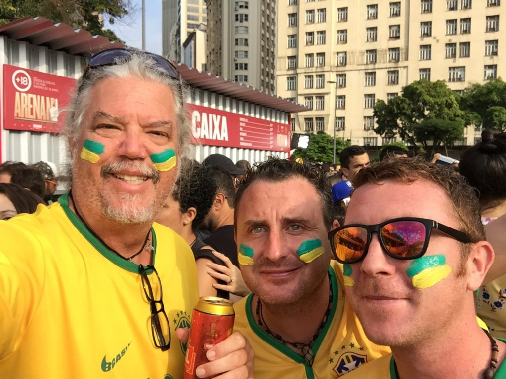
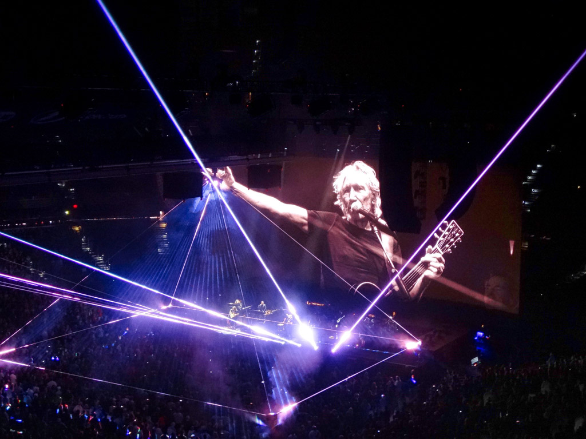
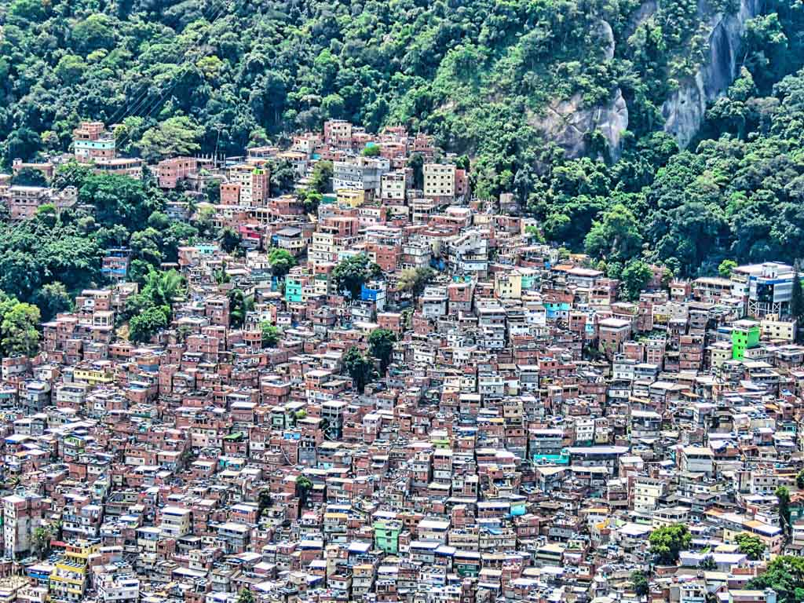
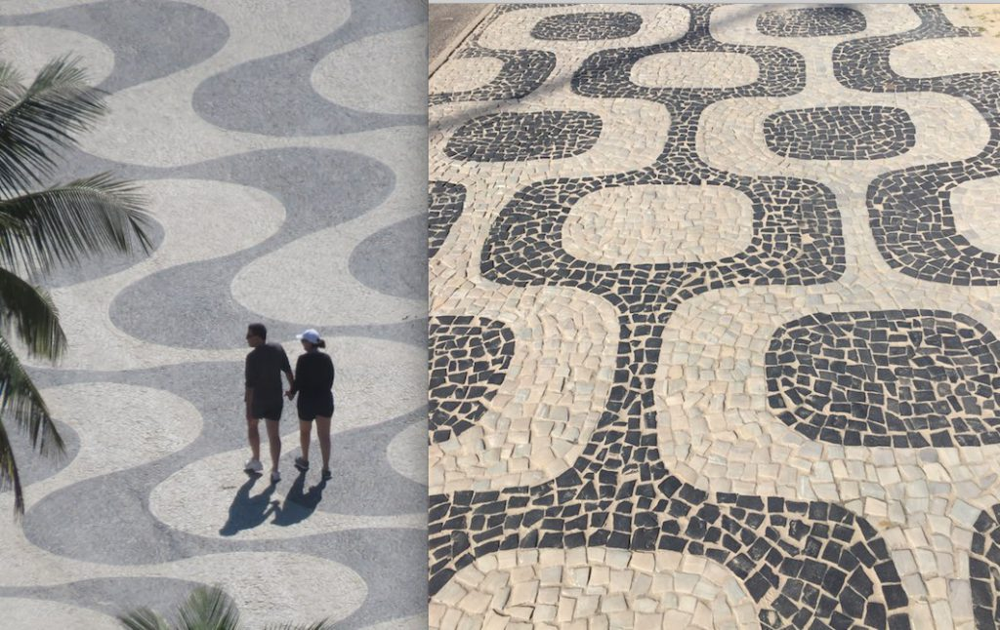
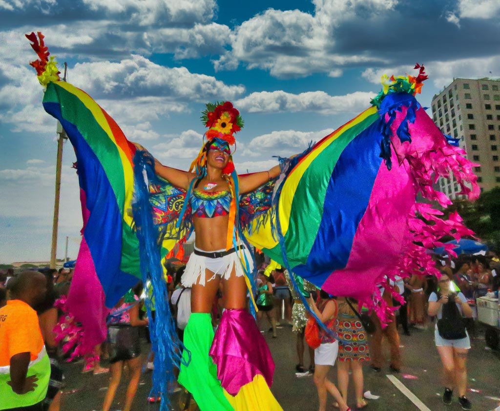
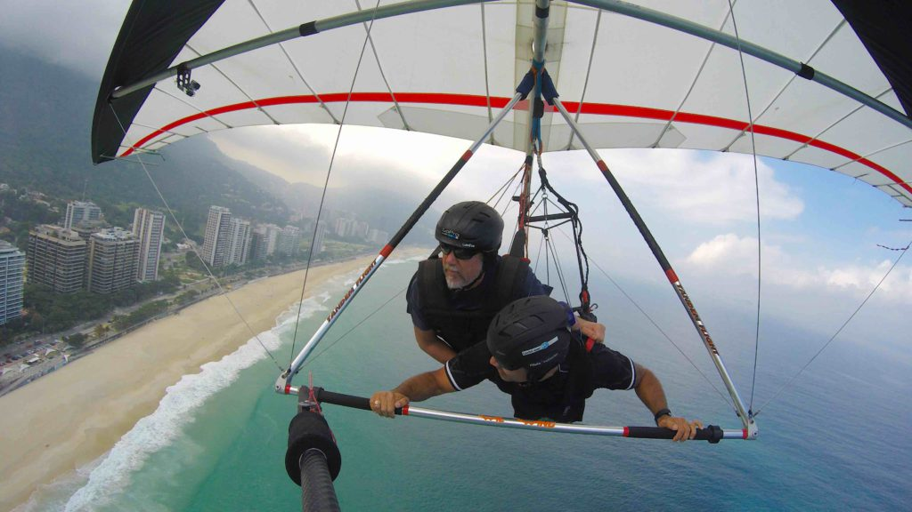
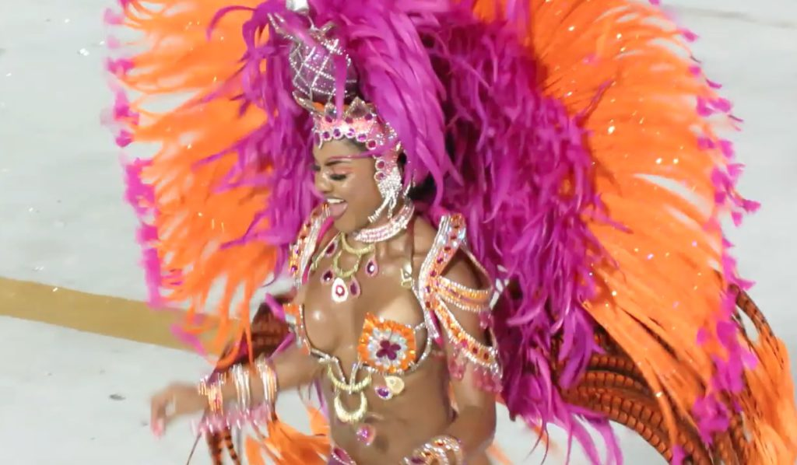

I had some real reservations about going to Rio de Janeiro. 

https://youtu.be/IC-WexF9zhk

I’d met other travelers along the way that told me horror stories of being ripped-off and how it’s the most dangerous city in the world.  I met one guy who had two different phones stolen from in two days.  I was nervous. I knew I couldn’t just skip going to the most famous city in Brazil but I considered just stopping in for a few days and then getting the hell outta there.  I’m happy to say that’s not what I did.  I ended up staying in Rio for four months, coming back three different times, and loved every minute of it.  I will be going back there again at some point.  The only reason I left Brazil was because my six-month visa was about to expire or else I would have stayed even longer.  Rio is the most geographically beautiful city I’ve ever been to.  The city has it all.  The downtown beaches, a huge lake, rock formations and the mountains with their interesting and fun favelas.  As a photographer, I was continuously inspired to take photos.

The day I arrived in Rio I met up with Eoin and headed to the famous Copacabana Beach for some beers, swimming and sightseeing.  The beaches in Rio are full of beautiful people every day, not just on weekends.  It can be hard to relax because beach vendors are always walking around constantly bothering you to buy whatever they are selling.  I try to ignore them but they are persistent. 

_World Cup Fever with my Irish mates_

The World Cup was still going on so Eoin, Kieran and I headed downtown to a huge viewing party with giant screens set up for the thousands of fans to watch Brazil play their next match.  We painted our faces and wore our Brazilian team jersey’s and fit right in.  Many beers later and a great Brazilian win caused us to party the night away along with everyone else.  We watched the next few matches at local Copacabana outside bars until Brazil was finally eliminated.  I was sad to see the party come to an end but it was great while it lasted.  Futbal is a religion in Brazil and their church is the famous Maracanã Stadium.  I wasn’t lucky enough to see a futbal match there but I did go to their church to see Roger Waters “Us + Them” tour when it came to town. It was my second time to see this show, having seen it in Tampa the year before.

_Roger Waters Live in Maracanã Stadium_

Eoin and Kieran traveled on to their next destination but I decided to stay in Rio and get down to really exploring and understanding the city.  I was lucky to befriend a group of Cariocas, the name for people from Rio, that showed me around the city and let me know where to go each night of the week to find the most fun.  The famous favelas of Rio have a bad reputation for danger but most of them have been pacified in the last ten years.  The residents are stacked on top of each other on the steep hillsides.  They are a dizzying maze of footpaths, tin shacks and small shops.  The favelas may be the poorest area of Rio but they have the best views of the city.  The crazy moto-taxis are the best way to reach the top.  They expertly weave between traffic and pedestrians on their steep ascent through the winding narrow roads. I found the locals that live in the favelas some of the kindest and most delightful in all of Rio.

_Hillside Favela_

I lived in many different places while I was in Rio. I lived in the Copacabana and Ipanema neighborhoods to be close to the famous beaches.  Then I lived in the downtown Lapa neighborhood, which is the big party area. I could only take that for a week because the non-stop music and partying wasn’t ideal for a good night’s sleep. Each neighborhood is distinguished by the mosaic patterns of their sidewalks.  If I ever got lost I could just look down at the sidewalk and know where I was.

_Copacabana and Ipanema Sidewalks_

When I arrive in a new city I usually go on the free walking tour.  Most cities around the world have these and they are a good way to get acclimated and learn the history of a city.  Then I will go back to the most interesting and scenic spots with my camera and spend as much time as needed to get a good photo.  Rio has so many iconic sights.  I took the cable car to the top of Sugarloaf Mountain and went up another mountain to stand in the shadow of the giant 98 foot Christ the Redeemer statue, or Cristo, as the locals call it.  One of the 7 Wonders of the World.  The sunset from this vantage point was truly amazing. 

Just as the Argentines are obsessed with the Tango, the Brazilians are just as obsessed with the Samba. The heat mixed with alcohol and the African rhythms are all that’s needed to get their hips shaking.  They love any excuse for a street party where they can dance and I went to quite a few of them.  The largest street party, besides Carnival, every year is the Gay Pride parade.  I’ve never seen anything like it.  Everyone goes to celebrate, not just gay people, because everyone loves a wild street party.  The moving party slowly crept through the Copacabana neighborhood where I was living.  Needless to say, the costumes and sometimes lack of costumes are a highlight and not to be missed.

_Rio Gay Pride Parade_

Just like the samba and street parties, another Brazilian pastime is protesting against the government or whatever else that irks them.  I attended a huge anti-Bolsonaro rally with thousands of other just before the election.  He’s known in Brazil as the “Little Trump”, but may be even worse than the original, if that’s possible.

There is one extreme sport I’ve never done but always wanted to and thought Rio would be the perfect place for it.  I met up with my co-pilot and drove up to the top of one of the tall mountains overlooking the city and went hang gliding.  It was a beautiful but cloudy day as we ran and jumped from the take-off ramp and soared into the wild blue yonder. It was so thrilling to slowly glide thru the air with a beautiful view of Ipanema and Copacabana until we gently landed on the beach.  It’s something I’ll never forget and a highlight of my time in Rio.

When I left Rio a second time to fly to Chile I made sure I had two weeks remaining on my visa so I could come back in four months for Carnival.  It’s been a goal of mine to hit all the biggest parties in the world and Carnival is probably the biggest of them all.  They call the street parties _blocos_ during Carnival and they happen all over the city every day for the five days of Carnival. When I arrived back in Rio I met up with my Carioca crew and immediately went to a huge night bloco party.  It was non-stop partying until I left town again.  In Brazil there are social organizations called Samba Schools who organize and fund their parade every year in the Sambadrome.  They are very similar to the Krewes that organize the Mardi Gras parades in New Orleans, happening at the same time.  The night before the Samba School is scheduled to parade they have a rehearsal in the neighborhood where they reside.  I went with my friends to one of these massive rehearsal parties.  Non-stop music, dancing and drinking until sunrise. I purchased my ticket to the Sambadrome for the first night of parades.  The Sambadrome is about a half mile long parade ground with double deck grandstands on either side.  It was pouring rain by the time the first Samba School starting parading at midnight but that didn’t dampen my spirits.  I stayed all night until they finished about 7 a.m.  Many people left early because of the rain, which allowed me to sneak up to the front and have a great view. 

The music, dancing, imaginative floats and costumes were a marvel to behold. Many featured dancing girls wore no clothes at all.  They proudly shook their asses wearing only intricately painted designs on their body and huge feathered headdresses.  These parades are a competition that go on for four straight nights until an ultimate winner is crowned.  During the next few days we went to multiple blocos every day throughout the city dressed up in different silly outfits.  I think I would like to return to Rio for Carnival again, especially since I lost all my great Carnival photos when my computer hard drive crashed. That’s as good an excuse as ever to return, plus I’d like to see all my Carioca friends again.

On the Road,

Andy
