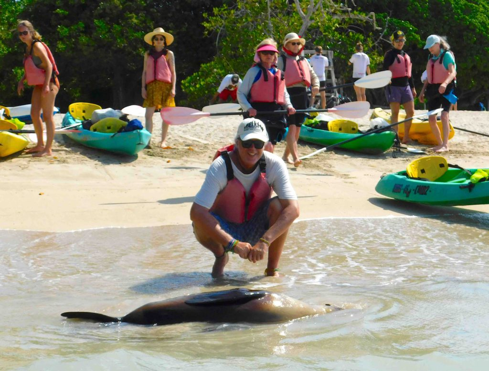
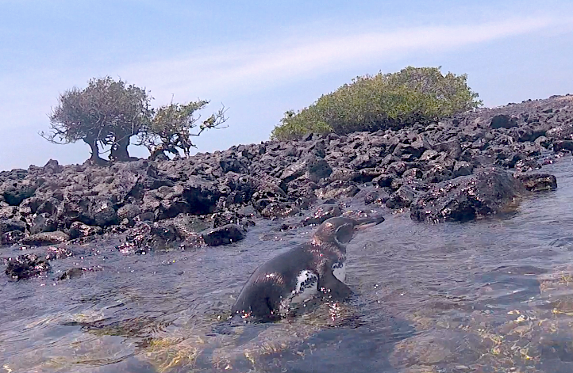
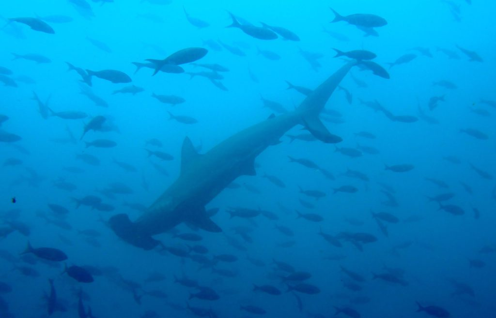

I flew directly from Rio to the Galápagos Islands, over 600 miles west of the Ecuadorian coast.  The Galápagos Islands is a volcanic archipelago in the Pacific Ocean and one of the worlds most famous destinations for wildlife-viewing.  Instead of joining an expensive live-aboard boat tour I decided to what most travelers do, I did it on the cheap.  I talked to a few people who did the expensive tours and many were disappointed because they were captive to their boats and its rigid schedule.  I was free to travel the islands as I saw fit and see only what I wanted to see instead of what I was told to see.  Those boat tours cost thousands of dollars and I spent less than two hundred dollars for the whole week and probably had more fun.

https://youtu.be/4jsyxuTWlC0

My plane arrived on Baltra Island but I immediately got a small boat across the channel to the larger main island of Santa Cruz.  As I walked around the main town of Puerto Ayora I noticed how unafraid all the animals were of humans.  The sea lions liked to lay around everywhere, even on the city benches and wouldn’t move if I wanted to sit next to them.  I bought snorkeling gear in Lima (then sold it for a profit after I was finished with it) so I wouldn’t have to rent it every day and was glad I did. I found some great places to snorkel almost every day.  My first day I ventured to Las Grietas (crevasse) and snorkeled in the beautiful clear water that lies between two tall cliffs.  Las Grietas is a series of three long narrow pools of water separated by small rock formations that can be climbed over in order to reach the next pool of cool water.

Every place I wanted to see was within easy walking distance from the main town. I took a hike along the main road to visit some underground lava tunnels.  These tunnels are formed when the outside skin of a molten-lava flow solidifies. A very interesting natural phenomena.  On my way there I came across many giant tortoises just slowly roaming around munching on vegetation.  They are the longest-living land animal in the world with many living over 150 years.  They are protected here and aren’t supposed to be bothered or touched but anyone who knows me knows I can’t resist touching the untouchable.  I tried to lift a rather large one up but couldn’t even budge it.

This main island of Santa Cruz houses the Charles Darwin Research Station.  These islands are where Darwin visited in 1835 and then later wrote his book _On the Origin of Species_, which outlined his theory of evolution and natural selection.  As well as the many interesting attractions at the Research Station it is also a large breeding center for the giant tortoise.  There were hundreds of them of all different sizes in different pens doing what they are supposed to be doing.  If you’ve never seen two large tortoises having ‘sexy time’ then you’ve missed out.  It was the only time I ever heard them make any noises.  An extended walk thru a hardened lava field path rewarding me with a long secluded beach full of marine iguanas.  They ranged in size from small to very large and loved to lay on the beach getting sun away from the crashing waves.  Just around the corner was a small cove with calmer water that was perfect for swimming and snorkeling. Giant eagle rays would glide past me while I swan.

After a few days it was time to take a fast boat a few hours away to the island of Isabela.  Isabela Island is the largest and youngest island.  It’s only about a million years old and was formed by the merger of six volcanos and the only island which straddles the equator.  In the mid 20th century parts of this island was used as a penal colony.  The last ugly vestige of this time is the _Wall of Tears_. This immense wall was built by the prisoners by stacking large, sharp volcanic rocks for no other purpose but punishment.  Thousands died building it in a desolate area of the island. Some friends and I made the solemn bike ride out to see it, passing many large tortoises along the way.

I made a good friend while visiting this island. Carly traveled from Austin, Texas to visit an Ecuadorian guy she knew from college but the reunion wasn’t going as she hoped so she ended up spending most of her time exploring the island with me.

_Beached Sea Lion_

We took a kayaking tour together to some other rock formations and small beaches where we snorkeled with sea turtles, marine iguanas, sharks and penguins.  It was so fun to see the penguins swimming underwater around us.  This is the only place in the world where you’ll see penguins and cactus in the same place.  As we paddled further we visited a few colonies of blue footed boobies resting on rock outcrops.

_Galapagos Penguin_

It was good timing on my part to be on Isabela Island at this moment because they were celebrating the anniversary of the islands founding. The multi-day celebration included boat and horse races, a beauty contest, greased pole and other games for kids and a big concert at night in the small town square.  The music didn’t stop until early the next morning.

There is a small hidden cove with a dock that is perfect for swimming and snorkeling that I liked to visit in the afternoons to cool off from the heat but sometimes it had more people that I would have liked and that would scare off some of the wildlife.  On my last morning I arrived there early at 8am and had the place to myself.  Sea lions laid on the dock blocking my entrance to the water so I gently tried to move them away so I could enter the calm clear water.  As I got into the water one of the sea lions decided to join me for a swim.  He circled around me a few times and would come up close to my face as I was underwater.  It was a delight to have such a close encounter with this elegant swimmer.  A bit later a pair of penguins zoomed right underneath me while I was swimming.  I’m happy I made the effort to get up early and experience this serene underwater nature by myself.

I returned by fast boat to Santa Cruz island for a few more days of snorkeling and exploring.  I really wanted to go scuba diving so I picked the best dive shop and arranged a two-dive package for the next day.  Our first dive of the day was to Seymour Channel between two islands.  This is a very well know ‘cleaning station’ for large fish.  A cleaning station is where a symbiotic relationship exists where the larger fish come to be cleaned by smaller fish.  The smaller fish will remove and eat the parasites from the larger fish, even swimming into their mouth and gills to get the job done.  Seymour Channel is also known to have very large schools of hammerhead sharks.  I didn’t see any large schools like the divers did the day before but I did see a few hammerheads and plenty of other different sharks.  On our second dive I saw a few large spotted eagle rays, more sharks, sea turtles, a seahorse and an uncountable number of bright and varied fish.  On our boat ride back to the dock we feasted on a wonderful buffet and drinks provided by the dive shop.

_Hammerhead Shark_

I think I will return to the Galapagos Islands again someday, especially since most of my photos were lost to a damaged computer hard drive.  I don’t think I’d do it any differently the next time except maybe I’ll spend more time in this tropical wonderland.

On the Road,

Andy
