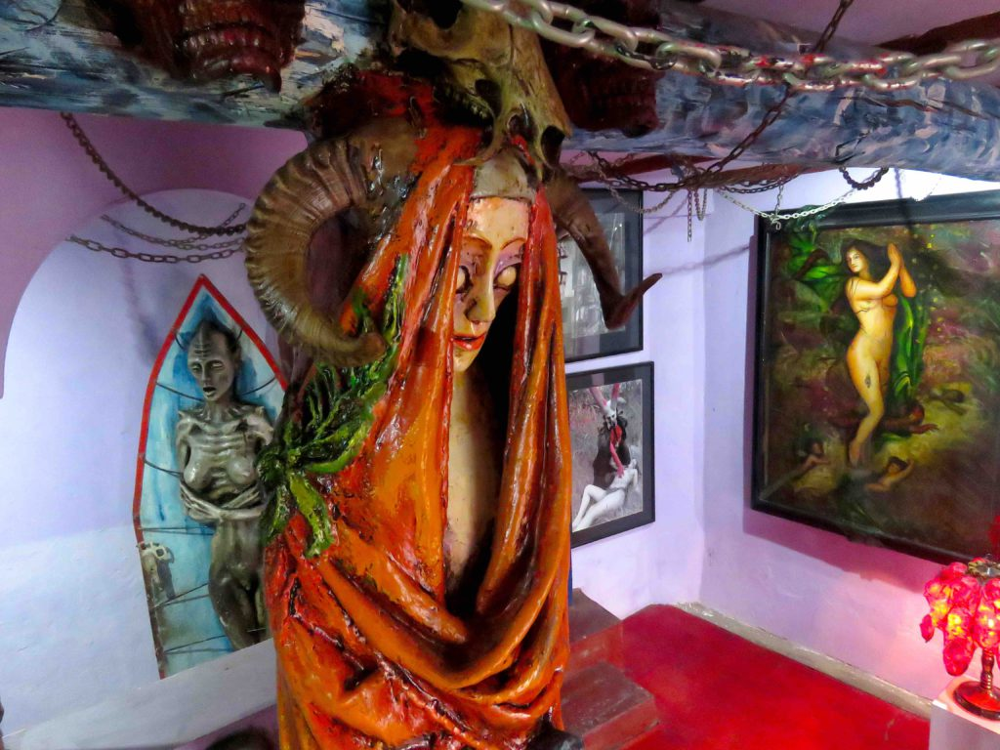
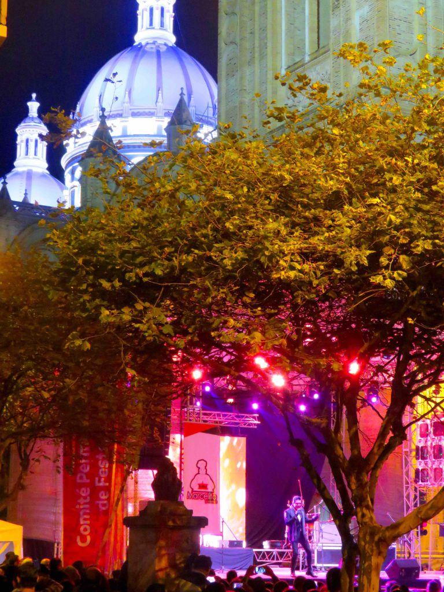
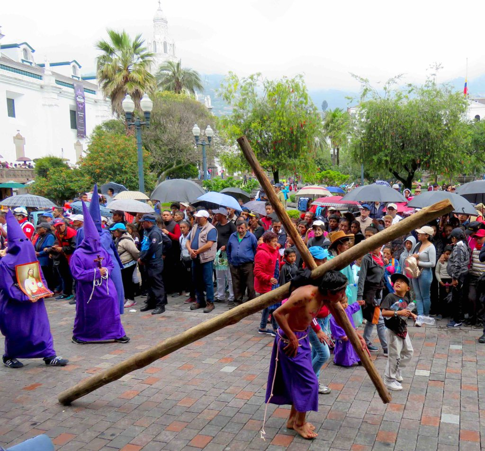
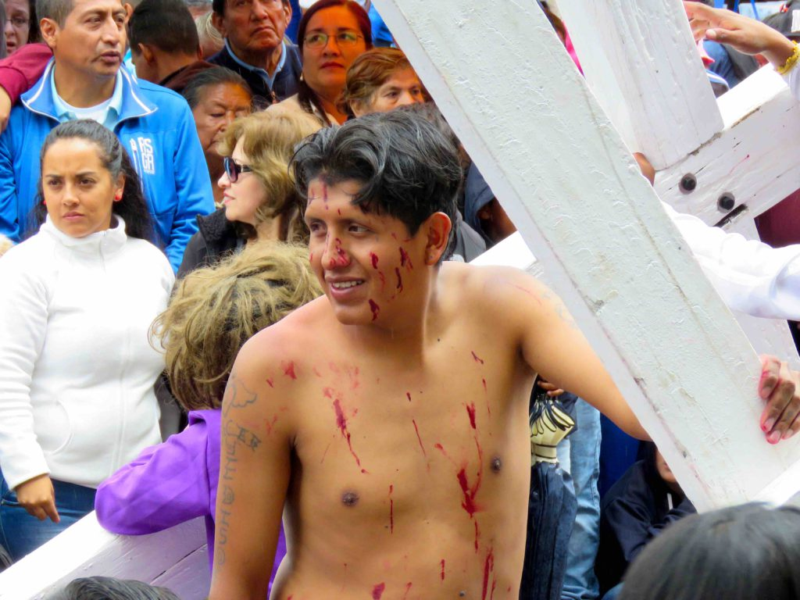
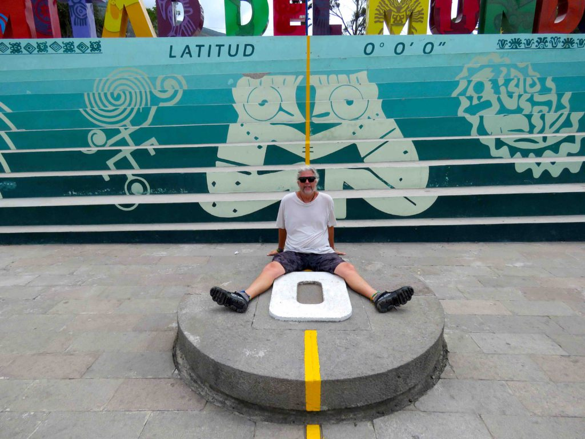

When I left the Galapagos Islands I flew to Quito and met up with my friend Carly again and we decided to take the bus down to Baños de Agua Santa, known simply as Baños.  Baños is a quaint city divided by a river canyon three hours south of Quito in a mountainous region of Ecuador. Baños is known for its adrenaline fueled thrill sports and activities. 

https://youtu.be/4jsyxuTWlC0

On our first day I accompanied Carly on her first-ever bungee jump from the main bridge in town into the deep gorge below.  I’ve bungee jumped a few times before and from higher places so I didn’t feel the need to do it again.  I’d rather save my money for other thrill sports.  In the afternoon we rented bikes to do the ‘waterfall tour’. The ride is along the main highway and is downhill most of the way but does have some uphill sections, which I hated, especially when it started pouring rain on us.  We both got soaked and had to stop a few times along the way to take shelter because we could barely see the dangerous curvy road.  Our first waterfall stop was at _Manto de la Novia_ (Bride’s Veil).  These twin waterfalls drop 131 feet into the Pastaza River.  I thought this would be a great place to try zip lining for the first time.  We both suited up and were able to fly side by side over the gorge and over the waterfalls to the other side and then fly back again. 

_Zip lining with Carly 'Superman' Style_

As we continued our 10 mile ride we passed a few other smaller waterfalls until until we arrived at our final destination, Pailon del Diablo (Devil’s Cauldron) waterfall.  We parked our bikes and hiked 20 minutes through the woods to the second largest waterfall in Ecuador.  We traversed a thin bouncy suspension bridge with great views over the river and its huge boulders below, as well as the smaller magnificent waterfalls leading up to the Devil’s Cauldron.  There is a path alongside the huge waterfall that allowed me to get really close to it and feel its power and even venture partially underneath and behind the huge falls by climbing thru a small crawlspace on my hands and knees. 

_The Devil Cauldron_

Since I was already wet I didn’t mind getting even more soaked by the spray.  After basking in the glory of the waterfalls for a good while we made our way back towards the entrance and instead of riding back in the rain we put our bikes in the back of a truck and paid a few dollars to get a ride back to Baños.

After a hot shower we caught a bus up to the top of a mountain to a place called The Treehouse, where the _Swing at the End of the World_ resides.  The Treehouse was originally built as a watchtower for the nearby active Tungurahua volcano.  The swing was built by a grandfather who lived on the hill and worked as the watchman. He wanted his grandkids to come visit him so he built the swing for them and they came to visit him every day.  It has since been updated and modified into a tourist attraction with a zip line, restaurant, bar and other attractions. As I strapped into the swing and was pushed out over the 1.6-mile deep valley below I was reminded of the swing my dad built when we were little kids that swung us out over the ravine in our backyard. The Treehouse swing pusher took great delight in pushing people harder and harder while laughing and ignoring the scared swingers who yelled for him to stop.  I just kept saying “higher, higher”, just like I did when I was a kid and my brothers would push me on our home swing.

_Swing at the End of the World_

When we returned to our dorm room we found we had a new Canadian roommate named Louis.  Louis and I both work in the film business and Carly is a muralist painter so we all got along great.  There was an election going on in Ecuador so, as is common in many places in the world, all alcohol sales are suspended until the election is over. A nice local citizen directed us to a secret bar that sold alcohol to us.  Then later in the evening we were treated to a downtown fireworks show.

The next day the three of us booked a whitewater rafting trip down the Pastaza River for a very modest price that also included a nice restaurant lunch on the way home.  After we donned our wetsuits and helmets and got some basic instructions, we soon learned that we had the craziest of all the guides.  He was the only guide that allowed and even encouraged us to sit on the front of the rubber raft and pretend like we were riding a bronking bull down the class lll and lV rapids. 

_Ridem' Cowboy_

I immediately jumped at the chance to show off my bull riding skills and preceded to get thrown into the rushing waters twice.  I held onto the rope as instructed and was swiftly pulled back into the raft after only being dragged thru the whitewater for a short time.  Midway thru the trip we stopped and got out of our rafts to slide down some natural boulder slides into giant pools of water.  When we completed the task we were christened with facial war paint made of mud.

_Rapids Warrior_

It wasn’t until we were finished and were carrying the rafts up the rocky hill to the trailers that I actually got hurt.  I lost my balance and fell backward onto the boulders.  Luckily, I was still wearing my helmet and life jacket which helped cushion the fall but I was still in a lot of pain for a few days.  To help alleviate the pain in my back we visited one of the many natural hot springs that gives Baños de Agua Santa its name.  The active Tungurahua volcano is what causes the natural springs to heat up and bubble to the surface.

When Carly and Louis caught a night bus back north to Quito I stayed an extra day to rest my back before a long bus ride south to the city of Cuenca.

I arrived in Cuenca at 4am and was happy the hostel allowed me to check in and get a bed.  I paid for a dorm room but was happy to be put in a room all by myself with a nice view of the river that runs thru town.  Cuenca is a well know ex-pat haven for North Americans, with about 5,000 living there full time.  My brother had expressed interest in a possible future move there so I told him I’d check it out for him.  I stayed there about a month and could actually see myself living there also.  I met a few ex-pats when I went to a restaurant to watch a screening of _The Big Lebowski,_ complete with White Russian cocktails.  They told me the cost of living is pretty cheap. There are modern hospitals and good inexpensive medical care.  Ecuador also uses the US dollar as its official currency. As usual, I did the free walking tour (tips only) to acclimate myself to the city and all its history.  Cuenca is a very picturesque city with four rivers that flow through it and many beautiful cathedrals and parks.  They have many interesting museums, including the very deranged Prohibited Museum, which is not for the faint of heart or easily offended. I loved it and spent hours inside taking photos.

_Prohibited Museum_

I probably would have left Cuenca a week sooner but I wanted to wait for my birthday on April 12 because that is also the day of Cuenca’s founding in 1557.  They put on a great celebration every year with concerts, parades and fireworks spread out all over town.  I pretended it was all for me and went to as many of the events as I could.

I took the nine-hour bus ride back to Quito in time for the Holy Week events before Easter.

Quito has the largest, least-altered, and best preserved historic center in the Americas and is the second-highest capital city in the world, after La Paz. It is also the the closest capital city to the equator.  It’s an exhausting city to walk because of the steep hills within the city.  Quito also has an aerial tramway system that takes visitors to the top of the 13,500-foot mountain for a great overview vista of the city.  The city center has some really amazing churches and old buildings to explore as well as large parks where the residents gather for sports, bike riding and picnics.  I saw postcards and photos of holy week celebrations in the city center and did not want to miss these massive celebrations.  The workers started setting up stages and decorations early in the week and the festivities started on Thursday night with a candlelight procession through the historic district. 

On Good Friday I went to the downtown Plaza de San Francisco amongst the crowds to watch the haunting ceremony that starts at noon.  Hundreds of men and women dress in purple robes and pointed hoods begin the long march known as the Procession of the Penitents through Quito’s ecclesiastical historic district.  The purple robed men are called _cucuruchos_ and the women are called _Veronicas._ They are joined by others dressed as Christ with chains on their legs and carrying large wooden crosses complete with Roman soldiers flogging them. Pain is the name of the game here as many participants inflict real suffering on themselves by self-flagellation or by attaching cacti onto their exposed bloody backs.

It was very comparable to the _Semana Santa_ celebrations I witnessed in Seville, Spain years ago.

From Quito I took a taxi twenty miles north to the tract of land known as _Ciudad Mitad del Mundo_ (Middle of the World City).  In 1736 this area was determined to be the center of the earth, Latitude 0° 0′ 0″. Even with their primitive measuring tools they were only 790 ft. off the mark. The tract of land includes a large monument marking the original equator line, planetarium, exhibits and restaurants.  It was enough to keep me busy for a few hours taking the obligatory photos of myself straddling the equatorial line and looking at all the sights.

_Equator_

Ecuador is a country with lots to offer and many great cities and sights but it was time to head further north so I caught a bus and headed into Colombia.

On the Road,

Andy
