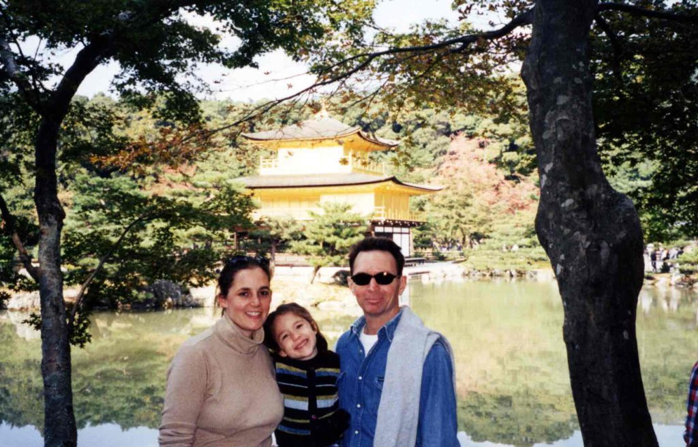
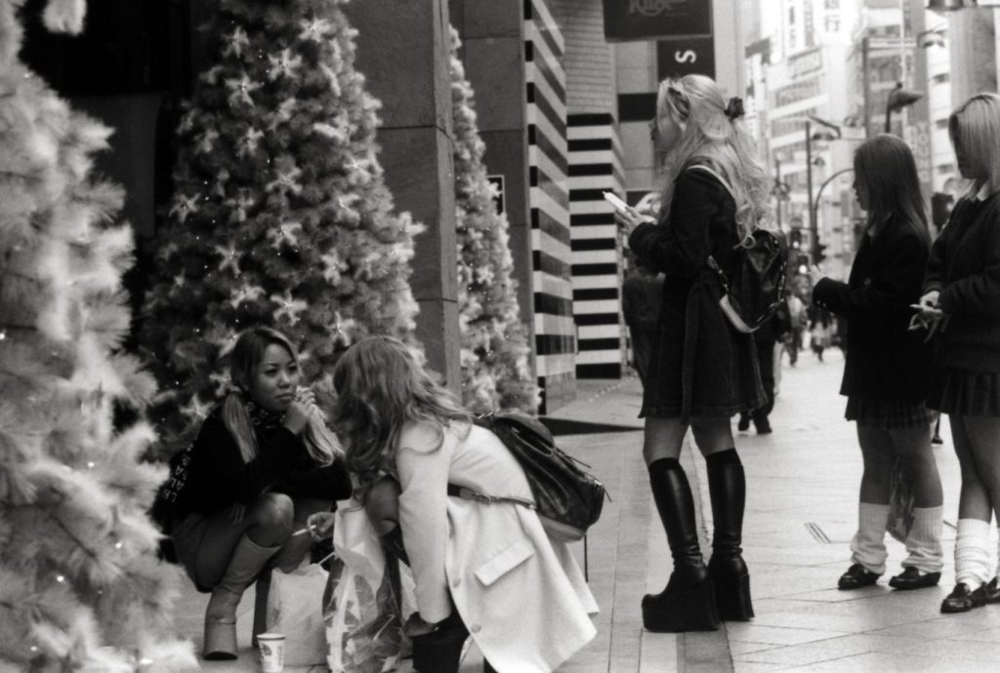

As most of you know I am beginning a five-month journey that will take me all over Asia and India. This isn't my first journey. I've already traveled thru Europe and Africa a few times for over a year a few years back but this is my first time to travel through Asia extensively. I spent 6 weeks in Singapore ten years ago for work but didn't travel outside Singapore. I thought email would be the best way to keep in touch with everybody but I will still be sending out postcards along the way.  
I arrived in Japan after a long flight that was delayed six hours on the runway. At least the airline paid for my hotel in Tokyo since we arrived so late. The next morning I took a train down to Nagoya to visit friends I knew from Austin, Texas.

_Mansell family at Golden Temple in Kyoto_

They are both college professors. We have taken day trips to many of the cities near here, including Kyoto. We visited the Golden Temple and I have seen the most famous Zen rock garden in Japan (boring). I am glad I have a place to stay here because Japan is so expensive. I took a bullet train to downtown Tokyo and found the cheapest, smallest hotel I could find and it still cost me almost $200. I need cheaper accommodations so the next night I checked into a capsule hotel. What an interesting concept. The capsules are stacked two-high in a locker room type setting, separate for men and women. They are about three feet tall by three feet wide and about seven feet deep. They have a tiny TV and alarm clock built into the inside of the plastic formed capsule. Many businessmen stay in these capsules at night if they have been drinking and don’t want to make the commute home. The locker room has showers and everything else a locker room would have. These tiny sleeping quarters only cost $40 a night. Not a great deal but still way cheaper than a regular room hotel.  
Downtown Tokyo is very crowded. The streets are crowded day and night. This is a very peculiar country. The kids wear the wildest fashions and try to stand out from the crowd in every way possible. I think the kids have an unspoken agreement with society that says they can look and act as weird as they want, but as soon as they graduate college it is over and they must toe the line and start conforming.

The guys have to buy their blue suits and the girls have to get married and stay home to raise the kids.  
I will be going to Internet cafes whenever I can find them to check and write emails. Feel free to write me but please don’t put me on any email forwarding lists since I have to pay by the minute to the Internet. This hour-long session cost me $15. I’ll try to write again soon.

On The Road,  
Andy
